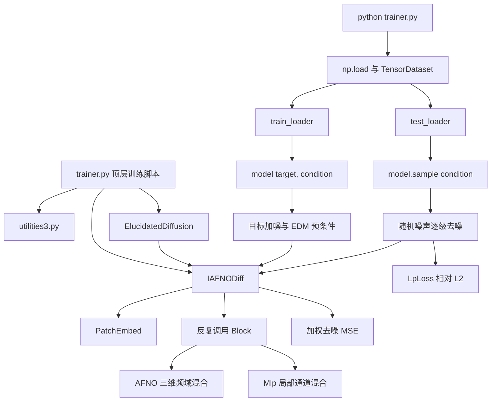

# DiAFNO 源码分析与“前 7 帧 → 后 15 帧”改造评估

> [!abstract] 结论先行
> 当前仓库是一个面向三维湍流体数据的、条件式单步扩散预测原型。原始数组按 `[case, time, x, y, z, variable]` 使用；当前配置从每个时刻构造 `t → t+1` 样本，模型内部张量为 `[batch, channel, x, y, z] = [B, 3, 64, 65, 32]`。`IAFNODiff` 是扩散去噪网络，AFNO 只在三个空间维度做频域混合；`ElucidatedDiffusion` 负责给目标场加噪、预条件去噪和迭代采样。README 描述了 autoregressive framework，但当前 `trainer.py` 没有把预测帧回灌到下一步，因此仓库代码本身只实现了单步预测，不包含完整的 autoregressive rollout。
>
> 仅把 `InferenceWidth` 改为 `7` 或 `15` 不会得到“前 7 帧 → 后 15 帧”：当前数据集永远只取窗口的第 0、1 帧，而且骨干网络假定条件通道数与目标通道数相同。改造前必须确定是一次性生成 15 帧，还是训练单步模型并自回归滚动 15 次。

## 0. 分析范围与结论标记

本报告完整检查了以下文件：

- `IAFNO.py`：367 行；
- `diffusion.py`：289 行；
- `trainer.py`：255 行；
- `utilities3.py`：309 行；
- `README.md`：29 行。

同时检查了 `requirements-lock.txt` 与 `environment.yml`，但没有创建 Conda 环境，也没有执行训练。原因是当前训练路径和数据路径仍是占位字符串，13 项问题可通过静态源码完整分析；安装依赖不会补足缺失的真实数据语义。

下文使用三种标记：

- **源码确认**：代码可直接证明；
- **README 确认**：项目说明明确陈述；
- **待数据确认**：源码和 README 都不能确定，必须检查真实文件、元数据或实验定义。

## 1. 文件作用与调用关系

### 1.1 总体调用图



### 1.2 `trainer.py`

**作用：** 当前唯一的可执行训练脚本。它把配置、数据加载、数据切窗、归一化统计、模型构造、优化器、训练循环、测试循环和 checkpoint 保存全部放在模块顶层。

关键位置：

- 导入 `ElucidatedDiffusion` 与 `IAFNODiff`：`trainer.py:23-24`；
- 数据加载及切窗：`trainer.py:72-90`；
- 归一化统计与 `sigma_data` 计算：`trainer.py:92-127`；
- `DataLoader`：`trainer.py:131-137`；
- `IAFNODiff` 构造：`trainer.py:139-151`；
- `ElucidatedDiffusion` 包装：`trainer.py:155-161`；
- 训练与测试：`trainer.py:180-235`；
- 每轮保存权重与损失：`trainer.py:243-255`。

由于没有 `if __name__ == "__main__":`，导入 `trainer.py` 也会立刻尝试加载数据并开始训练。

### 1.3 `IAFNO.py`

**作用：** 定义扩散模型使用的三维 IAFNO 去噪骨干。

主要组件：

| 组件 | 位置 | 作用 |
| --- | --- | --- |
| `SinusoidalPosEmb` | `IAFNO.py:38-52` | 把扩散噪声等级编码成正余弦向量；不是物理时间编码。 |
| `RMSNorm` | `IAFNO.py:54-61` | 对通道维做归一化。 |
| `PatchEmbed` | `IAFNO.py:71-91` | 把空间块通过 `Conv3d` 投影成 token embedding。 |
| `Mlp` | `IAFNO.py:95-117` | 每个空间 token 上的通道 MLP。 |
| `Block` | `IAFNO.py:121-157` | `LayerNorm → AFNO → 残差 → MLP → 残差`。 |
| `AFNO` | `IAFNO.py:161-226` | 对三个 token 空间轴做 FFT、分块复数线性变换、稀疏收缩和逆 FFT。 |
| `IAFNODiff` | `IAFNO.py:230-367` | 条件拼接、扩散时间调制、patch 编解码、隐式迭代与输出重建。 |

`IAFNO.py:19` 使用 `from utilities3 import *`。其中最重要的隐式依赖是 `utilities3.py:16` 的全局 `device`，它被 padding 代码 `IAFNO.py:337-345` 使用。

### 1.4 `diffusion.py`

**作用：** 实现 EDM 风格的扩散训练与采样外壳，具体去噪函数由传入的 `net` 提供。

关键位置：

- EDM 预条件系数：`c_skip`、`c_out`、`c_in`、`c_noise`，`diffusion.py:100-110`；
- 条件去噪调用：`preconditioned_network_forward`，`diffusion.py:115-134`；
- 噪声日程：`sample_schedule`，`diffusion.py:141-151`；
- 三维 Euler/Heun 采样：`sample`，`diffusion.py:153-212`；
- 训练损失：`forward`，`diffusion.py:259-289`。

`sample_using_dpmpp` 位于 `diffusion.py:214-249`，但它创建的是四维 `[B, C, H, W]` 噪声，而且没有向骨干传入外部条件，与当前三维 `IAFNODiff` 接口不兼容；当前训练脚本没有调用它。

### 1.5 `utilities3.py`

**作用：** 通用数据读取、归一化、损失和参数计数工具集合。

| 组件 | 位置 | 当前是否被主流程使用 |
| --- | --- | --- |
| `device` | `utilities3.py:16` | 被 `IAFNO.py` 通过星号导入间接使用。 |
| `MatReader` | `utilities3.py:19-70` | 未使用；支持旧版 MAT 和 HDF5 MAT。 |
| `UnitGaussianNormalizer` | `utilities3.py:73-109` | 未使用。 |
| `GaussianNormalizer` | `utilities3.py:111-133` | 未使用。 |
| `RangeNormalizer` | `utilities3.py:137-158` | 未使用。 |
| `LpLoss` | `utilities3.py:161-204` | 测试阶段使用；默认返回逐样本相对 L2 后取均值。 |
| `HsLoss` | `utilities3.py:208-272` | 未使用。 |
| `DenseNet` | `utilities3.py:275-301` | 未使用。 |
| `count_params` | `utilities3.py:305-309` | `trainer.py:176` 使用。 |

### 1.6 `README.md`

**作用：** 说明项目论文、原始应用、数据下载和引用信息。它没有给出安装命令、数据数组 schema、训练命令、checkpoint 恢复或推理示例。

README 明确把 DiAFNO 描述为 IAFNO 与 diffusion 的组合，用于三维湍流的 autoregressive prediction（`README.md:1-8`）；数据链接位于 `README.md:10-12`。

## 2. 当前训练入口

**源码确认：** 训练入口是 `trainer.py` 的模块顶层，通常只能通过以下形式启动：

```powershell
python trainer.py
```

但仓库当前不能直接运行：

- `np.load('your dataset')` 是占位路径，见 `trainer.py:74`；
- 归一化信息目录是占位字符串，见 `trainer.py:94`；
- checkpoint 保存目录是占位字符串，见 `trainer.py:243`；
- 没有 CLI 参数、配置文件解析、主函数或恢复训练逻辑。

## 3. Dataset 与 DataLoader 在哪里定义

**源码确认：** 没有自定义 `Dataset` 类。虽然 `Dataset` 在 `trainer.py:10` 被导入，但没有实现或实例化。

当前数据管线全部位于 `trainer.py:74-137`：

1. `np.load` 读取完整 NPY 数组；
2. `data[0:trainset_num, ..., 0:3]` 只保留前 `trainset_num=20` 个 case 和最后一维前 3 个变量；
3. 双层循环构造时间窗口；
4. `torch.utils.data.TensorDataset(data_set[:, 0, ...], data_set[:, 1, ...])` 构造输入/目标对；
5. `random_split` 按样本随机划分 80% train、20% test；
6. 使用两个 `torch.utils.data.DataLoader`。

当前没有 validation dataset/loader。随机划分发生在高度重叠的时间窗口之后，因此相邻时刻、同一条轨迹的样本可能同时进入 train 和 test；对时空预测而言存在明显的信息泄漏风险。

## 4. 当前模型输入 tensor shape

需要区分“原始数据”“扩散模型接口”和“IAFNO 骨干输入”。

### 4.1 原始与 DataLoader shape

根据 `trainer.py:74-89` 的索引方式，源码预期原始数组为：

```text
[N_case, N_time, X, Y, Z, C_all]
```

当前切片后：

```text
data: [最多 20, N_time, X, Y, Z, 3]
```

当前默认 `InferenceWidth=1` 时：

```text
data_set: [N_window, 2, X, Y, Z, 3]
xx:       [B, X, Y, Z, 3]
yy:       [B, X, Y, Z, 3]
```

模型配置固定 `X=64, Y=65, Z=32`，所以实际期望为：

```text
xx, yy before rearrange: [B, 64, 65, 32, 3]
```

### 4.2 `ElucidatedDiffusion` 接口 shape

`trainer.py:192-197` 把训练样本转成 channel-first：

```text
xx: [B, 3, 64, 65, 32]  # 条件场，即当前帧
yy: [B, 3, 64, 65, 32]  # 目标场，即下一帧
loss = model(yy, xx)
```

因此 `ElucidatedDiffusion.forward(images, self_cond)` 中：

- `images` 是要加噪并复原的未来目标 `yy`；
- `self_cond` 是外部条件 `xx`。

### 4.3 `IAFNODiff` 实际接收 shape

扩散模块把加噪目标传给 `IAFNODiff.forward(x, time, x_self_cond)`：

```text
x:           [B, 3, 64, 65, 32]  # 加噪后的目标
x_self_cond: [B, 3, 64, 65, 32]  # 当前帧条件
time:        [B]                  # 扩散噪声等级的编码输入
```

`IAFNO.py:311-313` 沿通道维拼接后：

```text
[B, 6, 64, 65, 32]
```

这解释了 `IAFNODiff.__init__` 在 `self_condition=True` 时把传入的 `in_chans=3` 内部翻倍为 6（`IAFNO.py:252`）。这里的 `self_condition` 实际承担“外部前一帧条件”的作用；标准 diffusion self-conditioning 代码在 `diffusion.py:274-280` 已被注释掉。

## 5. 当前模型输出 tensor shape

`IAFNODiff.head` 在 `IAFNO.py:275` 输出每个 patch 的 `out_chans × patch_volume`，`IAFNO.py:349-366` 再还原空间网格并切掉 padding。

当前输出为：

```text
IAFNODiff output:             [B, 3, 64, 65, 32]
ElucidatedDiffusion.sample:   [B, 3, 64, 65, 32]
test rearrange 后的 pred:     [B, 64, 65, 32, 3]
```

`ElucidatedDiffusion.sample` 最终把 `[-1, 1]` 映射回 `[0, 1]`，见 `diffusion.py:211-212`。`trainer.py:227-228` 再使用训练集的 `y_min/y_max` 恢复物理量范围。

> [!warning] shape 检查不完整
> `diffusion.py:260-263` 只显式检查 `H`、`W` 和通道数，没有检查实际 `Z` 是否等于 `image_size_z`。不过错误的 `Z` 后续通常仍会在位置 embedding、patch 重建或条件拼接处失败。

## 6. 时间维度如何组织

### 6.1 物理时间

物理时间最初位于原始数组的第 2 维，即索引 1：

```text
[case, time, x, y, z, variable]
```

`trainer.py:83-87` 先抽取长度为 `InferenceWidth + 1` 的窗口，但 `trainer.py:89` 无条件只取 `data_set[:, 0, ...]` 和 `data_set[:, 1, ...]`。因此：

- 当前 `InferenceWidth=1` 时，得到 `t → t+1`；
- 把 `InferenceWidth` 改大只会让临时窗口变长，模型仍只看到第 0、1 帧；
- `InitialInterval` 只出现在文件名和日志语义中，未参与索引，见 `trainer.py:58,95`；
- 进入网络后没有独立的物理时间轴，也没有对时间做 FFT/attention；当前历史长度实质上是 1。

### 6.2 扩散时间

`IAFNODiff.forward` 的 `time` 是扩散噪声等级 `c_noise(sigma)`，由 `diffusion.py:123-126` 传入。它通过 `SinusoidalPosEmb` 和 scale-shift 调制卷积特征（`IAFNO.py:277-328`）。

它不是：

- 数据的日期/时刻；
- 输入帧序号；
- lead time；
- 预报第几帧。

## 7. IAFNO/FNO 在模型中的作用

仓库中没有名为 `FNO` 的独立类，实际实现是 AFNO，并通过重复共享 block 形成 IAFNO 风格骨干。

### 7.1 AFNO 的空间频域混合

`AFNO.forward` 位于 `IAFNO.py:178-226`：

1. 输入 token shape 为 `[B, Xp, Yp, Zp, embed_dim]`；
2. `torch.fft.rfftn(..., dim=(1, 2, 3))` 只沿三个 patch 后的空间轴做 FFT；
3. embedding 通道被分成 `num_blocks`；
4. 对复数频谱做两层分块线性变换与 ReLU；
5. `softshrink` 施加频谱稀疏化；
6. 逆 FFT 回到空间域并与输入残差相加。

因此 AFNO 的主要作用是低复杂度地建立全局空间耦合，帮助扩散去噪阶段恢复全局一致的三维结构。它不负责 diffusion noise schedule，也不直接组织历史时间。

### 7.2 IAFNO 的“隐式”重复

`IAFNODiff.forward_features` 位于 `IAFNO.py:292-307`。当前配置 `explicit_layer=4, implicit_layer=4` 时，代码反复调用同一组 4 个 `Block`，共 4 轮；同一个 block 的权重跨隐式轮次共享。外层使用系数 `1 / (implicit_layer × explicit_layer)` 做残差更新。

这里还有一个源码风险：`IAFNO.py:298` 使用位运算符 `&` 写条件，而不是逻辑 `and`。当前 `4/4` 配置进入 `else` 分支，结果明确；对其他尤其是奇数 `nlayer` 配置，表达式语义可能偏离注释意图。

### 7.3 空间 patch 与 padding

当前配置：

```text
真实网格 dim_f = [64, 65, 32]
模型网格 dim   = [64, 66, 32]
patch_size      = [2, 2, 2]
```

`IAFNO.py:335-345` 在 y 方向补 1 个零点，使各轴能被 patch size 整除；输出时再删除该点（`IAFNO.py:359-364`）。该实现每个不等轴只会补 1 个点，并不是通用任意长度 padding。

## 8. diffusion 模块在预测流程中的作用

### 8.1 训练

`ElucidatedDiffusion.forward` 的数据流为：

```text
真实未来场 yy（先归一化至 [0, 1]）
    → 映射至 [-1, 1]
    → 从 log-normal 分布采样 sigma
    → 加高斯噪声
    → 以当前场 xx 为条件调用 IAFNODiff
    → EDM 预条件组合得到 denoised
    → sigma 加权逐元素 MSE
```

对应代码：`diffusion.py:253-289`。训练的本质是学习条件分布中的去噪器，而不是直接用普通回归损失拟合 `xx → yy`。

### 8.2 推理

`ElucidatedDiffusion.sample(xx)` 从 `[B, C, H, W, Z]` 的随机高斯噪声开始，按噪声日程逐步降低 `sigma`。每一步都把同一个条件 `xx` 传给 IAFNO；除最后一步外还使用二阶 Heun 修正。对应 `diffusion.py:153-212`。

因此 diffusion 的作用是：

- 表达给定过去场后未来场的条件分布；
- 通过多次去噪生成一个未来样本；
- 保留随机性，可用于生成 ensemble。

它当前不负责：

- 构造历史 7 帧窗口；
- 生成物理 lead-time 编码；
- 把输出回灌形成 autoregressive rollout；
- 处理不同数据源的坐标、mask 或变量。

## 9. `trainer.py` 的训练、验证、测试流程

### 9.1 训练前处理

1. 固定随机种子 123，选择 CUDA/CPU，见 `trainer.py:26-34`；
2. 载入 NPY 并截取前 20 个 case、前 3 个变量、前 200 个时间索引，见 `trainer.py:54,74-85`；
3. 构造相邻帧样本并随机 80/20 划分，见 `trainer.py:83-90`；
4. 仅从 train 输入帧计算每变量 min/max 和整体标准差 `sigma`，见 `trainer.py:105-127`；
5. 构造 IAFNO、EDM、Adam 和 CosineAnnealingLR，见 `trainer.py:139-168`。

### 9.2 训练循环

`trainer.py:180-204`：

- 输入与目标都做 per-variable min-max 归一化；
- 调整成 `[B, C, X, Y, Z]`；
- 调用 `model(yy, xx)`；
- 使用 AMP 与 `GradScaler` 反向传播；
- 记录的是 EDM 的 sigma 加权去噪 MSE。

### 9.3 验证流程

**不存在独立验证流程。** 没有 validation split、validation loader、early stopping 或 best-checkpoint 选择。名为 `test_loader` 的数据在每个 epoch 都被评估，实际上承担了验证集的使用方式。

### 9.4 测试循环

`trainer.py:206-235`：

- 使用 `model.sample(xx)` 完成 32 步扩散采样；
- 计算归一化空间中的 `LpLoss`；
- 反归一化后再次计算 `LpLoss`；
- 每轮把 checkpoint 写入新文件。

注意：变量名 `mse_test` 和 `mse_real` 不准确。这里使用的是 `utilities3.py:189-204` 的相对 L2 loss，不是 MSE。

### 9.5 当前训练流程的源码级限制

以下均由源码直接可见：

- `scheduler` 被创建，但没有任何 `scheduler.step()`，学习率实际不会按 cosine schedule 更新；
- `count` 先取真实时间长度，随后被硬编码覆盖为 200，见 `trainer.py:79-80`；
- min-max 除法没有 epsilon，常量变量会导致除零；
- 归一化信息目录在保存前没有创建；
- `pred` 的 `rearrange` 显式指定 `bs=batch_size`，最后一个不足 batch 的测试批次可能不满足该约束；
- 每个 epoch 都保存完整权重，没有 best/last 策略；
- `random_split` 未传入独立 generator，且只设置了 `torch.manual_seed`，结果在当前进程通常可复现，但数据切分仍不具有按时间或 case 隔离的科学含义；
- `IAFNODiff.__init__` 在 block 构造时直接调用 `.cuda()`（`IAFNO.py:269-272`），所以尽管 `trainer.py` 声称支持 CPU，当前骨干实际上要求 CUDA；
- `environment.yml` 包含 Linux 专用依赖和绝对 Linux prefix，不适合在当前 Windows 工作区原样创建。

## 10. 当前代码原本针对的数据与任务

### 10.1 README 确认

项目面向三维湍流的长期预测，覆盖：

- 强迫均匀各向同性湍流（forced HIT）；
- 衰减均匀各向同性湍流（decaying HIT）；
- `Re_tau ≈ 395` 与 `Re_tau ≈ 590` 的湍流槽道流。

见 `README.md:2-12`。

### 10.2 源码确认

当前实现固定使用 `64 × 65 × 32` 三维网格和最后一维前 3 个变量，训练相邻时刻的条件单步生成任务。源码没有变量名；结合三维湍流背景，前 3 个变量很可能是三分量速度，但这一语义仍需通过数据说明或真实数组确认，不能仅凭 `[..., 0:3]` 断言。

## 11. 当前代码是否已有 autoregressive prediction

**结论：当前提交的训练/测试代码没有实现完整 autoregressive prediction。**

证据：

- Dataset 只构造相邻帧 `t → t+1`，见 `trainer.py:83-90`；
- 测试只调用一次 `model.sample(xx)`，见 `trainer.py:223`；
- 预测 `pred` 没有追加到历史窗口，也没有再次作为下一步条件；
- `diffusion.sample` 的多次循环是在同一个输出场上的扩散去噪步骤，不是多个物理时间步。

README 的论文级描述确实宣称 autoregressive framework，但该仓库版本没有把 rollout 循环放进 `trainer.py` 或其他文件。当前模型可以作为 autoregressive rollout 的单步算子，但“可以被外部重复调用”不等于“当前代码已经实现”。

## 12. 改为“前 7 帧 → 后 15 帧”预计要改哪些文件与参数

### 12.1 必须先确定的两种预测定义

设每帧输入变量数为 `C_in`，目标变量数为 `C_out`。

#### 方案 A：一次性直接生成未来 15 帧

```text
condition: [B, 7 × C_in,  X, Y, Z]
target:    [B, 15 × C_out, X, Y, Z]
output:    [B, 15 × C_out, X, Y, Z]
```

优点是一次采样给出完整 15 帧，不产生逐步回灌误差；缺点是输出通道大、显存和建模难度更高，且必须明确地把通道恢复成 `[B, 15, X, Y, Z, C_out]`。

#### 方案 B：7 帧条件的单步模型，自回归滚动 15 次

```text
condition: [B, 7 × C_in, X, Y, Z]
target:    [B, C_out,       X, Y, Z]
output:    [B, C_out,       X, Y, Z]
```

每得到一帧，就丢弃最旧帧并把预测加入上下文，重复 15 次。它更贴近 README 的 autoregressive 表述，但需要评估误差积累，训练时还要决定是否只做 teacher forcing，或增加 rollout loss/curriculum。

> [!important] 为什么不能只改一个参数
> `IAFNODiff` 当前假设加噪目标和条件各有 `in_chans` 个通道，然后直接拼接成 `2 × in_chans`。无论方案 A 还是 B，7 帧条件的通道数通常都不等于目标通道数，因此必须把 `condition_channels` 与 `target_channels` 分开建模。

### 12.2 各文件的预计修改范围

| 文件 | 是否必须改 | 预计修改 |
| --- | --- | --- |
| `trainer.py` | 必须 | 用长度 22 的时间窗构造前 7/后 15；按 case 或连续时间块划分 train/val/test；把时间与变量展平到通道或保留明确时间轴；按任务设置变量、网格、mask、归一化和指标；加入独立 validation；实现 direct 输出 reshape 或 15 步 rollout；补 `scheduler.step()`；修正 batch 与保存逻辑。 |
| `IAFNO.py` | 必须 | 将 `condition_channels`、`noisy_target_channels`、`out_channels` 分开；调整拼接后的 `Conv3d`、RMSNorm、time MLP 与 PatchEmbed 通道；按真实 2D/3D网格配置 `dim/dim_f/patch_size`；避免固定 `.cuda()` 和全局 `device`；必要时加入物理 lead-time 编码。 |
| `diffusion.py` | 通常必须 | 将采样输出 shape 与 `target_channels` 绑定，而不是与条件通道混用；适配新的骨干条件接口；为 direct 方案输出 `15 × C_out`，或为 autoregressive 方案保持单帧并由 rollout 外层重复调用；不要使用当前不兼容的 `sample_using_dpmpp`。 |
| `utilities3.py` | 视数据而定 | 现有工具可暂时复用；若存在 NaN/陆地 mask、面积权重或多变量尺度差异，应增加安全的 masked normalization 和任务指标。`LpLoss` 还需防止目标范数为零。 |
| `README.md` | 实现后必须 | 写清四类数据的 schema、变量、单位、网格、7/15 窗口、训练命令、配置、checkpoint 与推理方式。 |
| 新的 dataset/config 文件 | 推荐但非强制 | 四类数据若格式不同，建议把读取与窗口化从 `trainer.py` 抽到一个数据模块，并用一个小型配置描述任务；在真实差异确认前不应预先搭建复杂继承体系。 |

### 12.3 需要参数化的核心项

```text
context_frames = 7
forecast_frames = 15
input_variables
target_variables
condition_channels = 7 × C_in
target_channels = C_out 或 15 × C_out
spatial_shape
patch_size
sample_interval / lead_time
train/val/test split boundaries
normalization statistics and masks
sigma_data
num_sample_steps
```

`InferenceWidth` 和 `InitialInterval` 当前语义与实现不一致，建议实现时换成明确的 `context_frames`、`forecast_frames`、`frame_stride` 或等价配置，不能继续让一个参数同时暗示窗口宽度、通道数和预测跨度。

### 12.4 四项任务的条件通道估算

以下只计算用户已经明确的变量定义；带问号的行不能由源码确定。

| 任务 | 已知/待确认变量 | 7 帧条件通道 | direct 15 帧目标通道 | autoregressive 单帧目标通道 |
| --- | --- | ---: | ---: | ---: |
| PRE | `u, v` | 14 | 30 | 2 |
| OSTIA | `SST` | 7 | 15 | 1 |
| Copernicus | 若为 `uo, vo`：14；若为速度标量：7 | 14 或 7 | 30 或 15 | 2 或 1 |
| ERA5 | 若为风速标量：7；若为 `u, v` 分量：14 | 7 或 14 | 15 或 30 | 1 或 2 |

若输入还包含静态场、海陆 mask、经纬度、深度、气压层或其他驱动变量，`C_in` 会进一步增加。

### 12.5 二维天气/海洋场与当前三维网络

当前骨干固定使用 `Conv3d` 和三维 FFT。若某数据集实际上是二维经纬度表面场，最小可行适配是增加 singleton 轴：

```text
[B, C, latitude, longitude] → [B, C, latitude, longitude, 1]
```

并把 z 方向 `patch_size` 改为 1。只有在确认四项任务长期都为二维、且三维壳层带来明显维护或计算负担时，才值得另写 `Conv2d/FFT2d` 版本。

不过，全球经纬网格只有经度方向天然周期，纬度方向不是普通周期边界。当前 AFNO 对所有空间轴做 FFT，且 padding 用零值；是否会造成极区、海岸线和边界伪影，需要结合真实网格、mask 与实验验证，源码无法回答。

## 13. 仅通过源码无法确定、必须检查真实数据的信息

### 13.1 所有数据集都必须确认

- 实际文件格式：NPY、NetCDF、Zarr、HDF5 或其他；
- 每个文件和变量的精确 shape、维度顺序、dtype、时间长度；
- 时间分辨率、是否有缺测时刻，以及“未来 15 帧”对应的真实预报时长；
- 网格分辨率、坐标顺序、经度范围、纬度方向、是否规则网格；
- 是否为二维表面场、三维深度/高度场，或包含多个 pressure/depth level；
- 变量名、单位、缩放因子、offset、异常值编码；
- NaN、陆地、海冰、海岸和无效区域 mask；
- train/validation/test 应按年份、事件、轨迹还是空间区域划分；
- 是否允许输入与目标使用相同变量，是否需要外生变量或静态特征；
- 评价指标：逐变量 RMSE/MAE、ACC、谱误差、海洋面积加权、纬度面积加权、矢量方向误差等；
- 归一化应按变量、层、网格点、季节还是全局统计；
- 数据许可证与预处理版本是否允许四项任务统一比较。

### 13.2 各任务的关键未知项

#### PRE

- `PRE` 数据源的完整名称和网格定义；
- `u/v` 是表面流、风场还是其他速度分量；
- 是否存在深度/高度层、mask 和周期边界。

#### OSTIA

- 使用 foundation SST、analysis SST 还是 anomaly；
- 海冰与陆地 mask 如何处理；
- 日频或其他频率，以及是否包含经纬度面积权重。

#### Copernicus

- 具体产品 ID 与版本；
- “全球流速场”是标量速度还是 `uo/vo` 矢量；
- 表层还是多深度层；
- 网格、时间频率、海陆 mask 和极区覆盖。

#### ERA5

- “风速”是由 `u10/v10` 计算的标量，还是直接预测两个分量；
- 使用 10 m 风、单层风，还是多气压层风；
- 小时/日平均频率、经纬分辨率、周期与极点处理。

## 14. 建议的下一轮检查顺序

在开始修改代码前，最少需要为四类数据各提供一个可读取的样例文件及变量说明。建议按以下顺序做只读检查：

1. 打印每类数据的维度、坐标、变量、dtype、单位、缺失比例和时间间隔；
2. 明确 direct 15-frame 与 autoregressive 15-step 二选一；
3. 确认四任务的 `C_in/C_out` 和二维/三维形式；
4. 确认科学合理的 train/validation/test 时间边界与评价指标；
5. 再设计统一 Dataset 接口与最小必要的 IAFNO/diffusion shape 改造。

> [!done] 本轮边界
> 本轮没有修改 `IAFNO.py`、`diffusion.py`、`trainer.py`、`utilities3.py`、`README.md` 或任何环境文件；只新增了本分析文档。
