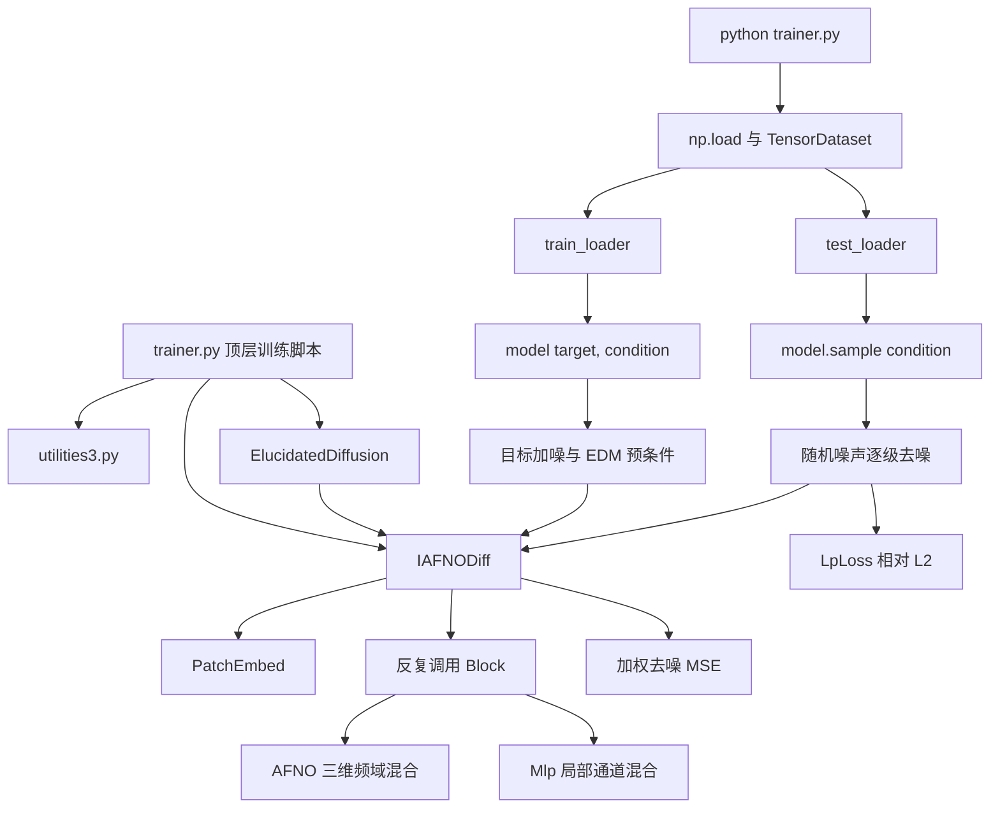

# DiAFNO 适配 PRE_ocean_data 的“前 7 天 → 后 15 天”预测评估

> [!abstract] 结论先行
> 本文只讨论一个任务：使用 PRE_ocean_data 连续 7 天的三维原始 `u/v` 流场，预测未来 15 天的三维原始 `u/v` 流场。不覆盖其他数据集，也不设计多数据集通用框架。
>
> 当前仓库是面向三维湍流数据的条件式单步扩散预测原型，只实现 `t → t+1`，没有完整的 autoregressive rollout。针对 PRE，本报告选择“7 天条件的单步模型 + 自回归滚动 15 次”作为第一版时间建模路线。原始 `u` 和 `v` 位于不同的 ROMS C 交错网格，不能直接堆叠为两个通道；实施前必须先确定共同网格表示，同时保持变量仍是网格方向的 `u/v`，不能未经导师同意替换成旋转后的正东/正北分量。

> [!note] 2026-08-24 同步后状态
> 本报告首次完成后，分支已移除 `IAFNODiff` 构造和 padding 中的强制 CUDA 绑定，新增 `load_checkpoint`、`checkpoint_path` 与 `smoke_test.py`。这些变更解决了核心模型的 CPU/device 冒烟问题，但尚未实现 PRE 数据管线或 7→15 rollout。本文是实施前的任务收敛文档，不表示代码改造已经完成。

## 0. 分析范围与结论标记

本报告完整检查了以下文件：

- `IAFNO.py`：367 行；
- `diffusion.py`：289 行；
- `trainer.py`：261 行；
- `utilities3.py`：322 行；
- `README.md`：29 行。

同时检查了 `requirements-lock.txt`、`environment.yml` 和 `docs/PRE_ocean_data.md`。当前已有 CPU smoke test，但没有执行真实 PRE 数据训练；训练路径和数据路径仍是占位字符串。

下文使用三种标记：

- **源码确认**：代码可直接证明；
- **README 确认**：项目说明明确陈述；
- **PRE 文档确认**：由当前仓库的 `docs/PRE_ocean_data.md` 确认；
- **待确认**：现有源码和数据说明都不能决定，必须由实验要求或真实样例确认。

## 1. 文件作用与调用关系

### 1.1 总体调用图



### 1.2 `trainer.py`

**作用：** 当前唯一的可执行训练脚本。它把配置、数据加载、数据切窗、归一化统计、模型构造、优化器、训练循环、测试循环和 checkpoint 保存全部放在模块顶层。

关键位置：

- 导入 `ElucidatedDiffusion` 与 `IAFNODiff`：`trainer.py:23-24`；
- 数据加载及切窗：`trainer.py:75-93`；
- 归一化统计与 `sigma_data` 计算：`trainer.py:95-130`；
- `DataLoader`：`trainer.py:134-140`；
- `IAFNODiff` 构造：`trainer.py:142-154`；
- `ElucidatedDiffusion` 包装：`trainer.py:158-164`；
- 训练与测试：`trainer.py:186-241`；
- 每轮保存权重与损失：`trainer.py:249-261`。

由于没有 `if __name__ == "__main__":`，导入 `trainer.py` 也会立刻尝试加载数据并开始训练。

### 1.3 `IAFNO.py`

**作用：** 定义扩散模型使用的三维 IAFNO 去噪骨干。

主要组件：

| 组件 | 位置 | 作用 |
| --- | --- | --- |
| `SinusoidalPosEmb` | `IAFNO.py:38-52` | 把扩散噪声等级编码成正余弦向量；不是物理时间编码。 |
| `RMSNorm` | `IAFNO.py:54-61` | 对通道维做归一化。 |
| `PatchEmbed` | `IAFNO.py:71-91` | 把空间块通过 `Conv3d` 投影成 token embedding。 |
| `Mlp` | `IAFNO.py:95-117` | 每个空间 token 上的通道 MLP。 |
| `Block` | `IAFNO.py:121-157` | `LayerNorm → AFNO → 残差 → MLP → 残差`。 |
| `AFNO` | `IAFNO.py:161-226` | 对三个 token 空间轴做 FFT、分块复数线性变换、稀疏收缩和逆 FFT。 |
| `IAFNODiff` | `IAFNO.py:230-367` | 条件拼接、扩散时间调制、patch 编解码、隐式迭代与输出重建。 |

`IAFNO.py:19` 仍使用 `from utilities3 import *`，但 padding 已改用 `x.new_zeros` 跟随输入的 dtype/device，不再依赖 `utilities3.py` 的全局 `device`。

### 1.4 `diffusion.py`

**作用：** 实现 EDM 风格的扩散训练与采样外壳，具体去噪函数由传入的 `net` 提供。

关键位置：

- EDM 预条件系数：`c_skip`、`c_out`、`c_in`、`c_noise`，`diffusion.py:100-110`；
- 条件去噪调用：`preconditioned_network_forward`，`diffusion.py:115-134`；
- 噪声日程：`sample_schedule`，`diffusion.py:141-151`；
- 三维 Euler/Heun 采样：`sample`，`diffusion.py:153-212`；
- 训练损失：`forward`，`diffusion.py:259-289`。

`sample_using_dpmpp` 位于 `diffusion.py:214-249`，但它创建的是四维 `[B, C, H, W]` 噪声，而且没有向骨干传入外部条件，与当前三维 `IAFNODiff` 接口不兼容；当前训练脚本没有调用它。

### 1.5 `utilities3.py`

**作用：** 通用数据读取、归一化、损失和参数计数工具集合。

| 组件 | 位置 | 当前是否被主流程使用 |
| --- | --- | --- |
| `load_checkpoint` | `utilities3.py:17-30` | 可加载纯模型 state dict，也兼容包含 optimizer/scheduler/scaler state 的字典。 |
| `MatReader` | `utilities3.py:32-83` | 未使用；支持旧版 MAT 和 HDF5 MAT。 |
| `UnitGaussianNormalizer` | `utilities3.py:86-121` | 未使用。 |
| `GaussianNormalizer` | `utilities3.py:124-147` | 未使用。 |
| `RangeNormalizer` | `utilities3.py:150-171` | 未使用。 |
| `LpLoss` | `utilities3.py:174-218` | 测试阶段使用；默认返回逐样本相对 L2 后取均值。 |
| `HsLoss` | `utilities3.py:221-285` | 未使用。 |
| `DenseNet` | `utilities3.py:288-314` | 未使用。 |
| `count_params` | `utilities3.py:318-322` | `trainer.py:182` 使用。 |

### 1.6 `README.md`

**作用：** 说明项目论文、原始应用、数据下载和引用信息。它没有给出安装命令、数据数组 schema、训练命令、checkpoint 恢复或推理示例。

README 明确把 DiAFNO 描述为 IAFNO 与 diffusion 的组合，用于三维湍流的 autoregressive prediction（`README.md:1-8`）；数据链接位于 `README.md:10-12`。

## 2. 当前训练入口

**源码确认：** 训练入口是 `trainer.py` 的模块顶层，通常只能通过以下形式启动：

```powershell
python trainer.py
```

但仓库当前不能直接运行：

- `np.load('your dataset')` 是占位路径，见 `trainer.py:77`；
- 归一化信息目录是占位字符串，见 `trainer.py:97`；
- checkpoint 保存目录是占位字符串，见 `trainer.py:249`；
- 没有 CLI 参数、配置文件解析或主函数；`checkpoint_path` 提供了基础权重加载，但当前 checkpoint 保存格式不含 epoch、optimizer、scheduler 或 scaler 状态，不能视为完整断点续训。

## 3. Dataset 与 DataLoader 在哪里定义

**源码确认：** 没有自定义 `Dataset` 类。虽然 `Dataset` 在 `trainer.py:10` 被导入，但没有实现或实例化。

当前数据管线全部位于 `trainer.py:77-140`：

1. `np.load` 读取完整 NPY 数组；
2. `data[0:trainset_num, ..., 0:3]` 只保留前 `trainset_num=20` 个 case 和最后一维前 3 个变量；
3. 双层循环构造时间窗口；
4. `torch.utils.data.TensorDataset(data_set[:, 0, ...], data_set[:, 1, ...])` 构造输入/目标对；
5. `random_split` 按样本随机划分 80% train、20% test；
6. 使用两个 `torch.utils.data.DataLoader`。

当前没有 validation dataset/loader。随机划分发生在高度重叠的时间窗口之后，因此相邻时刻、同一条轨迹的样本可能同时进入 train 和 test；对时空预测而言存在明显的信息泄漏风险。

## 4. 当前模型输入 tensor shape

需要区分“原始数据”“扩散模型接口”和“IAFNO 骨干输入”。

### 4.1 原始与 DataLoader shape

根据 `trainer.py:77-92` 的索引方式，源码预期原始数组为：

```text
[N_case, N_time, X, Y, Z, C_all]
```

当前切片后：

```text
data: [最多 20, N_time, X, Y, Z, 3]
```

当前默认 `InferenceWidth=1` 时：

```text
data_set: [N_window, 2, X, Y, Z, 3]
xx:       [B, X, Y, Z, 3]
yy:       [B, X, Y, Z, 3]
```

模型配置固定 `X=64, Y=65, Z=32`，所以实际期望为：

```text
xx, yy before rearrange: [B, 64, 65, 32, 3]
```

### 4.2 `ElucidatedDiffusion` 接口 shape

`trainer.py:198-203` 把训练样本转成 channel-first：

```text
xx: [B, 3, 64, 65, 32]  # 条件场，即当前帧
yy: [B, 3, 64, 65, 32]  # 目标场，即下一帧
loss = model(yy, xx)
```

因此 `ElucidatedDiffusion.forward(images, self_cond)` 中：

- `images` 是要加噪并复原的未来目标 `yy`；
- `self_cond` 是外部条件 `xx`。

### 4.3 `IAFNODiff` 实际接收 shape

扩散模块把加噪目标传给 `IAFNODiff.forward(x, time, x_self_cond)`：

```text
x:           [B, 3, 64, 65, 32]  # 加噪后的目标
x_self_cond: [B, 3, 64, 65, 32]  # 当前帧条件
time:        [B]                  # 扩散噪声等级的编码输入
```

`IAFNO.py:311-313` 沿通道维拼接后：

```text
[B, 6, 64, 65, 32]
```

这解释了 `IAFNODiff.__init__` 在 `self_condition=True` 时把传入的 `in_chans=3` 内部翻倍为 6（`IAFNO.py:252`）。这里的 `self_condition` 实际承担“外部前一帧条件”的作用；标准 diffusion self-conditioning 代码在 `diffusion.py:274-280` 已被注释掉。

## 5. 当前模型输出 tensor shape

`IAFNODiff.head` 在 `IAFNO.py:275` 输出每个 patch 的 `out_chans × patch_volume`，`IAFNO.py:349-366` 再还原空间网格并切掉 padding。

当前输出为：

```text
IAFNODiff output:             [B, 3, 64, 65, 32]
ElucidatedDiffusion.sample:   [B, 3, 64, 65, 32]
test rearrange 后的 pred:     [B, 64, 65, 32, 3]
```

`ElucidatedDiffusion.sample` 最终把 `[-1, 1]` 映射回 `[0, 1]`，见 `diffusion.py:211-212`。`trainer.py:233-234` 再使用训练集的 `y_min/y_max` 恢复物理量范围。

> [!warning] shape 检查不完整
> `diffusion.py:260-263` 只显式检查 `H`、`W` 和通道数，没有检查实际 `Z` 是否等于 `image_size_z`。不过错误的 `Z` 后续通常仍会在位置 embedding、patch 重建或条件拼接处失败。

## 6. 时间维度如何组织

### 6.1 物理时间

物理时间最初位于原始数组的第 2 维，即索引 1：

```text
[case, time, x, y, z, variable]
```

`trainer.py:86-90` 先抽取长度为 `InferenceWidth + 1` 的窗口，但 `trainer.py:92` 无条件只取 `data_set[:, 0, ...]` 和 `data_set[:, 1, ...]`。因此：

- 当前 `InferenceWidth=1` 时，得到 `t → t+1`；
- 把 `InferenceWidth` 改大只会让临时窗口变长，模型仍只看到第 0、1 帧；
- `InitialInterval` 只出现在文件名和日志语义中，未参与索引，见 `trainer.py:58,98`；
- 进入网络后没有独立的物理时间轴，也没有对时间做 FFT/attention；当前历史长度实质上是 1。

### 6.2 扩散时间

`IAFNODiff.forward` 的 `time` 是扩散噪声等级 `c_noise(sigma)`，由 `diffusion.py:123-126` 传入。它通过 `SinusoidalPosEmb` 和 scale-shift 调制卷积特征（`IAFNO.py:277-328`）。

它不是：

- 数据的日期/时刻；
- 输入帧序号；
- lead time；
- 预报第几帧。

## 7. IAFNO/FNO 在模型中的作用

仓库中没有名为 `FNO` 的独立类，实际实现是 AFNO，并通过重复共享 block 形成 IAFNO 风格骨干。

### 7.1 AFNO 的空间频域混合

`AFNO.forward` 位于 `IAFNO.py:178-226`：

1. 输入 token shape 为 `[B, Xp, Yp, Zp, embed_dim]`；
2. `torch.fft.rfftn(..., dim=(1, 2, 3))` 只沿三个 patch 后的空间轴做 FFT；
3. embedding 通道被分成 `num_blocks`；
4. 对复数频谱做两层分块线性变换与 ReLU；
5. `softshrink` 施加频谱稀疏化；
6. 逆 FFT 回到空间域并与输入残差相加。

因此 AFNO 的主要作用是低复杂度地建立全局空间耦合，帮助扩散去噪阶段恢复全局一致的三维结构。它不负责 diffusion noise schedule，也不直接组织历史时间。

### 7.2 IAFNO 的“隐式”重复

`IAFNODiff.forward_features` 位于 `IAFNO.py:292-307`。当前配置 `explicit_layer=4, implicit_layer=4` 时，代码反复调用同一组 4 个 `Block`，共 4 轮；同一个 block 的权重跨隐式轮次共享。外层使用系数 `1 / (implicit_layer × explicit_layer)` 做残差更新。

这里还有一个源码风险：`IAFNO.py:298` 使用位运算符 `&` 写条件，而不是逻辑 `and`。当前 `4/4` 配置进入 `else` 分支，结果明确；对其他尤其是奇数 `nlayer` 配置，表达式语义可能偏离注释意图。

### 7.3 空间 patch 与 padding

当前配置：

```text
真实网格 dim_f = [64, 65, 32]
模型网格 dim   = [64, 66, 32]
patch_size      = [2, 2, 2]
```

`IAFNO.py:335-345` 在 y 方向补 1 个零点，使各轴能被 patch size 整除；输出时再删除该点（`IAFNO.py:359-364`）。该实现每个不等轴只会补 1 个点，并不是通用任意长度 padding。

## 8. diffusion 模块在预测流程中的作用

### 8.1 训练

`ElucidatedDiffusion.forward` 的数据流为：

```text
真实未来场 yy（先归一化至 [0, 1]）
    → 映射至 [-1, 1]
    → 从 log-normal 分布采样 sigma
    → 加高斯噪声
    → 以当前场 xx 为条件调用 IAFNODiff
    → EDM 预条件组合得到 denoised
    → sigma 加权逐元素 MSE
```

对应代码：`diffusion.py:253-289`。训练的本质是学习条件分布中的去噪器，而不是直接用普通回归损失拟合 `xx → yy`。

### 8.2 推理

`ElucidatedDiffusion.sample(xx)` 从 `[B, C, H, W, Z]` 的随机高斯噪声开始，按噪声日程逐步降低 `sigma`。每一步都把同一个条件 `xx` 传给 IAFNO；除最后一步外还使用二阶 Heun 修正。对应 `diffusion.py:153-212`。

因此 diffusion 的作用是：

- 表达给定过去场后未来场的条件分布；
- 通过多次去噪生成一个未来样本；
- 保留随机性，可用于生成 ensemble。

它当前不负责：

- 构造历史 7 帧窗口；
- 生成物理 lead-time 编码；
- 把输出回灌形成 autoregressive rollout；
- 处理 PRE 曲线网格的坐标、海陆 mask 或变量。

## 9. `trainer.py` 的训练、验证、测试流程

### 9.1 训练前处理

1. 固定随机种子 123，选择 CUDA/CPU，见 `trainer.py:26-34`；
2. 载入 NPY 并截取前 20 个 case、前 3 个变量、前 200 个时间索引，见 `trainer.py:54,77-88`；
3. 构造相邻帧样本并随机 80/20 划分，见 `trainer.py:86-93`；
4. 仅从 train 输入帧计算每变量 min/max 和整体标准差 `sigma`，见 `trainer.py:108-130`；
5. 构造 IAFNO、EDM、Adam 和 CosineAnnealingLR，见 `trainer.py:142-171`；
6. `checkpoint_path` 非空时加载 checkpoint，见 `trainer.py:173-174`。

### 9.2 训练循环

`trainer.py:186-210`：

- 输入与目标都做 per-variable min-max 归一化；
- 调整成 `[B, C, X, Y, Z]`；
- 调用 `model(yy, xx)`；
- 使用 AMP 与 `GradScaler` 反向传播；
- 记录的是 EDM 的 sigma 加权去噪 MSE。

### 9.3 验证流程

**不存在独立验证流程。** 没有 validation split、validation loader、early stopping 或 best-checkpoint 选择。名为 `test_loader` 的数据在每个 epoch 都被评估，实际上承担了验证集的使用方式。

### 9.4 测试循环

`trainer.py:212-241`：

- 使用 `model.sample(xx)` 完成 32 步扩散采样；
- 计算归一化空间中的 `LpLoss`；
- 反归一化后再次计算 `LpLoss`；
- 每轮把 checkpoint 写入新文件。

注意：变量名 `mse_test` 和 `mse_real` 不准确。这里使用的是 `utilities3.py:202-217` 的相对 L2 loss，不是 MSE。

### 9.5 当前训练流程的源码级限制

以下均由源码直接可见：

- `scheduler` 被创建，但没有任何 `scheduler.step()`，学习率实际不会按 cosine schedule 更新；
- `count` 先取真实时间长度，随后被硬编码覆盖为 200，见 `trainer.py:82-83`；
- min-max 除法没有 epsilon，常量变量会导致除零；
- 归一化信息目录在保存前没有创建；
- `pred` 的 `rearrange` 显式指定 `bs=batch_size`，最后一个不足 batch 的测试批次可能不满足该约束；
- 每个 epoch 都保存完整权重，没有 best/last 策略；
- `random_split` 未传入独立 generator，且只设置了 `torch.manual_seed`，结果在当前进程通常可复现，但数据切分仍不具有按时间或 case 隔离的科学含义；
- 核心 IAFNO 的强制 `.cuda()` 与 padding 全局 device 依赖已经移除；`utilities3.py` 中遗留的 `.cuda()` 是 reader/normalizer 的可选便捷方法，不会在主流程中自动执行；
- `environment.yml` 已无绝对 Linux prefix，但它没有声明 `xarray`，也没有给出安装 `torch==2.4.1+cu124` 所需的 wheel 来源；它与 `requirements-lock.txt` 仍不是完全等价的可复现环境；
- `checkpoint_path` 虽把 optimizer/scheduler/scaler 传给加载器，但当前保存端只写 `model.state_dict()`，因此实际只能恢复模型权重，且不会恢复已完成 epoch。

## 10. 当前代码原本针对的数据与任务

### 10.1 README 确认

项目面向三维湍流的长期预测，覆盖：

- 强迫均匀各向同性湍流（forced HIT）；
- 衰减均匀各向同性湍流（decaying HIT）；
- `Re_tau ≈ 395` 与 `Re_tau ≈ 590` 的湍流槽道流。

见 `README.md:2-12`。

### 10.2 源码确认

当前实现固定使用 `64 × 65 × 32` 三维网格和最后一维前 3 个变量，训练相邻时刻的条件单步生成任务。源码没有变量名；结合三维湍流背景，前 3 个变量很可能是三分量速度，但这一语义仍需通过数据说明或真实数组确认，不能仅凭 `[..., 0:3]` 断言。

## 11. 当前代码是否已有 autoregressive prediction

**结论：当前提交的训练/测试代码没有实现完整 autoregressive prediction。**

证据：

- Dataset 只构造相邻帧 `t → t+1`，见 `trainer.py:86-93`；
- 测试只调用一次 `model.sample(xx)`，见 `trainer.py:229`；
- 预测 `pred` 没有追加到历史窗口，也没有再次作为下一步条件；
- `diffusion.sample` 的多次循环是在同一个输出场上的扩散去噪步骤，不是多个物理时间步。

README 的论文级描述确实宣称 autoregressive framework，但该仓库版本没有把 rollout 循环放进 `trainer.py` 或其他文件。当前模型可以作为 autoregressive rollout 的单步算子，但“可以被外部重复调用”不等于“当前代码已经实现”。

## 12. PRE_ocean_data 任务定义

### 12.1 导师给定的目标变量

本文按以下目标执行，不再自行替换变量：

```text
数据集：PRE_ocean_data
时间分辨率：日平均，frame_stride = 1 天
输入：连续 7 天的三维原始 u、v
输出：随后 15 天的三维原始 u、v
预测方式：单步条件扩散模型，自回归滚动 15 次
垂向范围：全部 30 个 s_rho 层
```

`u/v` 是 ROMS 曲线 C 网格原始方向上的三维流速分量，单位 m/s：

```text
u: [T, s=30, eta_u=400, xi_u=440]
v: [T, s=30, eta_v=399, xi_v=441]
T = 10591
```

它们不是深度平均的 `ubar/vbar`，也不是旋转到地理正东/正北方向的 `u_eastward/v_northward`。除非导师重新限定任务，本文不再默认只取表层，30 个 sigma 层均属于输入和预测目标。

### 12.2 首要适配问题：`u/v` 位于不同交错网格

`u` 位于相邻 rho 点的 xi 方向面中心，`v` 位于相邻 rho 点的 eta 方向面中心，因此二者水平 shape 不同、物理采样位置也不同。以下做法不成立：

- 直接把原始 `u/v` 沿通道轴堆叠；
- 仅裁掉一行或一列，使 shape 相同后就当作同一位置；
- 为了方便建模，未经确认直接改用正东/正北派生变量。

现有 `IAFNODiff` 只接受所有通道共享同一空间网格的单个 tensor。第一版最小可行方案建议为：

1. 从原始 `u/v` 出发；
2. 使用标准 C-grid 插值，将两者分别插值到 rho 点；
3. 不进行 `angle` 旋转，保留网格 xi/eta 方向的 `u/v` 语义；
4. 将派生结果明确命名为 `u_on_rho/v_on_rho`，避免与原始交错数组或正东/正北分量混淆；
5. 在 rho 网格上联合训练两通道模型。

这一步属于**空间表示变换，不是目标变量替换**。但它改变了原始采样位置，开始写代码前仍应向导师确认“允许把原始 `u/v` 插值到共同 rho 网格”。如果要求输出严格保持原生 u/v 网格，则需要双网格输入/输出或分别建模，改动明显更大，不应在当前文档里假装已经解决。

### 12.3 选定 autoregressive 时间路线

在 `u/v` 已被对齐到共同网格的前提下，每个训练样本使用过去 7 天预测下一天：

```text
history: [B, 7, 2, eta=400, xi=441, s=30]
condition after flatten: [B, 14, 400, 441, 30]
target: [B, 2, 400, 441, 30]
```

原始 NPY 的顺序是 `[T, s, eta, xi]`，送入当前 IAFNO 前需要显式转置，使 30 个垂向层作为第三个空间维度，而不是把深度折叠进通道。

推理时重复以下操作 15 次：

1. 用当前 7 帧历史预测下一帧；
2. 移除最旧帧；
3. 把预测帧追加到历史末尾；
4. 保存该 lead day 的结果。

最终共同网格预测 shape 为 `[B, 15, 2, 400, 441, 30]`。这条路线保留了原论文/README 的自回归思想，单次目标仍是两个变量通道。代价是 rollout 误差会累积，因此指标必须分别报告第 1～15 天。

第一版训练先采用单步 teacher forcing。只有单步、15 步 rollout 和 persistence baseline 均可运行后，再判断是否需要多步 loss、scheduled sampling 或 curriculum。

> [!important] 为什么不能只改一个参数
> 对齐后，PRE 条件是 14 通道，单步目标是 2 通道。`IAFNODiff` 当前却假设条件和加噪目标都有 `in_chans` 个通道，因此必须分开定义 `condition_channels`、`target_channels` 和 `out_channels`。

### 12.4 数据窗口和时间切分

PRE 时间范围为 1994-01-01T12 至 2022-12-30T12，共 10591 个连续日平均时刻。数据窗口必须在时间切分之后分别生成，不能先生成高度重叠窗口再 `random_split`，否则相邻日期会跨集合泄漏。

建议首轮实验使用连续年份切分：

| 集合 | 建议时间范围 | 用途 |
| --- | --- | --- |
| train | 1994-01-01 至 2016-12-31 | 训练模型、计算归一化统计量 |
| validation | 2017-01-01 至 2019-12-31 | 选择 checkpoint 和超参数 |
| test | 2020-01-01 至 2022-12-30 | 最终 15 天 rollout 评估 |

这是实施建议，不是数据集官方划分。若导师已有规定，应替换边界，但仍必须保持连续时间切分。

单步训练样本至少需要连续 8 帧；完整 15 天评估样本需要连续 22 帧。窗口只能在各自 split 内部构造，不得跨越边界。PRE 文档记录时间连续、无缺失日，但加载时仍应断言时间差为 1 天，防止文件遗漏或排序错误。

### 12.5 数据 shape 与按需加载

Dataset 应在进入模型前保留明确的时间、变量和空间轴：

```text
native u:       [T, 30, 400, 440]
native v:       [T, 30, 399, 441]
aligned pair:   [T, 2, 400, 441, 30]  # 建议的 u_on_rho/v_on_rho
history:        [7, 2, 400, 441, 30]
next target:    [2, 400, 441, 30]
rollout target: [15, 2, 400, 441, 30]
```

只有进入模型前才把 `[7, 2]` 展平为 14 个条件通道，评估和可视化时保留时间、变量、垂向层轴。

`u.npy` 和 `v.npy` 各约 208 GiB，不能整体载入内存。Dataset 应使用内存映射或分块存储，只读取当前时间窗口，再完成网格对齐和轴转置。第一版只需一个专用 PRE Dataset，不建设多数据集抽象层。

### 12.6 C 网格 mask、NaN 与归一化

原始 `u/v` 的陆地区域为 NaN，比例约为 30.7%。它们必须分别使用对应的交错网格 mask：

```text
mask_u: [400, 440]
mask_v: [399, 441]
```

不能直接用 `mask_rho` 遮罩原始 `u/v`。如果把变量插值到 rho 网格，应从 `mask_u/mask_v` 同步构造各自的有效点 mask，并明确边界处理，最终才得到共同网格上的两个 mask。

建议处理顺序：

1. 检查 `u/v` 与 `mask_u/mask_v` 的 shape、NaN 分布一致；
2. 只使用 train 时间段，在各自有效点上分别计算 `u/v` 统计量；
3. 执行已确认的 C-grid 对齐，并保留对齐后的双变量 mask；
4. 第一版沿用扩散代码数值约定，将两个变量分别归一化到 `[0, 1]`；
5. 归一化后把无效点填为 0，但 loss 和指标仍必须使用 mask 排除这些位置；
6. 保存训练集统计量，在 validation/test/inference 中复用。

数据说明记录 `u` 存在约 7.0 m/s 的近岸/边界极值。实施前应先定位这些点，不能在未确认其物理含义前直接用全局极值归一化或擅自裁剪。

现有 `diffusion.py` 的 loss 不接收 mask，这属于必改接口。仅用 `nan_to_num` 消除 NaN 而不做 masked loss，会让无效区域主导优化结果。

### 12.7 三维 PRE 网格对 IAFNO 的影响

任务的共同表示预计为 `400 × 441 × 30`，分别对应 eta、xi 和 sigma 层。它是真正的三维场，不再增加 singleton 轴，也不改写成二维 AFNO。

该网格与当前 `64 × 65 × 32` 湍流原型相比大得多。即使 batch size 为 1，7 天条件、完整 30 层和扩散训练也可能无法在单卡上直接容纳，因此必须先做 shape-only 和最小 batch 显存测试，再决定：

- 缩小 embedding/blocks/modes；
- 采用带重叠的水平空间 patch；
- 或使用经过导师允许的空间降采样。

不能为迎合原模型把 30 层补成 32 层。候选 patch size 必须与 400、441、30 的 padding/cropping 规则一起记录，并保证输出恢复到原尺寸。

PRE 是区域曲线网格，水平两个方向都不是天然周期边界；sigma 层对应的物理深度还随水深变化。AFNO 对三个空间轴做 FFT，可能产生边界、海岸和垂向混合伪影，必须通过逐层图、mask 指标和 persistence baseline 验证。

## 13. 预计代码修改范围（本轮不实施）

| 文件 | 是否必须改 | PRE `u/v` 专用修改 |
| --- | --- | --- |
| `trainer.py` | 必须 | 替换占位读取；先按连续时间切分，再构造 7 天条件/单步目标；加入 validation 和 15 步 rollout；按 lead day、变量和垂向层保存指标。 |
| `IAFNO.py` | 必须 | 在共同网格方案下分离 14 个条件通道与 2 个目标/输出通道；适配 `400 × 441 × 30`；根据实测显存缩放网络和 patch 配置。 |
| `diffusion.py` | 必须 | 将采样噪声和输出 shape 绑定 2 个目标通道；适配新条件接口；让训练 loss 接收并广播两个变量各自的三维有效 mask。 |
| `utilities3.py` | 需要 | 提供基于 train 有效点的 `u/v` 归一化、masked RMSE/MAE 和零范数安全处理。 |
| `pre_dataset.py`（新） | 推荐 | 专门封装原始 `u/v` 按需读取、C-grid 对齐、30 层轴转置、7/15 窗口和时间连续性检查。 |
| `README.md` | 实现后必须 | 记录 `u/v` 的严格语义、原生与模型网格、对齐方法、时间切分、训练/推理命令和指标复现方式。 |

建议核心配置明确命名为：

```text
context_frames = 7
forecast_frames = 15
frame_stride = 1
input_variables = [u, v]
target_variables = [u, v]
vertical_levels = 30
grid_representation = rho_collocated_unrotated  # 待导师确认
condition_channels = 14
target_channels = 2
spatial_shape = [400, 441, 30]
native_u_shape = [400, 440, 30]
native_v_shape = [399, 441, 30]
native_masks = [mask_u, mask_v]
```

`InferenceWidth` 和 `InitialInterval` 当前语义与实现不一致。实现时应替换为上述明确配置，不能继续让一个参数同时暗示窗口宽度、通道数和预测跨度。

## 14. PRE `u/v` 专用评估方案

最低限度应包含 persistence baseline：把输入第 7 天的完整三维 `u/v` 重复 15 次。模型若不能稳定优于该基线，不应增加架构复杂度。

所有指标应逐 lead day 报告，并区分 `u`、`v`：

- 原生 u 网格上、仅 `mask_u == 1` 的 RMSE 和 MAE；
- 原生 v 网格上、仅 `mask_v == 1` 的 RMSE 和 MAE；
- 各 30 层分别统计，并额外给出有效点加权的全层汇总；
- 第 1、3、5、7、10、15 天的代表性表层、中层、底层真值/预测/误差图。

若模型在 rho 共同网格上输出，正式报告原生网格指标前，必须使用固定、可复现的 rho→u/v 重采样规则把预测映射回两个交错网格；不能把 rho 网格指标冒充原生 u/v 指标。是否还报告共同网格指标，可以作为补充，但必须明确标注。

扩散采样具有随机性。首次联调可固定随机种子；正式结果至少记录采样步数、随机种子和 checkpoint。多成员 ensemble 属于后续实验，不是第一版跑通条件。

## 15. 开始改代码前的只读验收清单

服务器可用后，按以下顺序检查真实 PRE 文件：

1. 确认 `u.npy`、`v.npy`、`mask_u.npy`、`mask_v.npy` 的真实路径、dtype 和 shape；
2. 抽查 30 个 sigma 层及层顺序，确认任务使用完整三维 `u/v`；
3. 向导师确认是否允许将原始 `u/v` 插值到共同 rho 网格，但不旋转方向；
4. 验证时间轴有 10591 个日平均时刻、严格递增且无断日；
5. 验证原始 `u/v` 的 NaN 分布分别与 `mask_u/mask_v` 一致；
6. 定位 `u` 的极值点，判断是有效近岸流速、边界值还是异常点；
7. 用少量连续窗口验证 C-grid 对齐、轴顺序、日期和 history/target shape；
8. 先跑 persistence baseline，再做最小 batch 的前向、loss、反向和 15 步 rollout；
9. 根据显存实测决定全网格、空间 patch、模型缩小或经批准的降采样方案。

> [!done] 当前结论
> 任务已经修正为 PRE_ocean_data 的日平均三维原始 `u/v` 预测，覆盖全部 30 个 sigma 层；时间路线仍推荐“7 天条件单步模型 + 15 步自回归 rollout”。当前唯一未定的关键技术决策是如何让交错的原始 `u/v` 进入同一模型；建议先向导师确认“不旋转方向、仅插值到共同 rho 网格”的方案。本次只修订分析文档，没有修改任何 Python 代码。
