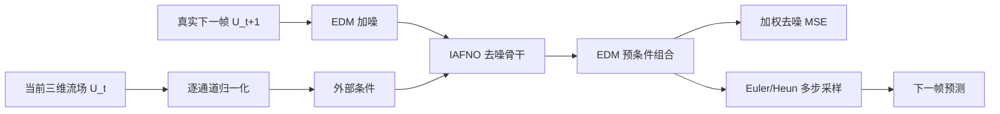
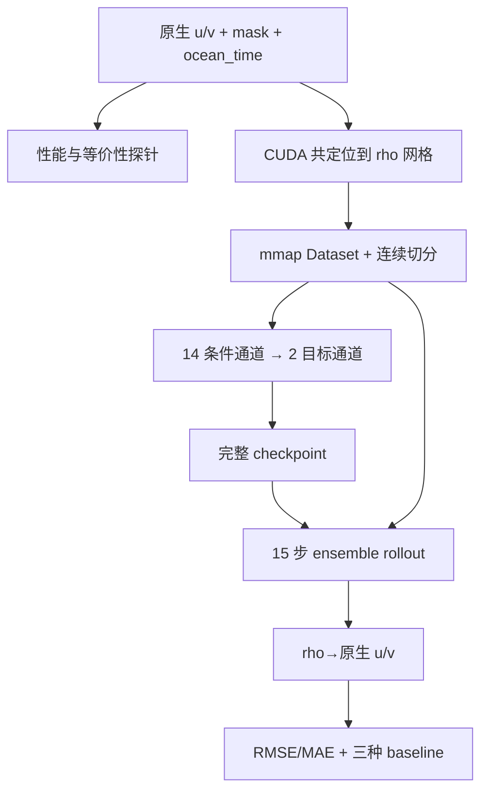

# DiAFNO 原始框架、PRE_ocean_data 迁移方案与执行现状

> 本文结合两份信息：
>
> - 这次改写前的“实施前源码分析与迁移计划”；
> - 当前 `adapt-weather-ocean` 分支已经完成的代码。
>
> 重点回答：原 DiAFNO 做什么、能否迁移、原计划要改什么、实际改了什么、执行到什么程度。由于 `IAFNO.py` 和 `diffusion.py` 已在本分支上做过兼容修改，本文只分析原框架，不逐行重建改造前源码。IAFNO 内部公式与 legacy shape 见 [IAFNO 网络架构说明](./IAFNO网络架构与公式对应.md)。

## 0. 直接回答四个问题

| 问题 | 回答 |
|---|---|
| 原 DiAFNO 是做什么的？ | 用 IAFNO 作为三维频域去噪骨干、用 EDM 扩散模型做条件生成，根据当前三维湍流场预测下一时刻；长期预测通过重复调用这个单步模型实现。 |
| 能否迁移到 PRE_ocean_data？ | **能迁移模型框架，不能直接替换数据。** 两个任务都是“条件三维场 → 下一时刻三维场”，但 PRE 的交错网格、海陆 mask、7 天历史、两变量、大文件和正式指标都不同。 |
| 迁移要改什么？ | 保留 IAFNO + EDM 核心；增加 u/v 共定位、mmap Dataset、连续时间切分、14→2 通道接口、masked loss、15 步 rollout、原生交错网格评估和完整训练恢复。 |
| 当前执行情况？ | **工程代码基本完成，但当前 surface diffusion 方案未通过科学验收。** SD1 和修复尺度后的 SD2 均已训练、消融并完成 15 天评估；SD2 day-1 与 15-day overall RMSE 分别为 persistence 的 2.201 倍和 1.640 倍。full3d 因未过 surface 门槛而暂停。 |

## 1. 原始 DiAFNO 代码是做什么的？

### 1.1 原始研究任务

原 DiAFNO 面向规则网格上的三维湍流长期预测。[README](../../README.md) 和论文背景包含：

- 强迫均匀各向同性湍流；
- 衰减均匀各向同性湍流；
- 不同摩擦雷诺数的湍流槽道流。

原任务把一个三维速度场作为当前状态，用条件扩散模型生成下一时刻速度场。把预测继续当作下一步条件，就形成自回归长期预测。

### 1.2 原始总体框架

`DiAFNO` 可以理解为 “Diffusion + IAFNO”：



各文件在原框架中的职责：

| 文件 | 原框架职责 |
|---|---|
| `trainer.py` | 数据加载、相邻帧切窗、归一化、模型构造、训练、单步测试、权重保存 |
| `IAFNO.py` | 三维空间骨干；patch embedding、三维 FFT、频域通道混合、隐式重复和输出重建 |
| `diffusion.py` | EDM 噪声分布、预条件系数、训练损失和 Heun 采样 |
| `utilities3.py` | 归一化器、相对 L2、参数量和 checkpoint 工具 |
| `README.md` | 论文任务、数据链接和引用信息 |

### 1.3 IAFNO 和 diffusion 分别解决什么？

- **IAFNO** 负责空间：在 patch 后的三个空间轴上做 Fourier 变换，用共享频域 MLP 建立全局耦合，再回到空间域。
- **EDM diffusion** 负责生成：对真实下一帧加噪，训练 IAFNO 复原；推理时从噪声逐步采样出下一帧。
- **外层 autoregressive loop** 负责物理时间：把单步预测回灌并重复调用模型。

所以原 DiAFNO 不是“直接一次输出很长未来”的模型，而是一个可重复调用的条件单步生成器。

### 1.4 原代码实际采用的数据与 shape

实施前文档从 legacy `trainer.py` 归纳出的原始假设是：

```text
raw:    [case, time, x, y, z, channel]
input:  [B, 3, 64, 65, 32]
target: [B, 3, 64, 65, 32]
condition history: 1 帧
```

`IAFNODiff` 把 3 通道条件与 3 通道加噪目标拼成 6 通道。真实网格 `64×65×32` 在 y 方向补成 `64×66×32`，再使用 `2×2×2` patch。

原框架默认规则三维域、三个同网格速度分量，数据可以整体 `np.load` 后在内存中构造样本。这些假设与 PRE 都不相同。

### 1.5 原仓库实现的边界

原论文描述 autoregressive prediction，但仓库中的 legacy `trainer.py` 只训练相邻帧并调用一次 `model.sample(xx)`。因此：

- 论文方法包含自回归思想；
- 原脚本只交付单步训练/测试；
- 完整多物理步 rollout 原本没有落在代码中。

实施前还记录了这些限制：

- 数据、归一化缓存和保存目录仍是占位字符串；
- 重叠窗口生成后使用随机 80/20 切分，不适合严格时序评估；
- 没有独立 validation；
- 数据整体载入，不适合数百 GiB 文件；
- 没有海陆 mask；
- 条件通道数被假定等于目标通道数；
- 原 checkpoint 只保存模型权重，不能完整恢复训练；
- legacy `trainer.py` 的 `InferenceWidth` 变大也不会真正形成多帧条件。

这些限制说明原代码是论文原型，不是可以直接套海洋数据的通用框架。

## 2. 能不能迁移到 PRE_ocean_data？

### 2.1 为什么可以迁移？

两个任务共享同一抽象：

```text
过去状态作为条件
→ 学习下一状态的条件分布
→ 单步采样
→ 预测回灌
→ 多步预报
```

PRE 也是三维场，因而可以复用：

- IAFNO 的三维 patch 与频域全局混合；
- EDM 的条件去噪训练；
- Heun 采样；
- 单步模型 + 外层 autoregressive rollout；
- stochastic ensemble。

因此不需要重建一种全新模型，迁移重点在模型外围和通道接口。

### 2.2 为什么不能直接换数据路径？

| 项目 | 原 DiAFNO | PRE_ocean_data | 必须处理的问题 |
|---|---|---|---|
| 变量 | 三个同网格速度分量 | 原始 u/v 位于两个 C-grid 交错网格 | 不能直接沿通道堆叠 |
| 历史条件 | 1 帧 | 连续 7 天 | 条件通道变为 14 |
| 输出 | 下一帧 3 通道 | 下一天 u/v 2 通道 | 条件与目标通道必须解耦 |
| 长期预测 | 原脚本无外层 rollout | 未来 1～15 天 | 必须实现 15 步回灌 |
| 网格 | 64×65×32 规则网格 | 400×441×30 曲线海洋网格 | patch、显存和边界风险都变化 |
| 有效域 | 基本全域有效 | 陆地 NaN，u/v mask 不同 | 统计、loss、指标必须 masked |
| 数据组织 | 多 case，可整体载入 | 单条 10591 天轨迹；单变量约 209 GiB | 必须 mmap 和分块 |
| 数据切分 | random split | 连续时间 train/val/test | 必须避免窗口泄漏 |
| 正式评估 | 相对 L2 | 原生 u/v 网格逐 lead day RMSE/MAE | 必须 rho→native 和 baseline |
| 边界物理 | 近似周期湍流域 | 海岸、非周期边界、sigma 层 | Fourier 伪影需要额外验证 |

结论：

> **可以迁移 DiAFNO 的模型框架，但不能复用原 `trainer.py` 的数据与评估假设。**

## 3. 改造前文档原先记录了哪些迁移要求？

本节保留这次改写前文件中的实施前决策和修改清单，再在第 4 节对照实际实现。

### 3.1 原先收敛的任务定义

```text
数据集：PRE_ocean_data
时间分辨率：日平均，frame_stride = 1 天
输入：连续 7 天的三维原始 u、v
输出：随后 15 天的三维原始 u、v
方法：单步条件扩散模型，自回归滚动 15 次
垂向范围：全部 30 个 s_rho 层
```

原生数据：

```text
u: [T, 30, 400, 440]
v: [T, 30, 399, 441]
T = 10591
```

目标是原始网格方向 u/v，不是 `ubar/vbar`，也不是旋转后的 `u_eastward/v_northward`。

### 3.2 原计划首先要解决的空间表示

旧文档明确指出三种错误做法：

- 直接堆叠 shape 不同的原生 u/v；
- 只裁掉一行/一列后假装处于同一位置；
- 未经任务确认直接替换成 east/north 派生变量。

当时建议的最小方案是：

1. 从原始 u/v 出发；
2. 用 C-grid 邻接关系共定位到 rho 点；
3. 不做 angle 旋转，保留 xi/eta 分量语义；
4. 保留各自对齐后的 mask；
5. 在共同 rho 网格训练两通道模型；
6. 正式评估时再映射回原生 u/v 网格。

这属于空间表示变换，不是目标变量替换。

### 3.3 原计划的时间建模路线

旧文档选定“7 天条件的单步模型 + 15 次 rollout”：

```text
history:   [B, 7, 2, 400, 441, 30]
condition: [B, 14, 400, 441, 30]
target:    [B, 2, 400, 441, 30]
rollout:   [B, 15, 2, 400, 441, 30]
```

每一步：

1. 用当前 7 天预测下一天；
2. 移除最旧一天；
3. 追加预测 u/v；
4. 保存当前 lead day；
5. 重复到第 15 天。

第一版只做单步 teacher forcing，不提前引入 scheduled sampling、curriculum 或多步 loss。只有单步、15 步 rollout 和 persistence 都跑通后，才考虑增加复杂度。

### 3.4 原计划的数据与统计要求

旧文档要求：

- 先按连续年份切分，再在各 split 内生成窗口；
- train 只用于训练和统计量；
- validation 用于 checkpoint/超参数选择；
- test 只用于最终 15 天评估；
- 单步样本至少 8 帧，正式评估窗口至少 22 帧；
- u/v 大文件使用 mmap 或分块，不能整体加载；
- u/v 分别使用 `mask_u` / `mask_v`；
- 对齐后仍保留双变量 mask；
- u/v 分别做 train-ocean min-max；
- 无效点可填 0，但 loss 和指标必须排除；
- 约 7 m/s 的 u 极值先定位，不能未经判断直接裁剪。

### 3.5 原计划预计修改哪些文件？

旧文档的预计范围与当前实际方案不完全相同：

| 旧计划 | 当时预计修改 | 当前实施方式 |
|---|---|---|
| `trainer.py` | 替换占位读取、连续切分、7 天条件、validation、rollout、逐层指标 | **没有把 PRE 塞进 legacy trainer**；改为新增 `pre_trainer.py`、`pre_evaluate.py`，保留原入口 |
| `IAFNO.py` | 分离 14 条件通道和 2 目标通道；适配 PRE shape/patch | 已实施 `cond_chans`，并保留 legacy 默认行为 |
| `diffusion.py` | 采样输出改为 2 通道；loss 支持双变量 mask | 已实施，shape 由模型配置驱动，mask 为可选参数 |
| `utilities3.py` | train-ocean 归一化、masked RMSE/MAE、零范数安全 | checkpoint 能力放在这里；PRE 指标拆到无副作用 `pre_metrics.py` |
| 新 `pre_dataset.py` | mmap、对齐、轴转换、7/15 窗口、连续时间检查 | 已实施；生产共定位进一步拆到 `scripts/preprocess_align_uv.py` |
| `README.md` | 记录变量语义、网格、切分、命令和指标 | 已更新，并增加 `PRE_runbook.md` |
| 原计划未单列 | ensemble、逐窗口 seed、rho-oracle、resume 尺度策略 | 实施时新增到 `pre_rollout.py`、`pre_evaluate.py`、`pre_config.py` |

实际方案比旧计划更稳妥的一点是：没有继续膨胀 `trainer.py`，而是建立 PRE 专用入口，同时只对 IAFNO/diffusion 做向后兼容的最小修改。

### 3.6 原计划的正式评估标准

旧文档要求最低包含 persistence：

```text
persistence = 把输入第 7 天 u/v 重复为未来 15 天
```

正式指标应：

- 在原生 u 网格只用 `mask_u==1` 计算 RMSE/MAE；
- 在原生 v 网格只用 `mask_v==1` 计算 RMSE/MAE；
- 分 lead day、变量和 30 个 sigma 层；
- 额外报告按有效点数汇总的整体指标；
- 保存第 1、3、5、7、10、15 天代表性图；
- 记录 sampling steps、seed 和 checkpoint；
- rho 预测必须先通过固定规则回到原生网格，不能把 rho 指标冒充原生指标。

这些要求已经成为当前 `pre_metrics.py` / `pre_evaluate.py` 的设计基础。

## 4. 实际迁移改了什么？

### 4.1 当前 PRE 数据流



当前文件职责：

| 文件 | 实际职责 |
|---|---|
| `scripts/profile_preprocess_align_uv.py` | scratch-only CPU/GPU/I/O 性能探针，调用正式 CUDA 实现做等价性检查 |
| `scripts/preprocess_align_uv.py` | CUDA 分块共定位、双 mask、极值追踪、24h 时间校验、aligned 输出 |
| `pre_config.py` | surface/full3d 预设、7/15/2 常量、sigma_data 换算、run tag、resume 尺度策略 |
| `pre_dataset.py` | mmap、连续 split、窗口、统计缓存、双 mask、原生真值 reader |
| `pre_metrics.py` | rho→native、masked sums、pooled RMSE、relative L2、rho-oracle |
| `pre_rollout.py` | 单成员/ensemble 15 步自回归、逐窗口 seed、autocast |
| `pre_trainer.py` | PRE 单步训练、validation、early stop、完整 resume |
| `pre_evaluate.py` | test rollout、三种 baseline、元数据、图片和带 tag 输出 |
| `pre_smoke_test.py` | 直接调用正式实现的合成回归测试 |

### 4.2 网格与 mask

当前生产预处理把：

```text
native u [T,30,400,440]
native v [T,30,399,441]
```

转换为：

```text
u_rho [T,30,400,441]
v_rho [T,30,400,441]
```

规则是相邻有效 face 的 NaN-aware mean，边界单侧复制，不旋转方向。`mask_u_rho` 和 `mask_v_rho` 使用同一 stencil 构造；`mask_uv` 只作为兼容交集。

预处理强制：

- `mask==1` 出现 NaN 立即失败；
- `mask==0` 的数值丢弃并计数；
- 首个 chunk 的 NaN 图样与各自 rho mask 完全一致；
- 10591 个时间戳严格递增且相邻恰好 24 小时。

### 4.3 Dataset 与任务 shape

当前固定连续切分：

```text
train [0, 8401)
val   [8401, 9496)
test  [9496, 10591)
```

每个样本：

```text
history:   [7, 2, 400, 441, Z]
condition: [14, 400, 441, Z]
target:    [2, 400, 441, Z]
Z = 1（surface_smoke）或 30（full3d）
```

条件通道顺序为：

```text
u(day0), v(day0), ..., u(day6), v(day6)
```

### 4.4 模型核心的兼容修改

`IAFNODiff` 当前把通道语义拆开：

```text
in_chans   = 2   # 加噪目标
cond_chans = 14  # 7 天 u/v 条件
out_chans  = 2   # 下一天 u/v
```

`cond_chans=None` 时仍回退为 legacy `cond_chans==in_chans`。此外：

- 去除了构造期强制 `.cuda()`；
- padding 改为 `x.new_zeros`；
- `ElucidatedDiffusion.forward(..., mask=None)` 支持 masked MSE；
- 不传 mask 时保持 legacy loss；
- 采样输出 shape 随 2 通道目标配置。

当前 PRE patch：

| preset | 空间 shape | patch | token grid | embed | implicit × explicit | batch |
|---|---:|---:|---:|---:|---:|---:|
| `surface_smoke` | 400×441×1 | 4×3×1 | 100×147×1 | 180 | 4×4 | 4 |
| `full3d` | 400×441×30 | 4×3×2 | 100×147×15 | 128 | 2×4 | 1 |

两者都精确整除，不触发 legacy 的单点 padding。

### 4.5 归一化与 sigma_data 修复

u/v 分别只在 train 海洋点上计算 min/max，默认不做 percentile clipping。陆地归一化后填 0，但训练与指标使用 mask 排除。

统计缓存的 pooled sigma 属于 `[0,1]` 空间；EDM 内部把目标变为 `[-1,1]`，所以当前新训练使用：

```text
sigma_data = 2.0 * stats["sigma"]
```

surface 实测由约 0.08560 修正为 0.17120。新 checkpoint 保存 `stats_sigma`、`sigma_data_scale`、`sigma_data`；评估优先读取 checkpoint，旧 checkpoint 走明确的兼容回退。

### 4.6 训练、rollout 与评估

`pre_trainer.py` 已实现：

- validation 和固定验证 seed；
- masked relative L2；
- 新 `torch.amp` API；
- optimizer 真更新后才推进 scheduler；
- 非有限 loss 中止；
- early stop；
- model/optimizer/scheduler/scaler/epoch/best/config 完整 checkpoint；
- `loss.dat` 完整历史；
- resume 尺度冲突策略和防覆盖预检。

`pre_rollout.py` 已实现：

1. 预测下一天 u/v；
2. 删除最旧两通道；
3. 追加预测；
4. 重复 15 次；
5. 每个 ensemble 成员保持独立历史；
6. 每个评估窗口使用独立 seed。

`pre_evaluate.py` 已实现 rho→native 正式评估及：

- persistence；
- zero；
- rho-oracle；
- 逐 lead day × u/v × sigma 层 RMSE/MAE；
- 有效点数加权 overall RMSE；
- 代表性图片；
- 可复现元数据；
- 输出存在时拒绝覆盖。

## 5. 修改执行到什么程度？

### 5.1 完成度总表

| 工作项 | 状态 | 说明 |
|---|---|---|
| 原框架与 PRE 差异分析 | 已完成 | 迁移边界和任务 shape 已明确 |
| rho 共定位与双变量 mask | 代码已完成 | CUDA 分块、时间、极值和 NaN 检查已实现 |
| 预处理性能探针 | 已完成 | scratch-only，可比较正式 CUDA 与 NumPy |
| mmap Dataset 与连续切分 | 已完成 | 不整体加载 209 GiB 变量 |
| 14 条件 → 2 目标接口 | 已完成 | `cond_chans` 向后兼容 |
| masked diffusion loss | 已完成 | legacy 无 mask 行为保留 |
| PRE 训练/validation/resume | 已完成 | 独立 `pre_trainer.py` |
| 15 步 rollout/ensemble | 已完成 | 独立 `pre_rollout.py` |
| 原生指标与 baseline | 已完成 | persistence/zero/rho-oracle |
| CPU/合成烟测 | 已完成 | `smoke_test.py` 通过；`pre_smoke_test.py` 32 个测试入口通过，其中 4 个 CUDA 专用测试体在 CPU 环境按设计跳过 |
| 旧 surface 训练与评估 | 已执行但失败 | day-1 model RMSE 约为 persistence 的 2.7～3.1 倍；15 天没有稳定胜出 |
| sigma_data 尺度修复 | 已完成 | 新 SD2 路径使用 2 倍尺度并与旧目录隔离 |
| 新 surface SD2 正式重训 | **已执行但未过门槛** | epoch 3 最佳 val relative L2=1.52958，epoch 5 early stop |
| lr=3e-4 surface 附属对照 | **已执行但更差（兄弟分支归档）** | 仓库外副本运行；Ep1 day-1 ratio=2.520，Ep10=2.922，不是系统学习率搜索 |
| day-1 采样消融 | **已完成但无合格组** | churn=0 优于 80；E=4 仅改善 4.4%，最佳仍为 persistence 的 1.911 倍 |
| 新 surface 15 天正式评估 | **已完成但失败** | day-1 ratio=2.201，15-day overall ratio=1.640 |
| 条件通路诊断 | **部分完成** | linear probe 优于 persistence，condition 确实生效；轨迹/敏感度探针尚未运行 |
| full3d 训练与评估 | **未执行** | 按 Go/No-Go 规则被 surface 失败阻塞 |
| 科学验收 | **未通过** | 当前 diffusion 方案未在独立 test 上优于 persistence |

### 5.2 旧实验说明了什么？

旧 SD1 结果见 [实验 01](../experiments/01_surface_sd1_baseline/RESULTS.md)，修复后的
SD2 结果分别见[重训](../experiments/02_surface_sd2_retrain/RESULTS.md)、
[采样消融](../experiments/03_sampler_ablation/RESULTS.md)和
[15 天 rollout](../experiments/04_surface_sd2_rollout/RESULTS.md)：

- aligned 生产数据已经生成；后续修正的 shape 泛化问题不影响当时生产 shape；
- 旧 surface 模型完成过训练和正式 test rollout；
- 旧模型明显差于 persistence；
- 排查发现 `sigma_data` 用错了 `[0,1]` 尺度；
- 同期还修正了 AMP、scheduler、非有限 loss、best checkpoint 和 resume 等问题。

旧实验只证明管线能运行。SD2 修复后 day-1 RMSE 改善 22.5%，15-day overall
改善 18.6%，但仍全面败于 persistence，因此也不能证明科学迁移成功。

### 5.3 原“实施前验收清单”的当前状态

| 旧清单 | 当前状态 |
|---|---|
| 确认 u/v/mask 路径、dtype、shape | 已由数据分析和预处理代码固定 |
| 确认 30 层顺序 | 已确认 0=海底、29=海面 |
| 确认允许不旋转、共定位到 rho 网格 | 代码已采用该方案；是否有仓库外正式确认记录，仓库内不可证明 |
| 验证 10591 天连续 | 已实现严格 24h 校验 |
| 验证 NaN 与 mask | 已实现全层检查和 fail-fast |
| 定位 u 极值 | 预处理会记录极值；物理解释仍需实验人员判断 |
| 验证窗口、轴顺序和 shape | 合成烟测已覆盖 |
| 跑 persistence 和最小前向/反向/rollout | 合成测试、SD1 和 SD2 真实评估均已覆盖 |
| 根据显存决定 full3d 配置 | 已提供保守预设，但真实 full3d 训练尚未完成 |

### 5.4 还差哪些实验才能闭环？

```text
condition-only 确定性 IAFNO / persistence-residual 基线
→ day-1 native RMSE 优于 persistence
→ 双 mask 输入和归一化/极值消融
→ 正式 surface 15 天评估通过
→ 再恢复 diffusion 并运行 sigma 轨迹诊断
→ full3d 探针、训练与评估
```

最低科学验收标准：

```text
每个 lead day 的原生 masked RMSE:
model / persistence < 1
```

surface 已在正确尺度和较优的 `churn=0` 配置下失败。当前应先建立 condition-only
确定性闭环，检查目标设计、mask、边界和归一化；不应直接扩大到 full3d 或继续增加
sampler 复杂度。具体证据见[条件诊断](../experiments/05_condition_diagnostics/RESULTS.md)。

### 5.5 当前准确的项目表述

应表述为：

> **DiAFNO 到 PRE_ocean_data 的工程迁移已经基本完成，合成回归测试通过；SD1 和 SD2 surface 实验均已完成并失败。当前证据表明任务有可预测信号且 condition 已接入，但 diffusion 模型没有形成可靠的条件预测器。full3d 按门槛暂停。**

不能表述为：

- 迁移已经科学成功；
- 模型已经优于 persistence；
- full3d 已验证；
- 当前 surface diffusion 模型具有可用的预测技能。

## 6. 当前入口与剩余风险

仓库根目录的验证入口：

```bash
python smoke_test.py
python pre_smoke_test.py
```

真实 PRE 执行顺序：

```text
profile_preprocess_align_uv.py（建议）
→ preprocess_align_uv.py（仅需重建 aligned 时）
→ pre_trainer.py
→ pre_evaluate.py
```

详细命令、覆盖风险和配置位置见 [PRE 运行手册](../operations/PRE_runbook.md)；
实验配置与结果见[实验索引](../experiments/README.md)。

尚存风险：

- AFNO 在海岸和非周期曲线网格上可能产生 Fourier 边界伪影；
- sigma 层不是固定物理深度，沿垂向 FFT 的物理合理性仍需验证；
- 15 步 autoregressive rollout 会累积单步偏差；
- diffusion 的随机采样未必适合 RMSE 点预测；现有 churn/ensemble 消融只能小幅改善；
- surface 结果不能代表 full3d；
- full3d 有 220,500 个 token，显存和 I/O 成本高；
- rho 共定位损失部分交错网格信息，必须保留 rho-oracle 作为转换误差下界；
- SD1/SD2 已共同说明“能运行”不等于“有预测技能”。

## 7. 最终结论

原 DiAFNO 是一个面向规则三维湍流场的“IAFNO 空间骨干 + EDM 条件扩散 + 单步自回归算子”框架。它能迁移到 PRE_ocean_data，因为任务抽象一致；但不能只改数据路径，必须重建网格、Dataset、历史条件、通道接口、mask、训练控制、rollout 和正式评估。

原先迁移文档提出的主要改造项已经落实，而且实际实现通过 PRE 专用 `pre_*.py` 文件避免破坏 legacy 入口。当前最准确的结论是：

> **工程迁移已落地；当前 surface diffusion 方案预测失败，需先重建可靠的确定性条件基线。**
