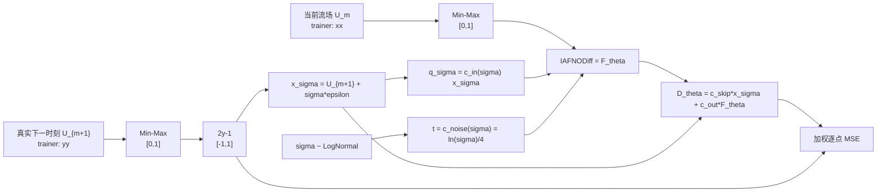
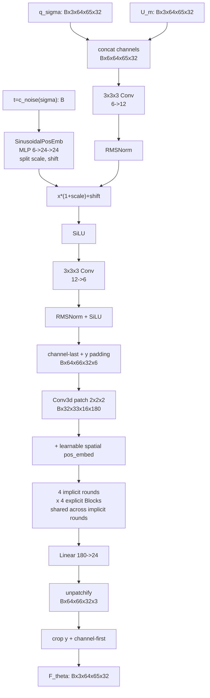

# IAFNO 网络架构、完整数据流与公式—代码对应

> 分析对象：[`IAFNO.py`](../../IAFNO.py)、[`diffusion.py`](../../diffusion.py)、[`trainer.py`](../../trainer.py)、
> [`pre_config.py`](../../pre_config.py)、[`pre_trainer.py`](../../pre_trainer.py)、[`pre_rollout.py`](../../pre_rollout.py)
>
> 论文依据：DiAFNO 论文、IAFNO 原论文、AFNO 原论文（链接见文末）
>
> 代码配置依据：原始湍流模板 `trainer.py` 与当前 PRE 预设 `pre_config.py`
>
> 本文只解释现有代码，不把论文设计、注释意图和实际执行结果混为一谈。已于 2026-08-28 同步：
> legacy 3→3 单步路径仍保留；PRE 路径已实现 14 条件通道→2 目标通道和 15 步外层 rollout。

## 1. 先给结论：`IAFNO.py` 在整个 DiAFNO 中负责什么

`IAFNODiff` 不是完整扩散模型，而是 EDM 预条件公式中的可训练去噪主干 $F_\theta$：

$$
D_\theta(x_\sigma;\sigma,U_m)
=c_{\mathrm{skip}}(\sigma)x_\sigma
+c_{\mathrm{out}}(\sigma)
F_\theta\!\left(c_{\mathrm{in}}(\sigma)x_\sigma,
c_{\mathrm{noise}}(\sigma),U_m\right).
\tag{1}
$$

其中：

- $U_m$：外部条件；legacy 为当前单帧，PRE 为过去 7 天按 day-major u/v 展平后的 14 通道；
- $U_{m+1}$：下一物理时刻的真实流场；
- $x_\sigma=U_{m+1}+\sigma\epsilon$：训练时加入噪声的下一时刻流场；
- $F_\theta$：`IAFNODiff.forward()`；
- $D_\theta$：`ElucidatedDiffusion.preconditioned_network_forward()`；
- `time` 表示扩散噪声等级 $c_{\mathrm{noise}}(\sigma)$，不是湍流的物理时间；
- `x_self_cond` 在这份代码中实际保存 $U_m$。它不是通常意义上“上一次去噪结果”的 self-conditioning；常规 self-conditioning 代码已在 `diffusion.py:178-203` 被注释掉。

现有实现可压缩成一条总公式：

$$
\boxed{
F_\theta(q_\sigma,t,U_m)
=Q\circ\operatorname{Crop}\circ
\Phi_{L,N}\circ
E_{\mathrm{patch}}\circ
\operatorname{Pad}\circ
S_t\!\left([U_m;q_\sigma]\right)
}
\tag{2}
$$

这里 $q_\sigma=c_{\mathrm{in}}(\sigma)x_\sigma$，$t=c_{\mathrm{noise}}(\sigma)$；$S_t$ 是噪声条件化卷积前端，$E_{\mathrm{patch}}$ 是 patch 与空间位置嵌入，$\Phi_{L,N}$ 是隐式—显式 AFNO 迭代核心，$Q$ 是线性投影与 unpatchify。

## 2. 完整数据流全景

### 2.1 训练路径



对应调用链：

```text
trainer.py:203
  model(yy, xx)
    -> diffusion.py:259-288  ElucidatedDiffusion.forward(images=yy, self_cond=xx)
      -> diffusion.py:115-134  preconditioned_network_forward(...)
        -> IAFNO.py:288-346  IAFNODiff.forward(q_sigma, t, U_m)
```

一个容易忽略的实际行为是：`yy` 在 `diffusion.py:265` 又从 $[0,1]$ 映射到 $[-1,1]$，但作为 `self_cond` 传入的 `xx` 没有执行这一步。因此当前训练代码拼接的是：

$$
\left[\widehat U_m^{[0,1]};\;
c_{\mathrm{in}}(\sigma)x_\sigma^{[-1,1]+\mathrm{noise}}\right],
\tag{3}
$$

而不是两个取值范围完全相同的张量。

### 2.2 采样与自回归路径

采样从 $y_0\sim\mathcal N(0,\sigma_{\max}^2I)$ 出发，在每个噪声等级调用同一个条件去噪器 $D_\theta(y_t;\sigma_t,U_m)$，用 Euler 预测和二阶 Heun 校正得到 $U_{m+1}^{\mathrm{pre}}$。论文的自回归设计是：

$$
U_0\rightarrow U_1^{\mathrm{pre}}
\rightarrow U_2^{\mathrm{pre}}
\rightarrow\cdots\rightarrow U_{m+1}^{\mathrm{pre}}.
\tag{4}
$$

原始 `trainer.py` 仍只调用一次 `model.sample(xx)`，没有论文式 (4) 的外层循环。PRE 路径已经在
`pre_rollout.py` 实现该循环：每一步从 14 通道历史预测 2 通道下一帧，删除最旧 u/v 两通道并追加预测；
`pre_evaluate.py` 默认滚动 15 步，还支持相互独立的 ensemble 成员和逐窗口 seed。

### 2.3 `IAFNODiff.forward()` 内部路径与 legacy 默认 shape

默认配置为：

| 符号 | 含义 | 当前值 |
|---|---|---:|
| $B$ | batch size | 4（训练） |
| $C_0$ | 单个流场通道数 | 3，即三个速度分量 |
| $C$ | 拼接后的有效输入通道 | $2C_0=6$ |
| $(H_f,W_f,D_f)$ | 原始网格 `dim_f` | $(64,65,32)$ |
| $(H,W,D)$ | padding 后网格 `dim` | $(64,66,32)$ |
| $(p_h,p_w,p_d)$ | patch size | $(2,2,2)$ |
| $(h,w,d)$ | token 网格 | $(32,33,16)$ |
| $E$ | embedding width | 180 |
| $k$ | AFNO channel blocks | 1 |
| $s=E/k$ | 每个 block 的通道宽度 | 180 |
| $f$ | hidden-size-factor | 4 |
| $N$ | explicit blocks，`ex_layer` | 4 |
| $L$ | implicit iterations，`nlayer` | 4 |
| $C_{out}$ | 输出通道 | 3 |

这张表与下方逐站 shape 是 legacy `trainer.py` 的 3 条件通道 + 3 加噪目标通道配置。当前构造器已把两者解耦：

| 路径 | `in_chans`（加噪目标） | `cond_chans`（外部条件） | stem 输入 | `out_chans` | 空间 / patch |
|---|---:|---:|---:|---:|---|
| legacy | 3 | `None` → 3 | 6 | 3 | 64×65×32 / 2×2×2（y 补到 66） |
| PRE surface | 2 | 14 | 16 | 2 | 400×441×1 / 4×3×1（精确整除） |
| PRE full3d | 2 | 14 | 16 | 2 | 400×441×30 / 4×3×2（精确整除） |

因此 PRE 的噪声 embedding、FiLM stem 中间通道和 head 宽度都由 16/2 通道配置派生；不能套用下面 legacy
例子中的 6、12、24。`cond_chans=None` 保留旧版 doubling，保证原始路径兼容。

逐站 shape 如下：

| 次序 | 操作 | 代码位置 | 输出 shape |
|---:|---|---|---|
| 1 | 输入缩放噪声场 $q_\sigma$ | `diffusion.py:123-126` | `[B,3,64,65,32]` |
| 2 | 与 $U_m$ 沿 channel 拼接 | `IAFNO.py:290-292` | `[B,6,64,65,32]` |
| 3 | `Conv3d(6,12,3,pad=1)` | `IAFNO.py:296` | `[B,12,64,65,32]` |
| 4 | RMSNorm + time scale/shift + SiLU | `IAFNO.py:297-304` | `[B,12,64,65,32]` |
| 5 | `Conv3d(12,6,3,pad=1)` + RMSNorm + SiLU | `IAFNO.py:306-308` | `[B,6,64,65,32]` |
| 6 | 转成 channel-last | `IAFNO.py:310` | `[B,64,65,32,6]` |
| 7 | 在 $y$ 轴末端补一层 0 | `IAFNO.py:319-321` | `[B,64,66,32,6]` |
| 8 | 非重叠 `Conv3d` patch embedding | `IAFNO.py:64-71` | `[B,32,33,16,180]` |
| 9 | 加可学习空间位置嵌入 | `IAFNO.py:272-275` | `[B,32,33,16,180]` |
| 10 | $4\times4=16$ 次显式 AFNO block 计算 | `IAFNO.py:281-284` | shape 不变 |
| 11 | 每个 token 线性映射 $180\to 2^3\times3=24$ | `IAFNO.py:327` | `[B,32,33,16,24]` |
| 12 | unpatchify | `IAFNO.py:328-337` | `[B,64,66,32,3]` |
| 13 | 删除补出的 $y$ 轴最后一层 | `IAFNO.py:340-341` | `[B,64,65,32,3]` |
| 14 | 转回 channel-first | `IAFNO.py:345` | `[B,3,64,65,32]` |

内部结构图：



## 3. 噪声条件化前端：对应论文式 (26)

DiAFNO 论文式 (26) 把输入写为：

$$
v(x,l=0)=P\left[\operatorname{ResNet}
\left(c_{\mathrm{in}}x;
\operatorname{SinuPosEmd}(c_{\mathrm{noise}})\right)\right].
\tag{论文 26}
$$

当前代码把这个表达式展开为以下三部分。

### 3.1 条件流场拼接

当 `self_condition=True`：

$$
a_0=[U_m;q_\sigma]
\in\mathbb R^{B\times6\times64\times65\times32}.
\tag{C1}
$$

对应 `IAFNO.py:290-292`。拼接顺序是条件 $U_m$ 在前，含噪目标 $q_\sigma$ 在后。

### 3.2 正弦噪声等级嵌入

设有效输入通道 $C=6$，$r=C/2=3$，$\theta=10000$。`SinusoidalPosEmb` 计算：

$$
\omega_j=\theta^{-j/(r-1)},\qquad j=0,1,2,
\tag{C2}
$$

$$
e(t)=\left[
\sin(t\omega_0),\ldots,\sin(t\omega_{r-1}),
\cos(t\omega_0),\ldots,\cos(t\omega_{r-1})
\right]\in\mathbb R^6.
\tag{C3}
$$

随后：

$$
[\gamma(t);\beta(t)]
=W_{t,2}\operatorname{GELU}(W_{t,1}e(t)+b_{t,1})+b_{t,2},
\tag{C4}
$$

其中输出宽度为 $24$，切成两个宽度为 $12$ 的向量。对应 `IAFNO.py:257-264,299-302`。

这里有两种“位置嵌入”，不可混淆：

- `SinusoidalPosEmb` 编码扩散噪声等级 $t$，不是空间坐标；
- `pos_embed` 是 patch token 的可学习空间位置参数，初始值全为 0。

### 3.3 RMSNorm、FiLM 与卷积

代码中的 `RMSNorm` 沿 channel 轴计算。对某个体素的通道向量 $a\in\mathbb R^C$：

$$
\operatorname{RMSNorm}(a)_c
=g_c\sqrt C\frac{a_c}{\sqrt{\sum_{j=1}^{C}a_j^2}},
\tag{C5}
$$

忽略 `F.normalize` 内部用于数值稳定的极小 $\varepsilon$。完整前端为：

$$
h_1=\operatorname{Conv}^{3\times3\times3}_{6\to12}(a_0),
\tag{C6}
$$

$$
h_2=\operatorname{SiLU}\left(
\operatorname{RMSNorm}(h_1)\odot(1+\gamma(t))+\beta(t)
\right),
\tag{C7}
$$

$$
h_3=\operatorname{SiLU}\left(
\operatorname{RMSNorm}\left(
\operatorname{Conv}^{3\times3\times3}_{12\to6}(h_2)
\right)\right).
\tag{C8}
$$

论文把它概括为 `ResNet block`，但当前 `IAFNO.py:296-308` 没有从 $a_0$ 到 $h_3$ 的加法残差。因此从实际代码看，它更准确地说是“带噪声 FiLM 调制的两层卷积前端”。

## 4. Padding、Patch embedding 与空间位置

原始 $y$ 方向长度为 65，不能被 patch size 2 整除，因此代码只在末端补一层 0：

$$
\bar h_3=\operatorname{Pad}_y(h_3)
\in\mathbb R^{B\times64\times66\times32\times6}.
\tag{C9}
$$

`PatchEmbed.proj` 是 kernel 与 stride 都等于 $(2,2,2)$ 的 `Conv3d`。每个互不重叠的 patch 被线性映射到 $E=180$ 维：

$$
v_{0,r}=W_P\operatorname{vec}(\bar h_{3,r})+b_P+e_{\mathrm{pos},r},
\qquad
v_0\in\mathbb R^{B\times32\times33\times16\times180}.
\tag{C10}
$$

这就是论文式 (26) 中的 $P[\cdot]$。`IAFNO.py:68` 的 `flatten(4)` 对当前五维 channel-last 输入不会改变 shape；它是早期可能存在额外时间轴时遗留的通用写法。

## 5. AFNO 频域 token mixer：从理论公式到逐行复数计算

### 5.1 为什么 FFT 能完成全局混合

AFNO 原论文先把自注意力解释为核求和/核积分，再把平移不变核限制为全局卷积：

$$
\mathcal K(X)(s)
=\int_D\kappa(s-t)X(t)\,\mathrm dt.
\tag{5}
$$

由卷积定理：

$$
\mathcal K(X)(s)
=\mathcal F^{-1}\!\left(
\mathcal F(\kappa)\cdot\mathcal F(X)
\right)(s).
\tag{6}
$$

这解释了 AFNO 的“全局”来源：一个 Fourier coefficient 由整个空间域共同决定，经过频域通道映射后再由 IFFT 回到所有空间 token。当前代码没有显式的 $q/k/v$、attention score 或 `softmax`；self-attention 只提供理论上的 kernel/token-mixing 解释，实际计算完全是 FFT + 频域 MLP。

### 5.2 3D real FFT 与 channel block

对一个 AFNO 输入 $a\in\mathbb R^{B\times h\times w\times d\times E}$：

$$
z=\operatorname{RFFT}_{h,w,d}(a)
\in\mathbb C^{B\times h\times w\times(d/2+1)\times E}.
\tag{C11}
$$

默认 $(h,w,d,E)=(32,33,16,180)$，所以：

```text
[B,32,33,16,180]
  --rfftn spatial axes-->
[B,32,33,9,180]
  --split channels into k blocks-->
[B,32,33,9,1,180]
```

一般情况下 $E=ks$。代码权重 shape 为：

$$
W_1\in\mathbb C^{k\times s\times(fs)},\quad
b_1\in\mathbb C^{k\times(fs)},
$$

$$
W_2\in\mathbb C^{k\times(fs)\times s},\quad
b_2\in\mathbb C^{k\times s}.
\tag{C12}
$$

当前 $k=1,s=180,f=4$。因此“block-diagonal channel mixing”退化成一个完整通道块；它没有形成多 block/多 head 式的通道分组。

### 5.3 代码实际执行的复数两层 MLP

论文把频域映射写成：

$$
R_{\mathrm{IAFNO}}\mathcal F(v)
=S_\lambda\!\left[
W_2\rho\!\left(W_1\mathcal F(v)+b_1\right)+b_2
\right],
\tag{论文 25}
$$

其中 $\rho$ 是激活函数。代码没有直接调用复数矩阵乘法，而是令
$z=z_R+i z_I$、$W_j=A_j+iB_j$、$b_j=c_j+i d_j$，显式展开实部和虚部。

第一层 `IAFNO.py:180-190`：

$$
u_R=\operatorname{ReLU}(z_RA_1-z_IB_1+c_1),
\tag{C13}
$$

$$
u_I=\operatorname{ReLU}(z_IA_1+z_RB_1+d_1).
\tag{C14}
$$

第二层 `IAFNO.py:192-202`：

$$
o_R=u_RA_2-u_IB_2+c_2,
\tag{C15}
$$

$$
o_I=u_IA_2+u_RB_2+d_2.
\tag{C16}
$$

这说明 ReLU 分别作用于实部和虚部，而不是某种复解析激活函数。

### 5.4 SoftShrink 与 inverse FFT

论文的 soft-thresholding 为：

$$
S_\lambda(x)=\operatorname{sign}(x)\max(|x|-\lambda,0).
\tag{7}
$$

`IAFNO.py:204-206` 先把 $o_R,o_I$ 堆叠，再对两个实数分量分别执行 `F.softshrink`：

$$
\tilde z=S_\lambda(o_R)+iS_\lambda(o_I).
\tag{C17}
$$

最后：

$$
\operatorname{AFNO}(a)
=a+\operatorname{IRFFT}_{h,w,d}(\tilde z).
\tag{C18}
$$

对应 `IAFNO.py:207-210`。式 (C18) 中的 $a$ 是 AFNO 自己内部保存的 `bias` 残差。

### 5.5 Fourier mode 保留策略

代码仅可能截断 real FFT 后最后一个空间轴的频率：

$$
m_{\mathrm{keep}}
=\left\lfloor(d/2+1)\,r_{\mathrm{keep}}\right\rfloor.
\tag{C19}
$$

它不会截断前两个 Fourier 轴。当前 `Block` 又把 `hard_thresholding_fraction` 固定为 1，所以 $9$ 个 $k_z$ modes 全部保留。

## 6. 一个显式 `Block` 到底计算了什么

论文式 (24) 把显式 kernel layer 概括为：

$$
v_{n+1}
=K_{n+1}(v_n)
:=\operatorname{MLP}\left\{
v_n+\mathcal F^{-1}
\left[R_{\mathrm{IAFNO}}\mathcal F(v_n)\right]
\right\}.
\tag{论文 24}
$$

当前 `Block.forward()` 还包括两个 `LayerNorm`、AFNO 内外两级残差和一个 channel MLP。默认 `double_skip=True`、`drop_path=0` 时，其精确计算是：

$$
a=\operatorname{LN}_1(v),
\tag{C20}
$$

$$
f=\operatorname{AFNO}(a)
=a+\mathcal F^{-1}\!\left[R_{\mathrm{IAFNO}}\mathcal F(a)\right],
\tag{C21}
$$

$$
u=v+f,
\tag{C22}
$$

$$
K_j(v)=u+\operatorname{MLP}_j(\operatorname{LN}_2(u)).
\tag{C23}
$$

其中：

$$
\operatorname{MLP}(x)
=W_2^{\mathrm{sp}}\operatorname{GELU}
(W_1^{\mathrm{sp}}x+b_1^{\mathrm{sp}})+b_2^{\mathrm{sp}},
\tag{C24}
$$

空间不变的 token-wise MLP 宽度为 $180\rightarrow720\rightarrow180$。它只混合最后的 feature/channel 维，不直接混合 token；全局 token mixing 发生在 AFNO 的 FFT 路径。

注意式 (C22)：AFNO 已经在式 (C21) 加过一次输入 $a$，`Block` 随后又加原始 $v$。这正是当前代码的双残差，而不是排版重复。

## 7. “Implicit” 的实际含义：共享参数的迭代更新

DiAFNO 论文式 (23) 写为：

$$
v_{l+1}
=v_l+\Delta t
(K_N\circ\cdots\circ K_1)(v_l),
\qquad
\Delta t=\frac1{NL}.
\tag{论文 23}
$$

这里 $N$ 是每个 implicit step 内的 explicit layers 数，$L$ 是 implicit iterations 数。核心思想是：$K_1,\ldots,K_N$ 在不同 implicit iteration 之间复用参数，从而增加有效深度而不线性增加参数量。

当前默认路径 `IAFNO.py:281-284` 更准确地写成：

$$
v_{i,0}=v_i,
\tag{C25}
$$

$$
v_{i,j+1}
=v_{i,j}+\frac1{LN}K_j(v_{i,j}),
\qquad j=0,\ldots,N-1,
\tag{C26}
$$

$$
v_{i+1}=v_{i,N},
\qquad i=0,\ldots,L-1.
\tag{C27}
$$

对当前 $L=N=4$：

- 一次 `IAFNODiff.forward()` 计算 16 次 AFNO；
- `blocks[0:4]` 是 4 个参数不同的 explicit blocks；
- 外层 4 次 implicit iteration 反复复用这同一组 4 个 blocks；
- 每个子更新的系数为 $1/16$。

论文式 (23) 是“先组合 $K_N\circ\cdots\circ K_1$，再做一次带 $\Delta t$ 的残差更新”；代码式 (C26) 是“每经过一个 $K_j$ 就立即做一次带 $\Delta t$ 的残差更新”。两者一般不代数等价，因此文档后续引用网络行为时应以式 (C26) 为准。

## 8. Projection、unpatchify 与 EDM 输出：对应论文式 (27)

迭代结束后，每个 token 经无 bias 线性层：

$$
q_r=W_Qv_{L,r}
\in\mathbb R^{p_hp_wp_dC_{out}}
=\mathbb R^{24}.
\tag{C28}
$$

`einops.rearrange` 把每个 24 维向量解释为一个 $2\times2\times2\times3$ patch，拼回：

$$
[B,32,33,16,24]
\rightarrow[B,64,66,32,3].
\tag{C29}
$$

删除补出的 $y$ 轴末层并转回 channel-first 后：

$$
x'_{\mathrm{ini}}=F_\theta(q_\sigma,t,U_m)
\in\mathbb R^{B\times3\times64\times65\times32}.
\tag{C30}
$$

`IAFNO.py` 到这里结束。论文式 (27) 的最终去噪结果：

$$
x'=c_{\mathrm{skip}}x_\sigma
+c_{\mathrm{out}}x'_{\mathrm{ini}}
\tag{论文 27}
$$

在 `diffusion.py:129` 才完成。因此不能把 `IAFNODiff.forward()` 的返回值直接叫作 $D_\theta$ 或最终无噪声流场；它是 $F_\theta$ 的原始输出。

EDM 系数的代码定义为：

$$
c_{\mathrm{skip}}(\sigma)
=\frac{\sigma_{\mathrm{data}}^2}
{\sigma^2+\sigma_{\mathrm{data}}^2},
\tag{C31}
$$

$$
c_{\mathrm{out}}(\sigma)
=\frac{\sigma\sigma_{\mathrm{data}}}
{\sqrt{\sigma^2+\sigma_{\mathrm{data}}^2}},
\quad
c_{\mathrm{in}}(\sigma)
=\frac1{\sqrt{\sigma^2+\sigma_{\mathrm{data}}^2}},
\tag{C32}
$$

$$
c_{\mathrm{noise}}(\sigma)=\frac14\ln\sigma.
\tag{C33}
$$

对应 `diffusion.py:100-110`。

## 9. 论文公式—代码一一对应表

| 理论或论文公式 | 数学含义 | 主要代码位置 | 对应结论 |
|---|---|---|---|
| AFNO 原论文式 (3)–(4)；IAFNO 原论文式 (14)–(15) | kernel integral 与全局卷积 | 无直接积分实现 | 理论动机 |
| AFNO 原论文 FNO 定义；IAFNO 原论文式 (16)；DiAFNO 附录式 (B.6) | $\mathcal F^{-1}(\mathcal F(\kappa)\mathcal F(X))$ | `IAFNO.py:169,208` | 代码扩展为 3D `rfftn/irfftn` |
| AFNO 原论文式 (5)–(6)；IAFNO 原论文式 (17) | channel block 与共享频域 MLP | `IAFNO.py:157-160,170,180-202` | 权重跨所有空间频率共享 |
| AFNO 原论文式 (7)–(8)；DiAFNO 式 (25) 后定义 | $S_\lambda$ 稀疏化 | `IAFNO.py:204-206` | 对实部、虚部分别 SoftShrink |
| IAFNO 原论文式 (20)–(21)；DiAFNO 式 (24)–(25) | 一个 explicit AFNO kernel layer | `IAFNO.py:105-210` | 代码额外明确 LayerNorm、双残差与 feature MLP |
| IAFNO 原论文式 (19)；DiAFNO 式 (23) | implicit iteration，$\Delta t=1/(NL)$ | `IAFNO.py:277-284` | 系数相同，但当前代码逐 block 更新，顺序与论文总式不完全等价 |
| DiAFNO 式 (26) | noise-conditioned stem + patch/position embedding | `IAFNO.py:257-275,288-326` | 代码还显式拼接物理条件 $U_m$ |
| DiAFNO 式 (22)、(27) | IAFNO 作为 $F_\theta$，EDM 预条件得到 $D_\theta$ | `IAFNO.py:288-346` + `diffusion.py:115-134` | 两个文件合起来才是完整公式 |
| DiAFNO 式 (28) | 测试相对误差 | `trainer.py:229-236`、`utilities3.py` 的 `LpLoss` | 不是 `IAFNODiff` 内部结构 |
| DiAFNO 式 (29) | 多物理步自回归 | legacy `trainer.py` 无；`pre_rollout.py` 已实现 | PRE 以 7 天条件滚动 15 步，并支持 ensemble |

## 10. 论文配置与两条当前代码路径的差异

DiAFNO 论文正文说明其基线采用 4 个 implicit iterations、2 个 explicit layers；附录超参数实验测试了 `explicit layers = 4`。legacy `trainer.py` 设置为：

```python
implicit_layer = 4
explicit_layer = 4
embed_dim = 180
hidden_size_factor = 4
num_blocks = 1
patch_size = (2, 2, 2)
```

因此当前文件走的是 $4\times4$ 的更深变体，不是论文正文所称的 $4\times2$ 基线。

PRE 配置来自 `pre_config.py`：`surface_smoke` 仍为 $4\times4$、embed 180；`full3d` 为
$2\times4$、embed 128。两者的 patch 分别为 `(4,3,1)` / `(4,3,2)`，网格精确整除，不走 legacy 的 y 单点 padding。

原始 IAFNO 论文中的 standalone IAFNO 直接学习下一时刻的流场增量并做自回归；这份 `IAFNO.py` 则经过修改，作为 DiAFNO 的条件去噪 $F_\theta$，加入了噪声等级嵌入、卷积条件化前端以及 `x_self_cond` 条件流场接口。二者不能仅凭类名视为完全相同的任务。

## 11. 只看构造参数容易得到的几个错误结论

### 11.1 `sparsity_threshold` 和 mode fraction 目前不可由 `IAFNODiff` 外部配置

虽然 `IAFNODiff.__init__` 接收：

```python
sparsity_threshold=0.01
hard_thresholding_fraction=1.0
```

但创建 `Block` 时没有把它们传下去；`Block` 又固定调用：

```python
AFNO(..., sparsity_threshold=0.01, hard_thresholding_fraction=1)
```

所以当前真实值始终是 $\lambda=0.01$、保留率 100%。修改最外层两个同名参数不会改变计算。

### 11.2 `drop_path_rate` 没有进入实际前向

- `IAFNODiff.__init__` 接收 `drop_path_rate`，但构造 `Block` 时没有传 `drop_path`，因此各 block 实际为 0；
- `drop_rate` 只控制 patch positional embedding 后的 `pos_drop`，默认值为 0。

### 11.3 `num_blocks=1` 不产生真正的 block-diagonal 划分

论文强调 AFNO 用 $k$ 个 channel blocks 降低通道混合开销。当前 $k=1$ 时只有一个 $180$ 维 block，相当于不分块；仍然保留频域 MLP、权重跨频率共享与 SoftShrink，但没有多 block 带来的参数/计算缩减。

### 11.4 特殊分支的条件表达式不是普通逻辑 `and`

`IAFNO.py:277` 写的是：

```python
if (self.ex_layer!=1 & self.nlayer==1):
```

受 Python 运算符优先级和链式比较影响，它解析为近似：

```python
self.ex_layer != (1 & self.nlayer) == 1
```

而不是直观上可能想表达的：

```python
(self.ex_layer != 1) and (self.nlayer == 1)
```

当前 `nlayer=4` 时条件为假，因此本文式 (C25)–(C27) 对默认配置成立；若改变层数，必须重新核对该分支。

### 11.5 Fourier truncation 只沿最后一个空间轴

即使未来把保留率改成小于 1，当前切片 `:kept_modes` 也只作用于 rFFT 的最后一轴 $k_z$；$k_x,k_y$ 仍完整保留。它不是三维球形或长方体频谱截断。

## 12. 最小但准确的心智模型

1. `ElucidatedDiffusion` 生成并调度噪声；`IAFNODiff` 只实现 $F_\theta$。
2. $U_m$ 与缩放后的含噪 $U_{m+1}$ 拼成 6 通道输入。
3. 噪声等级通过 sinusoidal embedding 生成 FiLM 的 scale/shift，调制两层 3D 卷积前端。
4. $64\times65\times32$ 先补成 $64\times66\times32$，再切成 $32\times33\times16$ 个 180 维 token。
5. 每个 AFNO 先做 3D FFT，再用跨频率共享的复数两层 channel MLP 处理频谱，SoftShrink 后 IFFT 回空间域。
6. 4 个 explicit blocks 在 4 次 implicit iteration 中共享，默认共执行 16 次 AFNO。
7. 线性 head 把每个 token 还原为一个 $2\times2\times2\times3$ patch；裁掉 padding 后输出 $F_\theta$。
8. `diffusion.py` 再应用 $c_{\mathrm{skip}}$ 与 $c_{\mathrm{out}}$，才得到论文中的最终去噪结果 $D_\theta$。
9. PRE 把 14 通道历史条件与 2 通道加噪目标拼成 16 通道 stem 输入，head 输出 2 通道；公式结构不变。
10. 多物理步自回归不在 `IAFNO.py` 内，而在 `pre_rollout.py`：每步采样后更新 7 天历史，默认共 15 步。

## 参考资料

1. Y. Jiang et al., [Integrating Fourier Neural Operator with Diffusion Model for Autoregressive Predictions of Three-dimensional Turbulence](https://arxiv.org/abs/2512.12628), arXiv:2512.12628v3, 2026。本文主要对应式 (22)–(27)、图 1–2 与附录 B。
2. Y. Jiang et al., [An Implicit Adaptive Fourier Neural Operator for Long-term Predictions of Three-dimensional Turbulence](https://arxiv.org/abs/2501.12740), arXiv:2501.12740。IAFNO 的原始架构、式 (16)–(21) 与 Algorithm 1。
3. J. Guibas et al., [Adaptive Fourier Neural Operators: Efficient Token Mixers for Transformers](https://arxiv.org/abs/2111.13587), arXiv:2111.13587。AFNO 的 kernel/global convolution、block-diagonal channel mixing、共享频域 MLP 与 soft-thresholding 来源。
