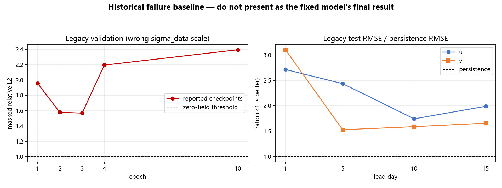

# 实验 01 结果：surface SD1 旧尺度基线

> 结论：工程链路跑通，但科学结果失败；本实验只能作为反面基线。

## 训练记录

validation masked relative L2：

| epoch | 1 | 2 | 3（best） | 4 | 10 |
|---:|---:|---:|---:|---:|---:|
| val relative L2 | 1.956 | 1.577 | **1.567** | 2.193 | 2.393 |

第 3 epoch 后验证结果持续恶化；每 epoch 约 1580～1607 秒。

## 15 天 test 结果

原生 C-grid、native mask、RMSE 单位 m/s：

| lead day | u model / persistence | 比值 | v model / persistence | 比值 |
|---:|---:|---:|---:|---:|
| 1 | 0.377 / 0.139 | **2.72** | 0.279 / 0.090 | **3.11** |
| 5 | 0.628 / 0.258 | 2.43 | 0.214 / 0.140 | 1.53 |
| 10 | 0.488 / 0.280 | 1.74 | 0.232 / 0.146 | 1.59 |
| 15 | 0.531 / 0.267 | 1.99 | 0.242 / 0.146 | 1.66 |

15 天没有任何 lead day 稳定胜过 persistence。代表图显示开阔海系统性负偏置，
并在近岸/边界出现约 +2 m/s 的异常尖刺。

## 分析

1. `sigma_data` 错用了 [0,1] 归一化空间的 `0.08560`；EDM 实际在 [-1,1]
   工作，正确尺度应约为 `0.17120`。
2. 旧训练还存在 AMP、scheduler、非有限 loss、best checkpoint 和 resume 等训练卫生问题。
3. 评估使用 `S_churn=80`、单轨迹，采样噪声可能进一步放大误差，但不足以解释全部失败。

## 结论与后续决策

- 旧结果不证明模型可用，但证明数据→训练→rollout→native 指标链可执行。
- 不覆盖或删除旧目录；SD2 修复实验必须使用独立目录。
- 下一步执行 [surface SD2 重训](../02_surface_sd2_retrain/EXPERIMENT.md)。
