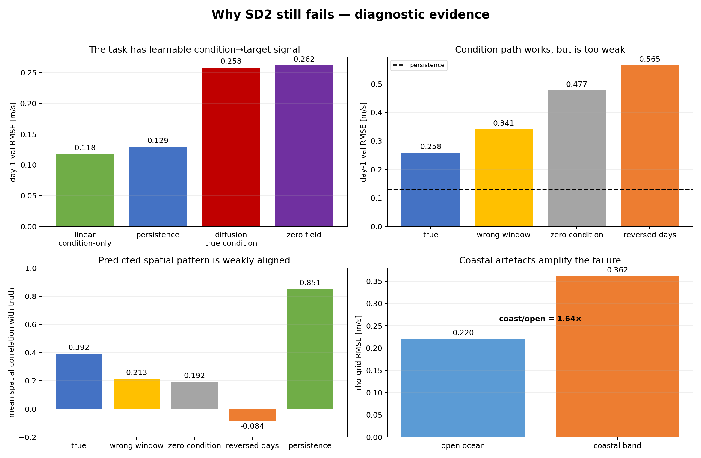

# 实验 05 结果：条件通路与任务可预测性诊断

> 结论：任务有信号、condition 确实进入网络；当前主要问题是条件约束不足或去噪目标与点预测目标失配。

## 已执行结果

### 1. 简单条件模型

一个只使用 14 个历史条件通道、空间共享的 ridge/linear probe 在独立 validation
时间段得到 0.1177 m/s，优于 persistence 的 0.1293 m/s。

这说明 condition/target 并非整体错位，当前数据和指标链能够支持“优于 persistence”。

### 2. Condition 破坏对照

同一批 156 个 validation 窗口和相同 seed：

| 条件 | day-1 RMSE (m/s) |
|---|---:|
| 真实 7 天条件 | 0.2584 |
| 另一窗口条件 | 0.3408 |
| 全零条件 | 0.4775 |
| 反转 14 个通道 | 0.5655 |

真实 condition 明显更好，说明条件通路没有断；但它仍远差于 linear probe 和 persistence。

### 3. 空间与区域诊断

- 模型预测与真值平均空间相关：0.392。
- persistence 与真值平均空间相关：0.851。
- 真实条件下 coastal-band RMSE：0.3616 m/s。
- open-ocean RMSE：0.2202 m/s。
- 近岸误差是开阔海的 1.64 倍，但开阔海也明显失败。

### 自回归反馈中的陆地值

代码可以直接确认：训练 condition 的陆地值恒为 0，而当前 `pre_rollout.py` 会把模型输出
整帧追加回 condition，没有按双变量 mask 把预测陆地值重新置零。因此 day-2 以后存在
训练—推理输入分布不一致的风险。远端 No-Go 历史报告记载过“一次性置零后 day-2 RMSE
改善约 7.7%”，但归档中没有对应日志或 NPZ；该数字只能作为待复现实验线索，不能作为
本仓库已验证结果。它也不能解释 day-1 和 open-ocean 已经失败的事实。

## 结果分析

1. 数据与时间配对有可预测信号，condition 通路也没有断；
2. direct diffusion 的主要差距更可能来自去噪/采样目标与确定性点预测不匹配；
3. coastal 明显更难，但后续 [实验 08](../08_static_mask_ablation/RESULTS.md) 证明显式静态
   mask 不能稳定改善该问题；
4. 陆地反馈确实造成中期污染，但后续 [实验 09](../09_remask_feedback_ablation/RESULTS.md)
   表明持续 remask 会使长段转差，overall 无增益；
5. 旧 sigma 尺度、checkpoint 选错、condition 完全断路和任务无信号已有反证。

## 尚未执行

`probe_net_sensitivity.py` 和 `probe_trajectory.py` 已存在，但没有对应日志；不能据脚本存在
宣称实验完成。远端 No-Go 历史报告虽然写入了单步去噪盆地和 Heun 轨迹的数值性结论，
归档提交实际只有 `probe_linear.log` 与 `probe_sample_conds_full.log/.npz`，所以这些轨迹结论
在当前证据口径下仍是未核验线索。

## 对后续工作的影响

- condition-only persistence-residual 已由 [实验 07](../07_residual_baseline/RESULTS.md) 完成，
  day-1 通过门槛，但 15-day overall 尚未通过；
- 静态 mask 和 remask 两条线索已分别由实验 08、09 检验，均未进入当前配置；
- 未执行的网络敏感度/采样轨迹探针继续保留为 diffusion 条件分支，不阻塞当前
  detached multi-step 路线；
- 当前方向见 [当前困难与下一步](../../project/CURRENT_CHALLENGES_AND_NEXT_STEPS.md)。
