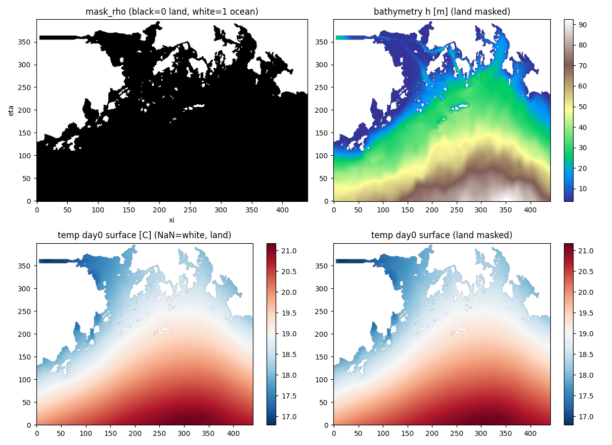
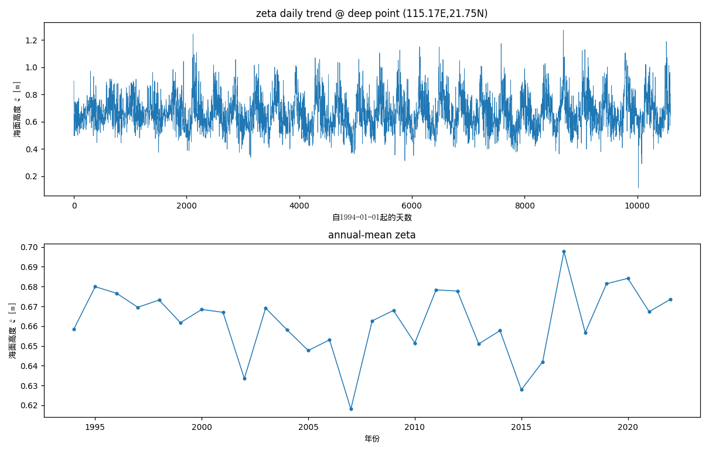
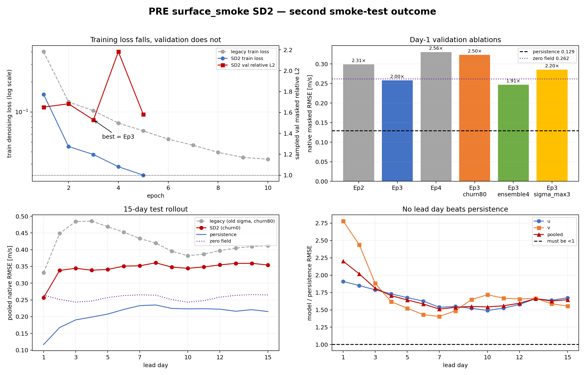

# DiAFNO / PRE 海流预报项目汇报与交接总结

> 核对日期：2026-09-01（上一版 2026-08-30；08-31 至 09-01 的 persistence-residual
> 基线、诊断与 Phase 5 决策已并入，见第 9 节）
> 项目主线：`PRE_ocean_data` 上的区域三维海流预报；`dataProcess_demo/` 是独立教学样例，不是本模型训练数据。
> 证据边界：本地仓库含代码、数据审计图、SD1/SD2 与 persistence-residual A/B
> checkpoint（`checkpoints/PRE/`，含 `loss.dat`、选型/test/remask/诊断 NPZ 与日志）；
> 不含服务器上的 4.1 TB 原始数据和 full3d 实验结果。

## 一句话结论

项目已完成 PRE 数据审计、ROMS C-grid 到 rho-grid 的 u/v 共定位、7 天到次日的条件
扩散建模、15 天自回归评估管线和合成回归测试。SD1/SD2 条件扩散路线失败（day-1 为
persistence 的 2.201×）后，改用同一 backbone 的**确定性 persistence-residual 基线**
（实验 07，Phase 3 Go）：day-1 native RMSE 反超 persistence（val 0.1011/0.1294 =
0.781，test 0.0973/0.1167 = 0.833），但 15-day overall 仍仅与 persistence 持平
（test 1.018）。长时效诊断确认瓶颈是确定性回归的方差塌缩 + 相关衰减 + 偏差漂移；
Phase 5 两项单变量改进（双静态 mask 输入、remask 回灌）均判"不保留"。当前骨干网与
数据/条件链路已验证可用，**下一轮（Phase 6）方向是对残差做生成式建模（residual
diffusion）以恢复长 lead 方差**，计划文档另立；full3d 继续暂缓。

## 1. 原始数据集有多少变量，各变量是什么

### 1.1 原始 NetCDF 的变量数

- 每日动态文件 `coawst_avg_*.nc`：85 个 data variables，其中 17 个空间科学场、68 个模式配置/标量；每个文件只有 1 个日平均时次。
- 静态网格文件 `PRE-90921-V2.nc`：42 个 data variables，其中 26 个网格场、16 个投影/标量。
- 实际建模读取的是处理后的 12 个动态 `.npy` 中的 `u.npy`/`v.npy`，以及 27 个静态 `.npy` 中的 mask/坐标等；不是把全部原始变量作为输入。

### 1.2 17 个原始动态科学场

| 变量 | 单文件 shape | 含义与单值语义 | 单位 |
|---|---:|---|---|
| `zeta` | `(1,400,441)` | 自由面高度；`zeta[0,r,c]` 是该日 rho 点海面位移 | m |
| `ubar`,`vbar` | `(1,400,440)`, `(1,399,441)` | 原始 C-grid ξ/η 方向的深度平均流速 | m/s |
| `ubar_eastward`,`vbar_northward` | `(1,400,441)` | 旋转到正东/正北的深度平均流速 | m/s |
| `u`,`v` | `(1,30,400,440)`, `(1,30,399,441)` | 原始 C-grid ξ/η 方向三维流速；`u[0,k,r,c]` 位于两个 rho 点之间的 u-face，`v` 类似 | m/s |
| `u_eastward`,`v_northward` | `(1,30,400,441)` | rho 点正东/正北三维流速 | m/s |
| `w` | `(1,31,400,441)` | 物理垂直速度，向上为正 | m/s |
| `omega` | `(1,31,400,441)` | sigma 坐标垂向动量分量，不是 `w` | m³/s |
| `temp` | `(1,30,400,441)` | 势温 | °C |
| `salt` | `(1,30,400,441)` | 盐度 | PSU/无量纲 |
| `rho` | `(1,30,400,441)` | 密度异常 = 绝对密度 − 1000，不是绝对密度 | kg/m³ |
| `AKv`,`AKt`,`AKs` | `(1,31,400,441)` | 垂直粘性、温度扩散、盐度扩散系数 | m²/s |

维度统一解释：`t` 是天，`k=0` 是海底、`k=29` 是海面，`r` 沿 eta 由南向北，`c` 沿 xi 由西向东。原始/processed 科学场的陆地点通常是 NaN。

### 1.3 26 个原始静态网格场

按用途完整分组如下：

- 地形/度量：`h`, `hraw`, `f`, `pm`, `pn`, `dndx`, `dmde`, `angle`。
- mask：`mask_rho(400,441)`, `mask_u(400,440)`, `mask_v(399,441)`, `mask_psi(399,440)`。
- 投影坐标：`x/y_rho`, `x/y_psi`, `x/y_u`, `x/y_v`。
- 经纬度：`lat/lon_psi`, `lat/lon_u`, `lat/lon_v`；原始静态文件不直接提供 rho 经纬度，后处理由 psi 四点插值得到 `lat/lon_rho`。

处理后的 27 个静态文件还包括 `s_rho`, `s_w`, `Cs_r`, `Cs_w`, `hc`, `Tcline`, `theta_s`, `theta_b`, `meta`。其中服务器实测的 `s_w.npy` 已损坏为空数组，应从原始 NetCDF 恢复；`meta.npy` 是 object 数组，不是科学场。

### 1.4 mask 语义和异常值

- `mask_rho/u/v`：**1=海洋/有效，0=陆地/无效**。
- `mask_rho` 湿点 123,265 / 176,400 = 69.9%；`temp[0,29]` 的 NaN 位置与 `mask_rho==0` 100% 一致。
- 例外：`u` 有 45 个 `mask_u==0` 的陆侧边界 face 仍有数值，预处理以 mask 为权威，全部丢弃为 NaN；`v` 未发现同类异常。
- `h` 在陆地上恒为 1 m，只是名义填充值，不可解释为真实水深。
- `rho<0` 在河口淡水区可以合理；`u` 的 7.009 m/s 极值更像近岸/边界异常，当前不做 percentile clipping，可能显著压缩 min-max 后的大多数样本。



这张图可信：黑色 `mask=1` 是海洋、白色 `mask=0` 是陆地；原始温度 NaN 白区和显式 mask 后的白区一致，地形也呈近岸浅、东南深。

### 1.5 演化趋势和分布

- 代表性深水点约 115.17°E, 21.75°N，水深约 92 m。
- `zeta` 代表点日值约 0.116–1.271 m，均值 0.663 m；存在明显高频波动和年际变化。
- `temp` 表层约 15.9–29.2°C，底层约 14.4–26.6°C；表层季节性更强，物理上合理。
- 抽样汇总：`temp` 10.15–33.59°C，`salt` 1.945–40.27，`u_eastward` −1.718–2.692 m/s，`v_northward` −1.462–0.821 m/s。




`02_zeta_trend.png` 的“annual mean”是每 365 天直接分组，未按闰年日历分组，适合看大势但不宜作为精确逐年统计；`03_temp_trend.png` 的层索引和季节信号正确。


这张分布图不能直接用于正式汇报：代码把 `salt[d,0]` 和 `u[d,0]`（底层）标成 surface；盐度出现约 `1e10` 的有限异常值；所谓 `u_eastward (zoom)` 没有设置缩放范围，实际重复了前一面板。应在服务器修正层索引、显式审计 fill value/异常点后重画。

## 2. 数据集时间、空间维度、网格大小和区域

| 项目 | 实际值 |
|---|---|
| 时间 | 10,591 个连续日平均时次，1994-01-01 12:00 至 2022-12-30 12:00，无缺档 |
| rho 水平网格 | `400 × 441`，不是 400×400 |
| 原生 u/v 网格 | u=`400×440`，v=`399×441`（ROMS Arakawa C-grid） |
| 垂向 | rho 30 个 sigma 层；w 点 31 层；层 0=底、层 29=表 |
| 网格物理尺度 | `dx=1/pm` 中位 758 m（216–995 m）；`dy=1/pn` 中位 407 m（169–824 m） |
| 经纬度步长 | 经向中位 0.00631°，纬向中位 0.00318°；不是统一 0.25° |
| 湿区范围 | 112.315–115.678°E（3.36°，约 347 km）× 20.896–23.028°N（2.13°，约 237 km） |

不能用 `400×某个固定度数` 粗算真实范围：这是旋转的曲线正交、各向异性网格，应该用 `lon/lat` 或 `pm/pn`。项目文档中“约 1 km”是量级描述，实测中位网格约 0.76 km × 0.41 km。

## 3. train / valid / test 大小与合理性

| split | 日索引与日期 | 原始天数 | 单步窗口数（7→1） | 占全部天数 |
|---|---|---:|---:|---:|
| train | `[0,8401)`；1994-01-01 至 2016-12-31 | 8,401 | 8,394 | 79.32% |
| valid | `[8401,9496)`；2017-01-01 至 2019-12-31 | 1,095 | 1,088 | 10.34% |
| test | `[9496,10591)`；2020-01-01 至 2022-12-30 | 1,095 | 1,088 | 10.34% |

这是约 80/10/10，不是 70/20/10。对预测任务，按时间连续切分是正确选择：随机切分会让高度重叠的 7 天窗口分散到不同 split，造成几乎相同的时间片泄漏。当前划分可解释为 23 年训练、3 年验证、近 3 年测试，也让测试包含 2020–2022 的独立气候阶段。窗口严格不跨 split 边界。

可再补的严谨性检查：按季节/年份分别报告指标，验证 2020–2022 与训练期的分布漂移；如果任务关心极端流速，应按事件而不只是按日期均匀抽样。

## 4. 模型输入输出、建模格式、缺失值及外部参考

### 4.1 本项目的输入输出

- 每个训练样本的 condition：`(14,H,W,Z)`，连续 7 天，每天 u/v 两通道。
- condition 顺序：`ch0=u(d0), ch1=v(d0), ch2=u(d1), …, ch12=u(d6), ch13=v(d6)`。
- target：`(2,H,W,Z)`，第 8 天 `ch0=u, ch1=v`。
- 扩散骨干实际 stem 输入：14 条件通道 + 2 个加噪 target 通道 = 16 通道；输出 2 通道去噪结果。
- 训练是单步 teacher forcing；评估把预测的 2 通道追加回 7 天历史，丢掉最旧 2 通道，重复 15 次。

注意：模型预测的是未旋转的 ROMS 网格 ξ/η 方向 `u/v`，不能在汇报中称为“正东/正北流速”。正式评估再映回原生 C-grid，但仍不做方向旋转。

### 4.2 缺失值与归一化

- u/v 先用 NaN-aware 邻接均值共定位到 rho 网格；边界单侧复制。
- 只用 train 段、各变量自己的海洋点计算 min/max；u、v 分别归一化到 `[0,1]`。
- 默认不做 percentile clipping。归一化后陆地 NaN 填 0，但训练 loss 和评估指标都用双变量 mask 排除陆地。
- 海洋有效点若出现 NaN 被视为动态缺测，预处理直接报错，不做均值填充；这比静默均值填充更安全。
- EDM 内部把 `[0,1]` 再映到 `[-1,1]`，所以 `sigma_data=2×stats_sigma`；surface 的 `0.08560` 应变为 `0.17120`。

### 4.3 外部参考与选择理由（stars 截至 2026-08-29）

| 参考 | 为什么相关 | 代码层面的处理 | 与本项目的共同点/差异 | stars 与可读性判断 |
|---|---|---|---|---|
| [FourCastNet](https://github.com/NVlabs/FourCastNet) | AFNO 架构和自回归网格场预测最接近 | NetCDF 变量按固定 channel order 写 HDF5；loader 用预计算 global mean/std 做 z-score，把历史时间展平到 channel；经度可循环 roll | 同为 AFNO/规则网格/自回归；但它是全球 2D 天气、无海岸 NaN 和 C-grid、不是扩散模型 | 697 stars；架构参考价值高，但老式 HPC 脚本有硬编码路径/通道，代码可读性中等，不宜整段照搬 |
| [NeuralOM](https://github.com/YuanGao-YG/NeuralOM) | 直接做全球海洋中长期自回归，含 u/v/温盐/SSH 和 land mask | 年度 HDF5 `[T,C,H,W]`，1993–2017 train、2018–2019 valid、2020 test；预存 mean/std 和 land mask；1-step 预训练后逐步 multi-step finetune | 同为海洋、多变量、连续时间划分、长 rollout；但其网格是全球 `361×720`、97 通道、固定深度，不是区域曲线 C-grid/sigma 层 | 262 stars、77 commits；结构清楚但训练脚本约 500 行且配置较重，可读性中等；适合参考 split、mask、multi-step finetune |
| [ARCO-OCEAN](https://github.com/inogs/arco-ocean) | 海洋 ML 数据预处理和 NaN/mask 处理最系统 | 连续场用 NaN-aware `conservative_normed` 重网格；分类 mask 用 nearest；对有效海点残余 NaN 做邻域加权填充；不同源各保留自己的 mask | 同样面对海岸、三维层和 u/v；但它重网格到全球 0.25° Zarr，本项目选择保留区域曲线网格并硬失败动态缺测 | 11 stars、51 commits；文档非常清楚，适合做数据规范参考，不是模型基线 |
| [南海 SSH 多模型仓库](https://github.com/happy364/Sea-Surface-Height-Prediction-Using-different-Neural-Network-Frames) | 区域海洋、海陆 mask、MSE、10 日预测与本任务最直观相似 | 将二值海陆 mask 作为额外输入；autoregressive PredRNNv2 每步重复注入 mask；其报告称 RMSE 由 2.03 降至 1.64 cm | 同为南海邻近区域、mask 和 rollout；但只预测 2D SSH，不是 u/v/3D/扩散 | 4 stars；代码目录清楚但社区验证弱，只能作为“mask 输入值得消融”的直接证据，不能当权威结论 |
| [OceanForecastBench](https://github.com/Ocean-Intelligent-Forecasting/OceanForecastBench) | 提供全球海洋多模型和观测对齐评估框架 | 日期文件分 train/val，预存每通道 mean/std，测试与 EN4/GDP/高度计等观测对齐 | 同为中期海洋预测和 RMSE；但目前仓库只有 2 commits，数据/预训练权重获取门槛较高 | 14 stars；适合参考评估设计，不建议作为主代码基座 |

因此当前实现选择 FourCastNet/DiAFNO 作为架构来源是合理的；数据处理上更应吸收 ARCO-OCEAN 的 mask/NaN 审计，训练策略上可借鉴 NeuralOM 的 multi-step finetune；是否把 mask 作为输入需要本项目自己的消融实验验证。

## 5. Channel 数量、0/1 通道及拼接合理性

同一个“ch0/ch1”要区分三层含义：

1. 单日物理场：`ch0=u`、`ch1=v`。
2. 7 天 condition：`ch0=u(d0)`、`ch1=v(d0)`，一直到 `ch13=v(d6)`。
3. IAFNO stem：`ch0..13` 是历史 condition，`ch14=u*`、`ch15=v*` 是当前扩散噪声等级下的加噪目标；输出再回到 2 通道 u/v。

这种 day-major 拼接在张量上是自洽的，自回归更新也明确按 `cur[:,2:] + prediction` 操作。问题不在通道顺序，而在 mask 没有作为输入：

- 优点：少 1–2 个通道，保持模型简单；固定海岸线也可能从长期为零的陆地填充值中被隐式识别。
- 风险：陆地填 0 与归一化后的有效值空间重叠；masked loss 又不给陆地区域梯度，而 AFNO 的 FFT 是全局混合，任意陆地输出可能影响近岸表示。
- **A/B 已完成（2026-08-31，Phase 5①，见第 9.3 节）**：`mask_u_rho`/`mask_v_rho`
  作为 2 个静态条件通道的 B 臂未带来稳定改善（10 epoch 中 9 个落后于 14 通道 A 臂，
  区域分解 4 项全部 A 优），**判"不保留"**——FFT 全局混合下，归一化后陆地填 0 的
  动态通道已隐式携带掩膜信息。当初"不要只用交集 mask"的告诫已在实现中遵守
  （用的是双变量非交集 mask）。

## 6. 训练时 H/W/Z、loss 与训练状态

| preset | 模型空间 `(H,W,Z)` | patch | token 网格/数量 | batch | IAFNO 深度 |
|---|---:|---:|---:|---:|---:|
| `surface_smoke` | `(400,441,1)` | `(4,3,1)` | `100×147×1 = 14,700` | 4 | implicit 4 × explicit 4 |
| `full3d` | `(400,441,30)` | `(4,3,2)` | `100×147×15 = 220,500` | 1 | implicit 2 × explicit 4 |

两个 preset 都精确整除，不触发 legacy `64×65×32 → 64×66×32` 的 padding。

训练 loss 是 EDM 噪声等级加权的 masked denoising MSE：先对每个样本只在有效 u/v 海洋格点上平均 MSE，再乘 `((σ²+σ_data²)/(σ·σ_data)²)`，最后对 batch 平均。验证不是同一 loss，而是采样后的物理单位 masked relative L2。

SD2 重训实际运行 5 epoch 后 early stop：train loss 从 0.15017 降至 0.02331，
最佳 epoch 3 的 validation relative L2 为 1.52958。checkpoint 已确认使用
`sigma_data=0.1712084`，`best.pth` 与 `Ep3.pth` 完全一致，因此失败不能再归因于
旧尺度或错 checkpoint。产物对应“最多 10 epoch + early stop”的执行配置；当前 `full`
训练仍把 `pre_config.py` 的 `surface_smoke.num_epochs=10` 作为唯一正常默认，
`EPOCH_OVERRIDES={}` 不再覆盖它，原 4/10 epoch 配置漂移已消除。训练脚本的安全入口默认
为隔离的 `smoke` 模式；只有显式设置 `DIAFNO_TRAIN_MODE=full` 才进入正式轮数。

服务器还在仓库外副本 `DiAFNO_lr3e4` 做过附属学习率对照，并归档到兄弟分支
`origin/adapt-weather-ocean-lr3e4`：`lr=3e-4` 的 Ep1 day-1 RMSE 为 0.3259 m/s
（persistence 的 2.520 倍），手动续训到 Ep10 后为 0.3779 m/s（2.922 倍），均差于
主实验 `lr=1e-3` 的 Ep3 结果 0.2584 m/s（1.998 倍）。这能排除“单独降低到
`3e-4` 即可修复”，但不是系统学习率搜索；相关大型产物不在当前工作树。

远端 No-Go 报告记录的“反馈帧陆地置零使 day-2 RMSE 改善约 7.7%”已于 2026-09-01
在归档协议下复现检验（Phase 5②）：day-2 实际仅 -0.49%，同量级改善实际位于
**day 4-7（-5.9%~-7.9%）**，且 day 9-15 转差、overall 持平——方向一致、数值
归属更正，详见第 9.4 节。




## 7. 评估指标是否合理，MSE 是否 make sense

当前正式评估在原生 C-grid、未裁剪物理真值上计算：

- 每个 lead day × u/v × sigma layer 的 masked RMSE 和 MAE；总体 RMSE 用 `sqrt(total SE / total valid count)`，不是各层 RMSE 算术平均。
- persistence：把第 7 天原生 u/v 重复到未来；zero-current；rho-oracle（只量化 rho↔native 映射不可逆误差）。
- 验证使用 masked relative L2；扩散可做多轨迹 ensemble mean。

判断：

- masked MSE/RMSE 合理且必要：速度误差有明确 m/s 物理单位，RMSE 对大误差敏感；EDM 本身也以 MSE 型去噪目标训练。
- 只看 RMSE 不够：海流分布以 0 附近为主、长尾明显，u/v 尺度和 mask 数量不同，极端/近岸值会主导平方误差。MAE 能补鲁棒性，但仍忽略矢量方向、空间结构和概率校准。
- min-max 默认不用 clipping，`u=7.009 m/s` 这类极值会压缩主体分布；训练 loss 在归一化空间的权重不等于物理空间 RMSE 的权重。这是需要消融的统计选择。
- relative L2 在整体速度接近 0 的窗口会放大，不应作为唯一模型选择指标。

建议正式汇报最少同时给：RMSE、MAE、相对 persistence 的 skill/ratio、u/v 分项、lead-time 曲线、coastal/offshore 分层、季节/年份分层。若强调扩散模型，还应给 ensemble CRPS 或 spread-skill；若强调物理质量，再加速度模长误差、方向误差（只在速度高于阈值处）、频谱/结构函数或散度诊断。

SD1/SD2 两次扩散实验都是失败记录。**现行成功基线是确定性 persistence-residual
（实验 07，A 臂 Ep10：14 通道、rf0、无 mask 输入）**，同为原生 C-grid masked
pooled 指标：test day-1 0.0973 m/s（persistence 0.1167，ratio 0.833），
15-day overall 0.2136 vs 0.2098（ratio 1.018，持平略差）；validation day-1
0.1011（0.781）。两次实验的对照表与逐 lead 曲线见
[实验 07 RESULTS](../experiments/07_residual_baseline/RESULTS.md)。

## 8. 结果可视化质量

`pre_evaluate.py` 的设计是每张图三列：truth、prediction、error(pred−truth)，文件名含 lead day、sigma layer、变量；列含义清楚，`RdBu_r` 对正负速度也合适。但当前实现仍有四个问题：

1. truth 与 prediction 各自自动取色阶，颜色相似不代表数值相似；应共用同一个、以 0 为中心的 `vmin/vmax`。
2. error 也自动取色阶，未强制 `[-e,e]` 对称，正负误差对比可能失真；建议用误差绝对值 98/99 分位设对称范围，并在标题写 RMSE/MAE。
3. 坐标是像素索引，没有 lon/lat、海岸线或 land 灰色背景；正式汇报应至少注明 ξ/η 或使用真实经纬度绘图。
4. 本地已有修复后的 `figures_h15_*`；代表图显示大尺度结构缺失、细碎纹理和近岸
   极值。由于前三项色标问题仍存在，不能仅凭颜色相似判断预测质量。

建议正式版布局：同一变量/层/lead day 固定共享 truth/pred 色标，误差用独立对称色标；每行一个 lead day，每列 Truth / Prediction / Error；标题明确日期、层深、变量和单位；旁边再放 lead-time RMSE ratio 曲线。不要把 `04_distributions.png` 混入最终结果页，修正后再用。

## 9. persistence-residual 基线、长时效诊断与 Phase 5 决策（2026-08-31/09-01）

完整数据与表格见 [实验 07](../experiments/07_residual_baseline/RESULTS.md)；
checkpoint/评估产物已随 git 归档（提交 `7cf959e`）。

### 9.1 基线建立与 Phase 3 Go

- 同一 IAFNO backbone 的确定性封装 `PersistenceResidualIAFNO`：预测 = 条件第 7 天
  persistence + 零初始化残差头；单卡/`DDP2` smoke 均 `SMOKE PASS`；10 epoch 短训练
  （3 h 35 min）val_relL2 从 0.583 单调降至 0.40325。
- validation day-1 native RMSE 选型（逐 `Ep{n}.pth`，禁用 `best.pth`）：**Go**——
  Ep10 0.1011 m/s vs persistence 0.1294（ratio 0.781），也优于 ridge probe 0.1177。
- test 报告：day-1 0.0973（ratio 0.833）；15-day overall 1.018（持平略差）。
  **Phase 6 准入门槛（确定性优于 persistence）已满足。**

### 9.2 长时效诊断（解释 overall 为何只持平）

对 77 个 test 窗口重放 15 天 rollout，补齐评估 NPZ 不含的三类统计
（`scripts/diag_leadtime_residual.py`）：

1. **方差塌缩（主导）**：u 方差比 d1 0.87 → d7 起 ~0.55——MSE 确定性回归的均值回归；
2. **空间相关中段塌缩**：d7 起模型 0.48 < persistence 0.57，d15 0.39 vs 0.61；
3. **偏差漂移且变号**：u bias -0.005 → -0.11 → +0.065（模糊预测回灌条件窗的污染）。

交叉点 day 4-5；u/v 不对称（v 的长段劣化主因是相关损失+正偏差，非模糊）。

### 9.3 Phase 5①：双静态 mask 输入 A/B → 不保留

`DIAFNO_STATIC_MASK=1` 路径（`static_cond` 单独前传、`_MSK` 目录隔离、元数据驱动
重建、47 项 CPU 测试）已实现并入库；B 臂（14+2 通道）完成 smoke + 10 epoch 训练
+ 选型：**A 臂 9/10 epoch 领先、最优 0.1011 < B 0.1024、区域分解 4 项全部 A 优**，
判"不保留"。附带观察：**近岸改善（0.867）< 离岸（0.777）**，近岸是后续靶点。

### 9.4 Phase 5②：remask 回灌 A/B → 维持 rf0

同 checkpoint、validation 15 天 rollout、rf0（历史整帧回灌）vs rf1（每步重应用
mask）：rf1 呈**分段效应**——day 2-8 改善（最大 -7.9%@day7），day 9-15 转差
（+1.5%~+7.8%），overall 持平略差 → **默认维持 rf0**。远端"day-2 改善 7.7%"声明
更正为"day 4-7 改善"（day-2 实际 -0.49%）。

### 9.5 对 Phase 6 的含义

骨干网/条件链路/数据管线已验证；当前瓶颈是**生成式目标缺位导致的方差塌缩**——
确定性回归只能给出条件均值。Phase 6 方向是对**残差**（target − 条件第 7 天）做
条件扩散（residual diffusion）：残差分布以 0 为中心、尺度远小于场本身，集成采样
均值的 MSE 期望不劣于确定性基线；验收门槛建议为 15-day overall ratio < 0.941 且
day 10-15 首次 < 1.0。新计划文档待另立。

## 当前代码/数据流地图

```text
raw PRE NetCDF / processed u.npy,v.npy,mask
  └─ scripts/preprocess_align_uv.py
       ├─ u_rho.npy / v_rho.npy
       ├─ mask_u_rho.npy / mask_v_rho.npy
       └─ verified ocean_time*.npy
          └─ pre_dataset.py
               ├─ chronological windows + train-only normalization
               └─ (cond[14], target[2], start_day)
                  └─ pre_trainer.py
                       └─ IAFNO.py + diffusion.py → checkpoints/loss.dat
                          └─ pre_rollout.py (15-step autoregression)
                               └─ pre_evaluate.py
                                    └─ pre_metrics.py → RMSE/MAE/baselines/figures
```

关键入口：

- 文档总索引：[`docs/README.md`](../README.md)
- 数据字典与原始审计：[`docs/data/PRE_ocean_data.md`](../data/PRE_ocean_data.md)
- 全流程操作手册：[`docs/operations/PRE_runbook.md`](../operations/PRE_runbook.md)
- 实验方案与结果：[`docs/experiments/README.md`](../experiments/README.md)
- 配置：`pre_config.py`
- 数据/归一化：`pre_dataset.py`
- 训练：`pre_trainer.py`
- 评估：`pre_evaluate.py`

## 交接时必须明确的未完成项（2026-09-01 更新）

1. ~~建立 condition-only 确定性 IAFNO / persistence-residual 基线~~ **已完成（实验 07，Phase 3 Go）**。
2. ~~双 mask 输入消融~~ **已完成（Phase 5①，不保留）**；`clip_pct=None/0.1` 消融**仍未执行**（优先级降低：day-1 已过门槛，裁剪对主体分布的压缩问题依然存在）。
3. ~~probe_net_sensitivity / probe_trajectory~~ 被实验 07 自建诊断（长时效/区域分解）取代；如需更深根因分析可在 Phase 6 中重启。
4. 修正 `scripts/analyze_pre_dataset.py` 的 surface 层索引、盐度 fill value、闰年分组和 zoom，再重画 `04_distributions.png`。**仍未执行**（不影响训练/评估结论，影响对外展示图）。
5. ~~复现"rollout 反馈帧陆地置零"消融~~ **已完成（Phase 5②，维持 rf0）**；远端 7.7% 声明已更正归属（day 4-7）。
6. ~~surface 未稳定优于 persistence 前不投入 full3d~~ **day-1 门槛已过**；但 15-day overall 未过 persistence，且 full3d 训练/评估成本 ~30×，**建议在 surface 长 lead 问题（方差塌缩）解决后再启动**。
7. **Phase 6 计划文档待另立**（旧计划已归档至 `archive/CODE_MODIFICATION_PLAN_20260830.md`）：residual diffusion 的 sigma_data 实测定标、短训冒烟、验收门槛（overall ratio < 0.941 且 day 10-15 < 1.0）。
8. 评估可视化三问题（truth/pred 各自色阶、error 色阶不对称、无经纬度）仍未修，正式汇报前需处理。
