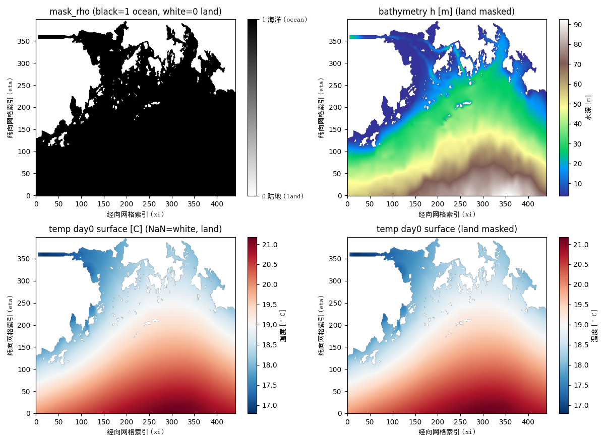
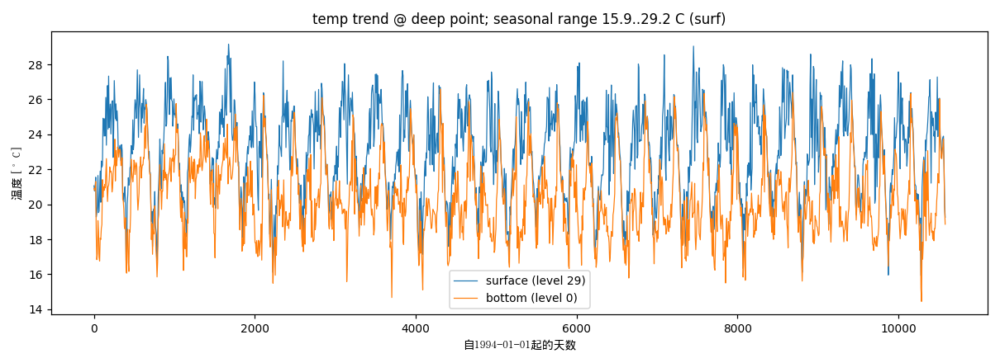
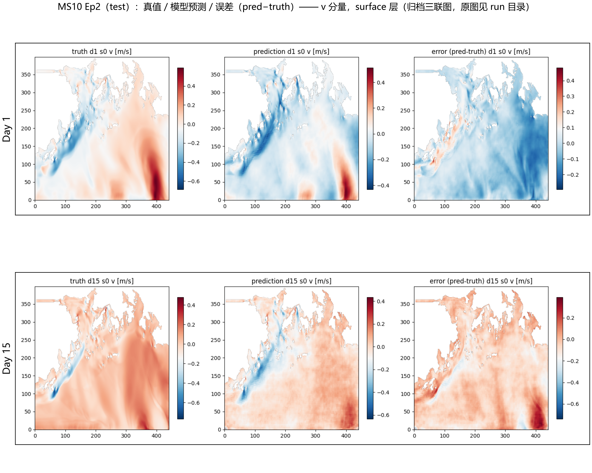
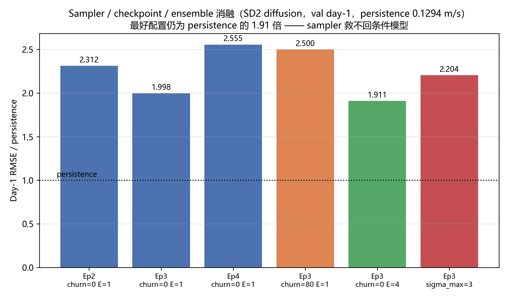
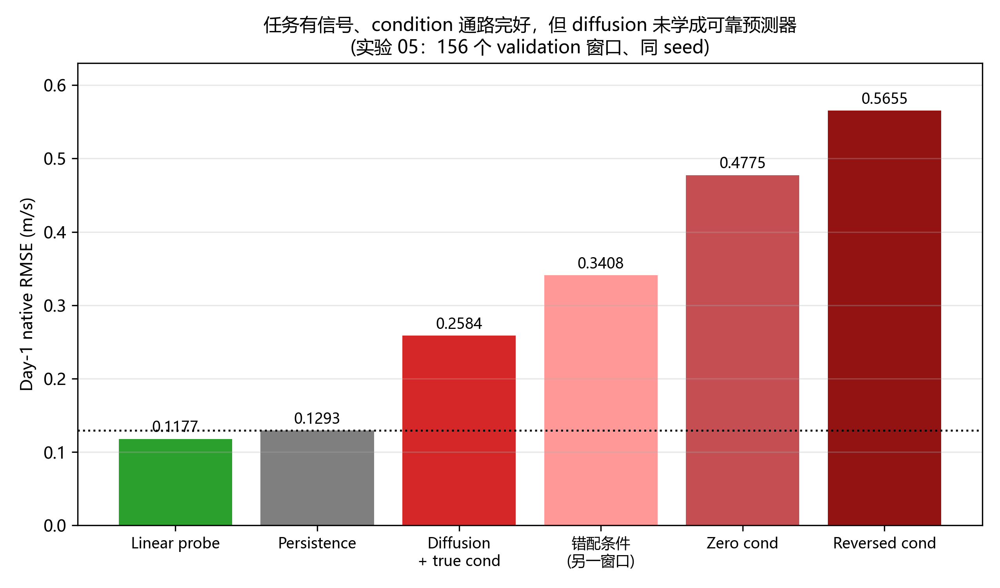
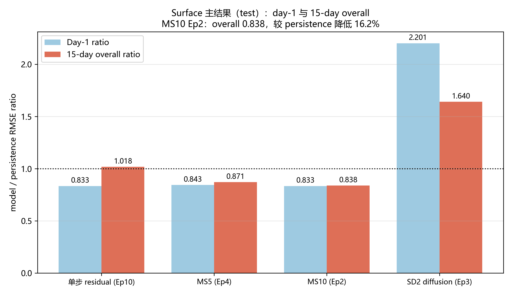
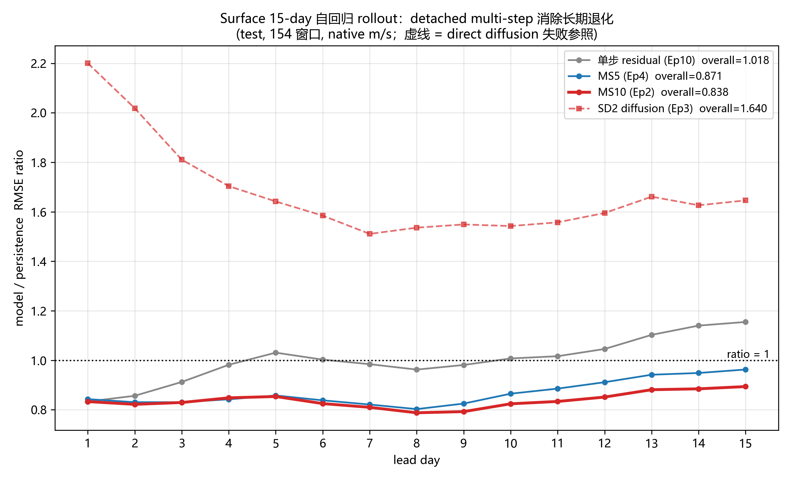
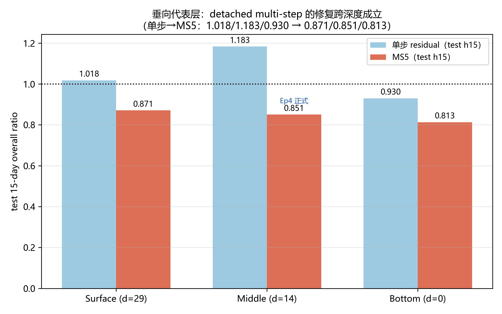
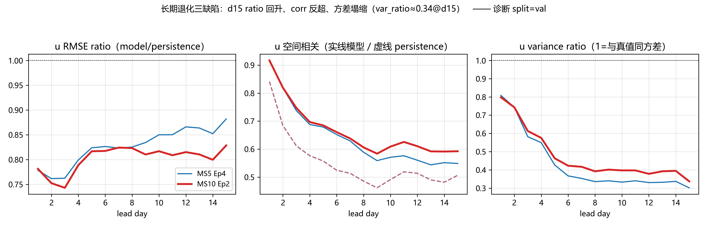
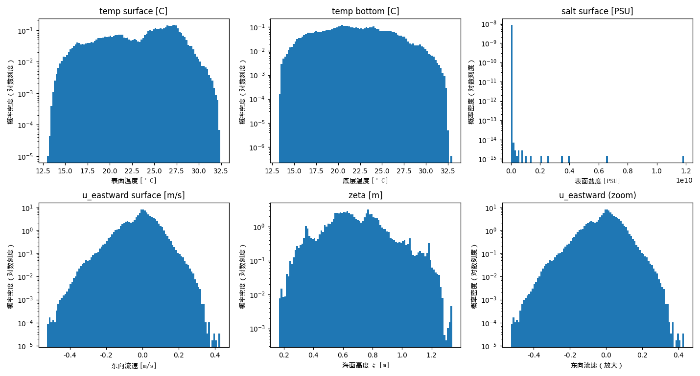

# DiAFNO 迁移与适配：组会汇报草稿

> 面向对象：负责项目管理的学长和导师。  
> 用法：每个“第 N 页”对应一张幻灯片；“页面文案”放在幻灯片上，“口播稿”供汇报时使用。
> 图像均为本仓库已归档、可追溯的结果图。数据来源见 `figures/MANIFEST.md` 与各实验目录的 `RESULTS.md`。

---

## 导读页｜关键术语与读图约定（约 1 分钟，不计主线页码）

**页面文案**

| 术语 | 本报告中的含义 |
|---|---|
| 持续性基线 | 直接把最后一个观测日的海流场作为未来预测，不使用神经网络。这是所有模型必须超过的最低参考线。 |
| 确定性残差模型 | 以持续性预测为起点，只学习需要修正的变化量，直接输出一个确定的未来海流场。 |
| 单步训练 | 训练时只预测下一天，正式评估时仍连续滚动预测 15 天，因此会遇到训练和使用输入不一致的问题。 |
| 多步自回归训练 | 训练时先生成若干天预测，再把预测作为后续输入，使模型提前适应 15 天滚动预测中的自身误差。 |
| 训练轮次与模型文件 | 完整遍历一次训练数据称为一轮训练。第 4 轮后保存的模型文件简称 `Ep4`，不是预测第 4 天。 |
| RMSE 比值 | 模型均方根误差除以持续性基线误差。小于 `1` 表示优于基线，`0.838` 表示误差低 `16.2%`。 |
| 验证集与测试集 | 验证集用于选择训练轮次和方案；测试集在方案冻结后才用于报告最终泛化结果。 |

脚注：代码和实验目录中的 `MS5`、`MS10` 分别指“训练时最远让模型预测到未来第 5 天、第 10 天”，两者仍统一评估未来 15 天。

**版式**

用左右两列排版。左列放“持续性基线、确定性残差模型、RMSE 比值、验证集与测试集”，右列放“单步训练、多步自回归训练、训练轮次与模型文件”。每项只保留加粗术语和一行解释，脚注放最下方。

**口播稿**

在进入结果前，先统一七个会反复出现的词。最重要的是持续性基线和 RMSE 比值：所有改进都以持续性基线为参照，比值低于 `1` 才表示模型真的有价值。

另外请区分训练跨度和训练轮次。训练到未来第 5 天或第 10 天，是模型在训练时经历多长的预测反馈；第 4 轮模型，则是完成第 4 次完整训练后保存的文件。验证集负责选择版本，测试集只在版本冻结后使用，这保证最后报告的数字没有被测试结果反向挑选。

---

## 第 1 页｜标题：从扩散生成到确定性多步预测

**页面文案**

**面向 PRE 海流场的 DiAFNO 迁移与适配**

根据过去 7 天的两个海流分量，连续预测未来 15 天

小字：原始扩散模型复现、失败诊断、确定性变化量模型、多步训练、代表深度验证

**版式**

标题居中。背景使用低对比度的海流场纹理或研究区域底图，不叠加数值图，避免让标题页承担技术细节。

**口播稿**

这项工作最初的目标很明确：验证原始 DiAFNO 的扩散预测思路能否迁移到 PRE 海流数据。
项目先完整跑通了这一路线，然后发现它在本任务上明显不如一个非常简单的预测方法，即“未来海流保持最后一天不变”。
所以后续工作没有直接换模型，而是先验证失败来自哪里，再把任务改成更适合确定性预测的形式。

今天我主要汇报三件事：扩散模型为什么在这里不适合，确定性多步模型怎样把 15 天预测做得优于基线，以及完整三维训练为什么目前暂停。

---

## 第 2 页｜阶段结论

**页面文案**

1. 直接扩散模型未通过任务要求：修正实现后，第 1 天误差仍为持续性基线的 `2.201` 倍，15 天总体误差为 `1.640` 倍。
2. 预测“相对最后一天海流的变化量”并进行多步训练后，海面未来 15 天总体误差降为基线的 `0.838`，即低 `16.2%`。
3. 中层和近底代表层得到同方向结果。完整 30 层训练需要独立计算预算，现处于暂停和复盘状态。

页脚定义：持续性基线指“把最后一天观测直接复制到未来每天”；误差比值小于 `1` 才表示模型更好。

**版式**

三条结论按从左到右的时间顺序排列。第 2 条用最大字号突出 `0.838` 和 `16.2%`。

**口播稿**

先给出结论，方便大家后面判断每个实验的意义。第一，原始扩散路线确实跑通了，但不是“效果一般”，而是第一天就显著落后于最简单的持续性基线。

第二，问题转向预测变化量以后，短期预测首先改善；再让模型在训练时接触自己的多天预测，15 天全程都保持优于基线。第三，代表深度验证说明这个结论不只局限在海面，但完整 30 层模型还没有足够的准入证据，因此没有继续消耗训练资源。

---

## 第 3 页｜原始论文解决的问题

**页面文案**

- 输入当前时刻的完整三维速度场，生成下一时刻速度场，再把结果连续反馈为下一次输入。
- 论文覆盖均匀各向同性湍流、衰减湍流和槽道流。
- 主要目标：长时间生成后仍保持正确的湍流统计特征。

页脚：原论文关注能量谱、速度波动和概率分布等统计性质，不以逐位置贴合唯一真实轨迹为唯一目标。

**版式**

左侧放三行任务说明，右侧放“当前状态 → 生成下一状态 → 连续预测”的简洁文字流程。不要在这一页展示 PRE 结果。

**口播稿**

理解原论文的任务很重要，因为这决定了为什么“论文里有效”不能直接推出“这里也应有效”。原论文的对象是数值模拟湍流。给模型一个完整三维流场，它生成下一时刻，并不断把生成结果送回模型。

论文追求的是长期统计仍然合理。也就是说，一条生成轨迹可以和某一条真实轨迹逐点不同，但只要能量分布、速度波动和统计规律保持正确，论文仍将其视为成功。这与我们后面要做的唯一确定海流点预测有根本差别。

---

## 第 4 页｜原始 DiAFNO 的模型结构

**页面文案**

```text
当前时刻完整三维速度场 ────────────────┐
                                      ├─ 傅里叶去噪网络 ─ 多步采样 ─ 下一时刻速度场
加入噪声的目标速度场 ──────────────────┘
```

- 扩散生成模块：从随机噪声逐步恢复目标流场。
- 傅里叶神经算子骨干：在频域中学习大尺度空间联系和能量分布。

**版式**

流程图占页面上半部分，下半部分只保留两条定义。正式制作时可用扁平的箭头重绘该流程，不需要画代码模块。

**口播稿**

这里的“扩散”可以先简单理解为：训练时给真实目标逐渐加噪声，模型学习如何在已知当前状态的条件下去掉噪声；预测时则从噪声开始，多次去噪得到一个下一时刻流场。

其中傅里叶神经算子负责处理空间结构。它适合规则网格上的大范围模式，因此在原论文的周期性湍流模拟中有明确的物理和计算优势。问题在于，PRE 数据满足不了它的一些关键前提。

---

## 第 5 页｜原论文成功的条件

**页面文案**

| 原论文中的有利条件 | 对长期生成的作用 |
|---|---|
| 周期、规则的结构化网格 | 傅里叶运算的边界条件自然成立 |
| 经频谱过滤的模拟流场 | 待恢复的场较平滑 |
| 完整三维速度 `u/v/w` | 当前状态信息较完整 |
| 统计指标为主 | 不强制逐点追踪同一条真实轨迹 |

补充事实：高雷诺数槽道流的长期逐点误差会累积，并稳定在约 `0.14`。这说明原论文并未宣称长期逐点误差始终很小。

**口播稿**

原论文有效并不是偶然。它面对的是规则的周期网格，傅里叶表示不会跨过复杂海岸线错误连接两个区域。输入也是完整的三维速度状态，模型需要补全的未知信息相对少。

还有一点常被忽略：原论文自己也记录了长期逐点误差的累积。在 CF590 槽道流中，连续预测 400 步后，不同随机种子的逐点误差大约在 `0.1374` 到 `0.1439` 之间。论文的优势主要在长期统计稳定，而非让每一个网格点持续锁定某一条真实未来。

资料依据：原论文 Appendix C.2、C.3 与 Table 10。

---

## 第 6 页｜PRE 海流数据与有效海域

**页面文案**

- 原始动态 NC 每天一个时次，1994–2022 年共 10,591 天；每个文件含 17 个科学场和 68 个模式配置量。
- 本项目只预测其中的三维网格方向海流 `u/v`，不把温度、盐度、海面高度等变量当作当前输入。
- 原始 `u` 与 `v` 位于不同的交错 C 网格，不能直接拼接；共定位后才形成共同的 `400×441×30` 模型网格。
- `mask=1` 表示有效海洋，`mask=0` 表示陆地；rho 网格湿点占 `69.9%`，陆地不进入损失和误差。



**口播稿**

PRE 是一个真实海洋环境中的海流预测任务。原始动态文件中不仅有海流，还有自由面高度、温度、盐度、密度异常、垂向速度和混合系数等科学场；但当前实验聚焦最小可验证任务，只使用三维海流的两个网格方向分量 `u/v`。

原始 `u` 和 `v` 在 ROMS 交错 C 网格上：`u` 为 `(30,400,440)`，`v` 为 `(30,399,441)`。因此不能简单把它们当成两个同位置的通道。预处理先按相邻面元平均把两者对齐到 rho 网格，才得到共同的 `400×441×30` 表示。

图中展示的是研究区域和有效海域。黑色有效海域对应 `mask=1`，白色陆地对应 `mask=0`。后面的误差都只在有效海洋位置计算；归一化后陆地虽以 0 占位，但这不是海流观测值，也不参与 loss 或正式指标。

资料边界：原始大体积 NC 文件不在本地工作区；本页变量清单、mask 核验和空间统计来自已归档的数据审计记录。

---

## 插页 A｜数据审计：网格、区域与物理演化（约 2 分钟）

**页面文案**

| 项目 | 已核验事实 |
|---|---|
| 研究区域 | 112.315–115.678°E、20.896–23.028°N，约 `347×237 km` |
| 水平网格 | 曲线正交、各向异性 `400×441`，不是规则 `0.25°` 格点 |
| 典型间距 | xi 方向约 `758 m`，eta 方向约 `407 m`，随位置变化 |
| 垂向网格 | 30 个随地形变化的 sigma 层；第 0 层近海底，第 29 层近海面 |
| 时间结构 | 连续日平均场，不存在随机缺日；相邻时间戳间隔严格为 24 小时 |



**口播稿**

这里要避免把数据想成规则的全球经纬度格点。该区域约为 3.36 度乘 2.13 度，实际网格是随海岸和投影变化的曲线正交网格，典型水平尺寸约 0.76 km 乘 0.41 km，并且各位置并不完全相同。第 0 到第 29 层也不是固定米深，而是随当地水深变化的 sigma 层。

图中的温度时间序列不作为当前模型输入，而是数据质量检查的证据：表层具有更强季节循环，近底更稳定，符合海洋物理直觉。完整变量分布、单位和原始 NC 维度留在备份页，避免主讲被数据字典淹没。

---

## 第 7 页｜预测任务定义

**页面文案**

```text
过去 7 天的两个海流分量                   未来 15 天
[第 t-6 天 …… 第 t 天]  →  预测第 1 天  →  将预测放回历史窗口  →  预测至第 15 天
         7 天 × 2 个分量 = 14 个输入通道              每天输出两个海流分量
```

- 输入通道顺序为 `[u(t-6),v(t-6),…,u(t),v(t)]`：第 0、1 通道为窗口首日的 `u/v`，第 12、13 通道为最后一天的 `u/v`。
- 输出为下一天的 2 个通道 `[u(t+1),v(t+1)]`；默认主线不把 mask 拼成第 15 个输入通道。
- 对照方法是持续性基线：把最后一天海流原样复制到未来每天。



**口播稿**

任务本身是确定性的：给过去 7 天的两个水平海流分量，我们要给未来每天、每个位置一个最可能的海流值。输入按“天优先、当天 `u/v` 相邻”的方式排列为 14 个通道，输出只有下一天 `u/v` 两个通道。模型先预测第 1 天，再把自己的预测塞回输入窗口，重复这个过程直到第 15 天。

掩码默认不作为动态输入通道。它独立地约束训练 loss 和评估，确保陆地占位 0 不会被误当作真实海流。我们曾把两个静态 mask 通道加到模型中做 A/B 对照，但没有稳定收益，因此没有进入正式模型。

持续性基线非常简单，就是假设未来海流保持最后一天不变。但它在短期海流预测里很强，所以任何复杂模型都必须先超过它。右图给出真实场、模型预测和误差的例子，直观上也可以看到预测时间拉长后，空间细节更难保留。

---

## 插页 B｜时间切分与正式评估口径（约 2 分钟）

**页面文案**

```text
1994-01-01 ───────── 2016-12-31 │ 2017-01-01 ─ 2019-12-31 │ 2020-01-01 ─ 2022-12-30
        训练：8,401 天，79.3%             验证：1,095 天，10.3%          测试：1,095 天，10.3%
```

- 按时间连续切分，窗口不跨集合，避免未来信息泄漏到训练。
- 验证集用于选择训练轮次；测试集在模型和协议冻结后只运行一次。
- 正式结果：原生交错 `u/v` 网格、未裁剪物理真值、有效海域 mask、单位 `m/s`。
- 同时报告 RMSE、MAE 和相对持续性基线的 RMSE 比值；总体 RMSE 先汇总全部平方误差再开方。

**口播稿**

时间预测不能随机打散。这里按完整年份连续切分：1994 至 2016 年训练，2017 至 2019 年验证，2020 至 2022 年测试。每个 7 天历史窗口和其目标都必须落在同一个集合内，因此模型不会在训练中看到测试期的任何未来片段。

正式评估也不在归一化后的模型网格上报分数。模型预测会映射回原始交错 `u/v` 网格，与未经裁剪的物理真值在有效海域比较。总体 RMSE 是所有窗口、格点和分量的平方误差先汇总再开方，而不是把各层 RMSE 简单平均。这样既保留物理单位，也避免小有效面积层被不合理放大。

---

## 第 8 页｜原论文任务与 PRE 任务的差异

**页面文案**

| 原论文 | PRE 任务 | 对迁移的影响 |
|---|---|---|
| 规则、周期网格 | 曲线网格、复杂海岸、陆地空缺 | 频域运算可能跨海岸错误关联 |
| 完整三维 `u/v/w` | 单层两个水平分量 `u/v` | 当前状态不完整 |
| 外部条件相对固定 | 有季节变化，未显式输入风和温盐等驱动 | 同一历史对应更多可能未来 |
| 统计合理性为主 | 逐位置 RMSE、MAE 为主 | 随机合理样本未必接近唯一真值 |

页脚：论文 Table 7 的“100 轮”是比较窗口，不是公开代码固定训练轮数。上游训练模板默认 150 轮。

**口播稿**

这一页是后续结果的解释桥梁。原论文的输入更完整、空间边界更规整、评价目标也更宽松。PRE 则要求在复杂海岸线上，根据不完整的单层状态，准确命中一个唯一的未来海流场。

因此，这不是简单的“把输入通道从 3 个改为 14 个”的适配。模型面对的物理信息、网格几何和评价标准都变了。这里也要避免一个误解：论文表 7 的 100 轮是它报告最低损失的比较区间，并不能和本项目提前停止的 5 轮扩散训练直接组成严格同预算比较。

---

## 第 9 页｜仓库中的完整数据和实验管线

**页面文案**

```text
原始 PRE 海流数据
  ↓ 对齐两个海流分量，生成海陆掩码
统一的训练、验证、测试时间窗口
  ↓
扩散模型或确定性变化量模型
  ↓ 训练并保存每轮模型
连续预测未来 15 天，与持续性基线比较
  ↓
按科学问题归档实验设计、结果和异常记录
```

小字：预处理 `preprocess_align_uv.py`，数据集 `pre_dataset.py`，训练 `pre_trainer.py`，评估 `pre_evaluate.py`。

**口播稿**

为了把结果变成可以交接和复核的工程资产，仓库把数据预处理、训练、连续预测和评估分开。每个环节都有独立职责：预处理保证两个海流分量和海陆掩码正确，数据集固定时间切分，训练保存完整配置，评估用统一的 15 天连续预测口径。

实验文档也按科学问题组织，而不是按代码修改组织。这样我们可以回看某个结论到底来自哪批数据、哪次模型选择、哪些归档文件，而不会把一次临时试验误当成正式结论。

---

## 第 10 页｜原始扩散路线的迁移内容

**页面文案**

- 输入从“上一时刻完整三维速度”改为“过去 7 天、共 14 通道的 `u/v` 海流历史”。
- 输出改为下一天两个水平海流分量；模型内部保留两个目标槽位，因此骨干接收 14 个条件通道加 2 个目标槽位。
- `u/v` 分别按训练期有效海点 min-max 归一化；陆地 NaN 归一化后填 0 占位，不是均值填补。
- 用变量专属海陆掩码只在有效海域计算训练损失和预测误差。
- 预测结果连续反馈，形成未来 15 天的自回归预测。
- 同时计算持续性、全零和网格变换对照，定位失败来源。

**口播稿**

迁移时做的不是直接套用原代码。数据先共定位，再用训练期有效海点独立归一化；陆地只作为张量里的 0 占位，掩码始终控制哪些位置可以贡献 loss 和指标。由于最终任务是 15 天连续预测，评估时也必须让模型不断使用自己的预测，而不能每一天都偷偷输入真实历史。

海面代表层的训练张量是 `(批次,14,400,441,1)`，输出为 `(批次,2,400,441,1)`，使用 `(4,3,1)` patch；完整三维则是相同水平范围、30 层和 `(4,3,2)` patch。它们都精确整除网格，不依赖 padding。这样可以把空间尺寸和 patch 选择从模型效果中分离出来。

同时保留多个对照，是为了区分“模型差”和“数据处理错”。例如，如果把预测映射回原始网格造成明显误差，我们就不能把失败归咎于扩散模型。后面的诊断表明，主问题不在这些工程环节。

---

## 第 11 页｜噪声尺度修正后，扩散模型仍未达标

**页面文案**

| 版本 | 发现的问题 | 结果 |
|---|---|---|
| 初始实现 | 模型内部把数据映射到 `[-1, 1]`，噪声尺度仍按 `[0, 1]` 计算 | 第 1 天误差约为基线的 2.7–3.1 倍 |
| 修正后重训 | 噪声尺度同步映射到 `[-1, 1]` | 第 1 天为 `2.201` 倍，15 天总体为 `1.640` 倍 |

**页面结论**：尺度错误确实存在，但修正后仍远落后于持续性基线，因此不是根因。

**口播稿**

第一个重要发现是一个实现问题。扩散模型内部先把输入映射到 `[-1, 1]`，但用于控制噪声量的参数仍按 `[0, 1]` 的统计量计算。这会让模型看到的噪声尺度不一致。

修正后结果确实改善，说明修复有效；但改善远远不够。第 1 天误差仍是基线的 `2.201` 倍，15 天总体误差是 `1.640` 倍。因此，我们不能把扩散失败解释成一个简单的尺度 bug，也不能因为修复了它就宣布原方案可用。

---

## 第 12 页｜采样设置和训练轮次不能解释主要失败

**页面文案**

- 关闭采样时的额外随机扰动优于强随机扰动。
- 按验证集选择了合适训练轮次，而非默认使用最后一轮。
- 限制最大噪声强度没有带来实质改善。
- 平均 4 次独立随机生成结果，只带来约 `4.4%` 改善。
- 最好设置下，第 1 天误差仍约为基线的 `1.91` 倍。



**口播稿**

扩散模型对采样过程敏感，所以我们继续排除了“只是采样参数没调好”的解释。图中比较了随机扰动、最大噪声、不同训练轮次，以及多次随机结果平均。

这些选择会带来小幅差异，最好组合也确实优于最差组合，但它们改变不了结论：第 1 天最好的扩散结果仍约为基线的 `1.91` 倍。也就是说，采样细节不能把一个本质上不合适的任务形式救回来。

---

## 第 13 页｜历史数据中存在可预测信号

**页面文案**

| 方法和输入条件 | 第 1 天均方根误差（m/s，越低越好） |
|---|---:|
| 简单线性预测器 | `0.1177` |
| 持续性基线 | `0.1293` |
| 扩散模型使用正确历史 | `0.2584` |
| 扩散模型使用错误历史 | `0.3408` |
| 扩散模型历史全部清零 | `0.4775` |
| 扩散模型历史顺序反转 | `0.5655` |



**口播稿**

接下来要回答两个非常关键的问题：第一，数据本身是否有可预测信号。第二，扩散模型是否真的读到了历史输入。

答案都是肯定的。简单线性预测器已经优于持续性基线，说明历史海流包含短期可预测信息。扩散模型在把历史换成错误时间窗口、全部清零、或者反转时间顺序后都明显变差，说明它确实在利用历史。这样，失败更可能来自训练目标和任务目标之间的不匹配，而不是数据无信号或条件输入丢失。

---

## 第 14 页｜扩散模型失败的机制判断

**页面文案**

```text
复杂海岸与陆地空缺
      + 单层两个水平分量，系统状态不完整
      + 从随机噪声重建完整海流场
      + 去噪目标与逐位置误差目标不同
      + 没有直接继承最后一天海流的稳定锚点
                         ↓
高噪声阶段难以把生成结果稳定限制在唯一真实未来附近
                         ↓
预测趋于平均、接近零或过度平滑的流场
                         ↓
第 1 天已经失败，连续反馈后误差继续积累
```

**页面结论**：现有证据只否定“从噪声直接生成完整海流场”的条件扩散路线，不否定扩散模型在其他目标上的价值。

**口播稿**

现在可以给出一个受到实验支持的机制判断。PRE 的复杂海岸让频域空间联系变得更难，单层 `u/v` 输入又无法完整表示海洋状态；与此同时，扩散模型每一步都要从噪声恢复整个流场，却没有把最后一天的细节作为一个直接保留的稳定锚点。

这与当前评价目标冲突。我们要求每个点贴近唯一真实未来，而扩散模型更天然地适合表达“可能的未来样本”。因此，模型容易给出整体看似合理但对本条真实轨迹偏离较大的平滑结果。这个结论限定在当前任务和当前路线内，不能泛化成“扩散模型无效”。

---

## 第 15 页｜路线转向：预测相对最后一天的变化

**页面文案**

$$
U_{t+1} \approx U_t + \Delta U_t
$$

- 相邻两天的海流通常保留大量已有结构。
- 持续性基线已经给出一个强而稳定的初始预测。
- 模型只学习基线没有解释的变化量。

**版式**

公式居中。左侧用一句“保留最后一天已有结构”，右侧用一句“只预测新增变化”。不放复杂网络图。

**口播稿**

这一步不是放弃深度模型，而是先尊重任务的时间结构。相邻两天的海流不会从零开始重新生成，最后一天的海流本身就是非常强的先验。持续性基线之所以强，正是因为它保留了已有空间细节。

因此我们把问题改写为：先保留最后一天的海流，再让模型预测第二天相对它发生多少变化。模型要学习的目标更小、更集中，也更符合确定性点预测的评价方式。

---

## 第 16 页｜确定性变化量模型

**页面文案**

$$
\hat U_{t+1} = U_t + f_\theta(U_{t-6:t})
$$

- 使用与扩散模型相同的傅里叶神经算子骨干，保证比较主要反映训练目标差异。
- 变化量输出层从零开始，训练前模型严格等于持续性基线。
- 输出为唯一确定值，不再需要随机采样。

**口播稿**

这个模型沿用同一个空间骨干网络，目的是控制变量：如果性能改善，我们可以更有把握地归因于“预测目标改了”，而不是偷偷换了一个更大的模型。

模型的初始状态就是持续性基线。它只在这个基线之上添加一个预测变化量。这样做的直接好处是，最后一天已经存在的海流结构不会在高噪声去噪过程中丢掉；模型只需要学习那些真正发生变化的部分。模型不再随机采样，因此每次预测都给出同一个结果。

---

## 第 17 页｜只训练下一天：短期改善，长期仍会失效

**页面文案**

- 海面代表层只训练下一天后，第 1 天误差比值为 `0.833`，比基线低约 `16.7%`。
- 连续预测 15 天后，总体误差比值为 `1.018`，略差于基线。
- 在完整测试集上，约从第 5 天起被持续性基线反超，第 15 天达到基线的 `1.117` 倍。

**页面结论**：模型已经能预测下一天，新的困难来自连续反馈时模型只能使用自己的旧预测。

**口播稿**

改成变化量后，第一天立刻从失败变成有效，误差比值是 `0.833`。这说明此前的主要问题确实不是数据无信号，也不是傅里叶骨干完全不能用，而是让模型从噪声重建整个场的目标不合适。

但只训练下一天仍无法解决长预测。训练时模型看到的都是准确的历史；真实连续预测时，它只能看到自己的旧预测。早期的小误差逐步进入下一次输入，时间越长，输入分布就越偏离训练时见过的真实历史，这就是反馈分布偏移。

---

## 第 18 页｜多步训练：让模型见到自己的反馈输入

**页面文案**

```text
真实的 7 天历史
  ↓
连续预测前 J-1 天，并把这些预测放回历史窗口
  ↓
预测第 J 天
  ↓
只用第 J 天误差更新模型
```

- 一半训练批次仍监督第 1 天，保护短期精度。
- 第一阶段让模型最远训练到未来第 5 天。
- 第二阶段让模型最远训练到未来第 10 天。
- 前面的反馈步骤不保存完整梯度，控制显存并保持训练稳定。

**口播稿**

多步训练的核心不是让模型一次性输出 15 天，而是让它在训练中经历和正式预测相同的反馈过程。比如本批次要监督未来第 5 天，就先让模型连续生成前 4 天，把这些生成结果放回历史窗口，再用第 5 天误差更新参数。

我们保留一半批次只训练第 1 天，防止模型为了长期稳定而损失短期精度。前面几天只负责构造真实会出现的反馈输入，不保留完整的反向传播图，因此可以在现有显存预算下稳定训练。

---

## 插页 C｜训练收敛不等于正式模型选择（约 2 分钟）

**页面文案**

| 训练臂 | 训练过程中的健康信号 | 作用 |
|---|---|---|
| 单步确定性残差模型，10 轮 | `train_loss 0.00116 → 0.00055`；`val_masked_relL2 0.58275 → 0.40325` | 证明优化稳定 |
| 最多训练到未来第 5 天，5 轮 | `val_masked_relL2 0.4238 → 0.3897` | 证明多步训练未发散 |
| 最多训练到未来第 10 天，3 轮 | `val_masked_relL2 0.3965 → 0.3867` | 证明训练健康 |

**正式选择规则**：逐个评估保存的模型文件。单步模型按验证集第 1 天原生网格 RMSE 选择；多步模型先通过第 1 天门槛，再选择验证集 15 天总体 RMSE 比值最低者。测试集只在版本冻结后使用一次。

**口播稿**

训练 loss 和训练期验证相对 L2 都在下降，说明优化过程没有异常。但这不等于它们可以直接选出最终模型。确定性残差模型的 loss 是归一化 rho 网格上的 masked MSE，扩散模型则是去噪 loss，两者数值本身不能横向比较。

正式模型选择使用独立的连续预测协议：单步模型比较验证集第 1 天原生网格 RMSE；多步模型必须先不牺牲短期精度，再比较验证集未来 15 天总体误差。当前海面正式模型是“最多训练到未来第 10 天”的第 2 轮版本；同一目录自动保存的 `best.pth` 对应第 3 轮，只能作为训练健康记录，不能代替正式选型。

---

## 第 19 页｜海面代表层的测试集主结果

**页面文案**

| 训练方式 | 第 1 天误差比值 | 未来 15 天总体误差比值 |
|---|---:|---:|
| 只训练下一天 | `0.833` | `1.018` |
| 最多训练到未来第 5 天 | `0.843` | `0.871` |
| 最多训练到未来第 10 天 | `0.833` | **`0.838`** |



小字：正式海面模型在测试集未来 15 天总体均方根误差为 `0.1759 m/s`，持续性基线为 `0.2098 m/s`。

**口播稿**

这是海面代表层的正式测试集结果。只训练下一天时，短期很好，但 15 天总体已经略差于基线。让模型训练到未来第 5 天后，总体误差下降到 `0.871`；继续训练到未来第 10 天后，下降到 `0.838`。

换成物理单位，当前正式模型的 15 天总体误差是 `0.1759 m/s`，持续性基线是 `0.2098 m/s`。所以这不是只在归一化指标上的小变化，而是在真实单位下也有约 `16.2%` 的误差下降。

---

## 第 20 页｜15 天全程误差曲线

**页面文案**



- 横轴：预测未来第 1 至第 15 天。
- 纵轴：模型误差 ÷ 持续性基线误差。
- 水平线 `1`：模型与基线持平。

**页面结论**：只训练下一天的模型会越过基线；经过多步训练的模型在 15 天内始终低于基线。

**口播稿**

这张图比总体平均数更能说明多步训练解决了什么。只训练下一天的模型在前几天受益于较好的短期变化预测，但随着反馈误差累积，曲线越过 `1`，说明持续性基线重新变得更可靠。

训练到未来第 5 天和第 10 天后，曲线被整体压到基线以下。特别是当前模型在第 15 天仍保持 `0.894`，说明它没有只把误差从前期挪到后期，而是在完整预测区间内维持优势。

---

## 第 21 页｜验证过但未保留的改动

**页面文案**

| 尝试 | 结果 | 决定 |
|---|---|---|
| 把静态海陆分布作为额外输入 | 近岸和外海均无稳定改善 | 不保留 |
| 每次反馈前重新清零陆地位置 | 中期略有改善，长预测变差 | 不保留 |
| 仅使用过去 7 天的动态海流历史 | 结果最稳定，结构最简单 | 保留 |

**口播稿**

在确定性路线里，我们也验证了两个看起来合理的工程增强。第一是把海陆掩码直接作为模型输入，第二是在每次把预测反馈回窗口前重新把陆地位置清零。

两者都没有稳定收益。静态海陆信息没有让近岸或外海结果持续改善；重新清零陆地在一部分中期预测上略好，但长预测会变差。这里的选择原则是只保留能稳定改善正式指标的改动，避免模型在没有证据的情况下不断增加输入和复杂度。

---

## 第 22 页｜代表深度验证

**页面文案**



| 代表深度 | 只训练下一天 | 多步训练后的结果 |
|---|---:|---:|
| 海面，第 29 层 | `1.018` | `0.838` |
| 中层，第 14 层 | `1.183` | `0.851` |
| 近底，第 0 层 | `0.930` | `0.813` |

**口播稿**

为了确认结果并非只来自海面，我们选取了海面、中层和近底三个代表深度。图和表统一使用测试集未来 15 天总体误差比值。三层的结论方向一致：只训练下一天时，海面和中层的长期结果不够好；经过多步训练后，三层都优于持续性基线。

中层有一个必须透明说明的勘误。早期记录中的某个第 1 天数字无法由归档结果复现。按预先规定的验证集选择规则重新计算后，正式选择了第 4 轮模型，它的测试集总体比值是 `0.851`。此前第 2 轮的 `0.830` 只保留为探索性记录，不再作为正式结论。

---

## 第 23 页｜完整 30 层模型：进度、成本与暂停理由

**页面文案**

| 事实 | 当前观测 |
|---|---|
| 单卡峰值显存 | 约 `22.6 GB`，24 GB 显卡余量很小 |
| 每轮训练时间 | 约 `2.3` 小时 |
| 完成 50 轮预计时间 | 约 5 天 |
| 已完成的试训 | 1 轮，训练和数据管线正常 |
| 第 1 天逐层预测信号 | 30 层 × 2 个分量均约等于基线，未见可靠改善 |

**页面结论**：等待独立计算预算后再重启完整 30 层训练；当前不启动更昂贵的多步扩展。

**口播稿**

完整 30 层模型并不是代码没有跑通。试训说明训练、数据和评估管线都是健康的，但它的资源成本很高：单卡峰值显存约 `22.6 GB`，每轮约 `2.3` 小时，完整 50 轮约需 5 天。

更重要的是，第一轮的 60 组结果，也就是 30 个深度乘两个海流分量，都还没有显示出可靠的逐层预测改善。因此当前决策是“证据不足，暂缓投入”，而不是判定完整三维方法无效。重新启动前需要落实独立预算，并先检查分层归一化和逐轮评估成本。

---

## 第 24 页｜当前科学缺陷与扩散路线的条件性回归

**页面文案**



- 到第 15 天，海面最佳模型的空间方差比为 `0.337`，预测仍偏平滑。
- 第 15 天误差比值为 `0.894`，虽优于基线，但已是 15 天中最弱的位置。
- 多步训练后，三个代表深度中两个海流分量的总体误差差距均不超过 `0.018`。
- RMSE/MAE 和持续性比值回答“点预测是否更准确”；它们不能单独证明空间结构、能量谱或物理守恒已正确。

**口播稿**

当前模型已经解决“能否超过持续性基线”的主问题，但还没有解决长期空间细节被压平的问题。正式 RMSE/MAE 都在原生 `u/v` 网格、未裁剪物理真值和有效海域上计算，因此它们适合回答当前的确定性点预测问题；但单个 overall 数字可能掩盖局部退化，所以选型还检查 `u/v` 分量、逐日误差、空间相关和是否被基线反超。

图中的方差比 `0.337` 表示到第 15 天时，预测场的空间起伏只有真实场的大约三成。也就是说，当前结论应表述为“点预测误差已经改善”，不能延伸为“完整物理结构已重建”。本项目尚未把能量谱、守恒误差和概率校准纳入正式 PRE 指标。

这也提示了扩散模型未来可能的合理位置：如果任务改为输出多种可能未来、估计不确定性，或者专门恢复确定性模型遗漏的空间波动，可以让扩散模块只生成剩余变化。但现阶段任务只要求一条最准确的确定性轨迹，因此不会为了“保留扩散”而新开一条没有准入证据的分支。

---

## 第 25 页｜需要组内确认的决策

**页面文案**

1. 代表深度验证已完成阶段性闭环：海面、中层、近底的多步模型均优于持续性基线；中层正式结果为 `0.851`，勘误已记录。
2. 完整 30 层模型等待约 5 天的独立计算预算，不在当前共享资源条件下继续扩展。
3. 当前不启动新的模型分支。后续只有在新增概率预测需求、独立预算或新的物理输入证据出现时重新立项。

结束语：近期工作重点是整理汇报材料、保留可复现证据，并将服务器实验准备与本地文档保持一致。

**口播稿**

最后希望组内确认这三个决策。第一，代表深度验证已经给出一致方向，现有结论可以作为本阶段正式结果使用，但中层的边缘缺陷和勘误必须同时保留。第二，完整 30 层训练应当作为单独的计算任务管理，而不是在没有预算保障时挤占共享训练资源。

第三，目前最合理的动作不是再开很多模型分支。已有实验已经排除了多项直观改动，当前确定性多步模型是最强且证据最完整的方案。等任务目标或计算条件发生变化，再以明确假设和预注册指标重新启动下一阶段。

---

## 备份页建议

以下内容放在备份页，不主动讲，按提问展开：

1. 扩散模型噪声尺度为什么需要同步乘以 2。
2. 验证集如何选择训练轮次，以及为什么自动保存的 `best.pth` 不能代替正式选型。
3. 中层勘误的完整复核过程：第 1 天误差门槛为 `0.05269 m/s`，正式第 4 轮模型测试集总体比值为 `0.851`。
4. 多卡混合精度训练中，为什么反馈预测需要关闭自动半精度权重缓存。
5. 本地可复算的归档数字与仅保存在服务器上的大文件范围。
6. 原始 NC 的完整变量数据字典、网格坐标、mask 特例和时间/分布检查。
7. 静态 mask 作为额外输入的 A/B 结果，以及为什么没有保留。
8. 与其他海流或 SST 任务的外部文献和代码比较。当前仓库没有可核验的 stars、代码可读性或预处理横向调研，不能写成既有结论。

## 备份页 A｜原始 NC 变量与数据质量核查

**页面文案**

| 原始动态科学场类别 | 代表变量 | 典型维度和单位 |
|---|---|---|
| 三维海流 | `u/v`、`u_eastward/v_northward` | 原始交错 `u=(1,30,400,440)`、`v=(1,30,399,441)`；m/s |
| 深度平均海流 | `ubar/vbar` 及东/北分量 | `(1,400,440)` / `(1,399,441)`；m/s |
| 海洋状态 | `zeta`、`temp`、`salt`、`rho` | 自由面 m、温度 °C、盐度无量纲、密度异常 kg/m³ |
| 垂向和混合 | `w`、`omega`、`AKv/AKt/AKs` | `w` 为 m/s；`omega` 为 sigma 坐标量，单位 m³/s，不能混同 |



**口播稿**

原始每日动态 NC 文件共有 85 个变量，其中 17 个是科学场，另有 68 个模式配置或标量；静态网格 NC 另有 42 个变量。主模型没有把这些变量全部作为输入，而是有意识地从最小的 `u/v` 预测任务开始。

右图是归档的数据分布检查。它用于发现单位、异常值和分布形态，不应直接拿来宣称模型使用了温度、盐度或东向流速。特别要注意：当前模型使用的是未旋转的网格方向 `u/v`；图中的 `u_eastward` 是数据审计辅助变量。原始大文件未随本地仓库提交，图和统计来自已归档审计记录。

## 备份页 B｜正式指标与模型选择公式

**页面文案**

$$
\mathrm{RMSE}_{\mathrm{overall}}
=
\sqrt{\frac{\sum \left(\hat y-y\right)^2\cdot \mathrm{mask}}
             {\sum \mathrm{mask}}}
$$

$$
\mathrm{RMSE\ ratio}
=
\frac{\mathrm{RMSE}_{\mathrm{model}}}
     {\mathrm{RMSE}_{\mathrm{persistence}}}
$$

- 掩码为变量专属：`u` 与 `v` 使用各自原生网格 mask，陆地不进入分子或分母。
- 总体 RMSE 对全部有效点、窗口、预报日、变量和层先累积平方误差，不取逐层算术平均。
- 单步模型按验证集第 1 天原生网格 RMSE 选择；多步模型先过第 1 天门槛，再比较验证集 15 天总体比值。
- 测试集只在 checkpoint 与配置冻结后运行一次；`best.pth` 不等于正式选择的 checkpoint。

**口播稿**

这套口径把三个问题分开：RMSE 和 MAE 给出真实单位下的点预测误差；相对持续性比值说明复杂模型是否真的超过强朴素基线；空间相关、bias 和方差比则检查 RMSE 未必能看出的结构退化。

它适合当前的确定性预测目标，但不等同于完整物理验证。若后续改为概率预测或物理机制研究，需要新增能量谱、守恒和概率校准等指标，而不能复用当前单一主分数。

## 备份页 C｜为什么参考上游 DiAFNO，而不夸大外部比较

**页面文案**

- 上游 DiAFNO 与本项目共享“历史速度场条件 → 下一时刻预测 → 自回归滚动”的计算骨架，因此适合作为迁移起点。
- 上游任务使用规则周期网格、完整三维速度场和长期统计指标；PRE 使用复杂海岸、两个水平海流分量和确定性点预测指标。
- 当前仓库没有已核验的“其他海流/SST 研究如何填补缺失值”、GitHub stars 或代码可读性横向评估，不将它们作为本次报告结论。

**口播稿**

选择上游 DiAFNO 的理由是任务骨架和代码基础可以复用，不是因为我们已经证明它是所有海流预测代码中最流行或最易读的实现。对外部方法的预处理和社区活跃度比较，需要单独做可引用的文献与代码调研；在完成前，报告只陈述已经被本仓库文档和实验支持的差异。

## 素材与证据

- 图表与数据来源：[figures/MANIFEST.md](figures/MANIFEST.md)
- 原始 NC 变量、mask、网格和分布审计：[docs/data/PRE_ocean_data.md](../docs/data/PRE_ocean_data.md)
- 训练、时间切分和正式指标协议：[docs/operations/PRE_runbook.md](../docs/operations/PRE_runbook.md)
- 项目总览：[docs/project/PROJECT_HANDOFF_SUMMARY.md](../docs/project/PROJECT_HANDOFF_SUMMARY.md)
- 当前决策与门槛：[docs/project/CURRENT_CHALLENGES_AND_NEXT_STEPS.md](../docs/project/CURRENT_CHALLENGES_AND_NEXT_STEPS.md)
- 多步训练正式结果：[docs/experiments/10_multistep_deterministic/RESULTS.md](../docs/experiments/10_multistep_deterministic/RESULTS.md)
- 代表深度正式结果与勘误：[docs/experiments/11_representative_layers/RESULTS.md](../docs/experiments/11_representative_layers/RESULTS.md)
